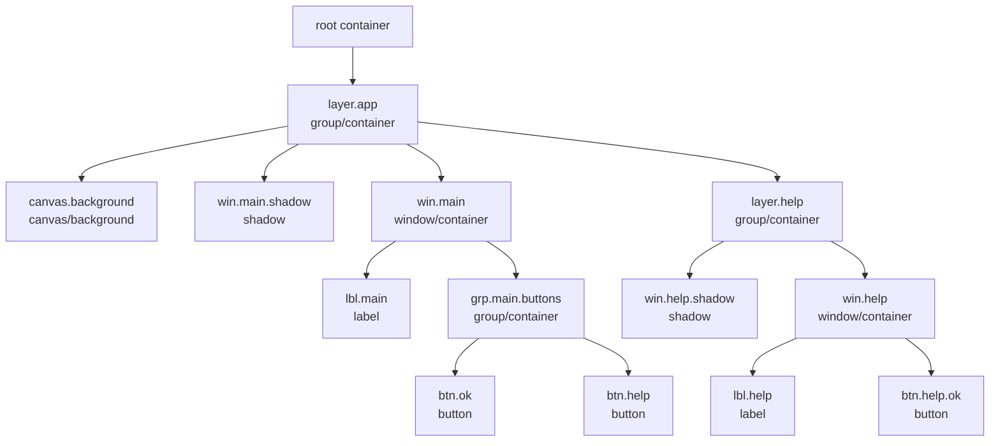

Данный фреймворк предназначен для создания TUI-приложений в среде Inferno.
Фреймворк работает с [особой модификацией ОС Inferno](https://github.com/sphynkx/inferno64ng), содержащей необходимые системные возможности.

Документ описывает общую модель работы `icurses`, устройство интерфейсного дерева, принципы построения экранов, обработку ввода и взаимодействие элементов через сообщения. API фреймворка находится в развитии, поэтому отдельные детали могут изменяться.
<a id="0"></a>
<details>
<summary><b>Оглавление:</b></summary>

+ 1\. [Общая концепция](#1)
+ 2\. [Основные сущности](#2)
  + 2\.1\. [Интерфейс приложения](#2-1)
  + 2\.2\. [Элемент дерева](#2-2)
  + 2\.3\. [Контейнер](#2-3)
  + 2\.4\. [Сообщение](#2-4)
  + 2\.5\. [Рендерер](#2-5)
  + 2\.6\. [Ввод](#2-6)
+ 3\. [Быстрый старт](#3)
  + 3\.1\. [Подключение интерфейсных файлов](#3-1)
  + 3\.2\. [Загрузка runtime-модулей](#3-2)
  + 3\.3\. [Инициализация модулей](#3-3)
  + 3\.4\. [Создание интерфейса](#3-4)
  + 3\.5\. [Добавление элементов](#3-5)
  + 3\.6\. [Отрисовка](#3-6)
  + 3\.7\. [Цикл обработки событий](#3-7)
  + 3\.8\. [Завершение](#3-8)
+ 4\. [Подключение модулей](#4)
  + 4\.1\. [`include`](#4-1)
  + 4\.2\. [`load`](#4-2)
  + 4\.3\. [`init`](#4-3)
  + 4\.4\. [Риск повторных объявлений](#4-4)
  + 4\.5\. [Рекомендуемые схемы подключения](#4-5)
+ 5\. [Дерево элементов](#5)
  + 5\.1\. [Корневой элемент](#5-1)
  + 5\.2\. [Идентификаторы](#5-2)
  + 5\.3\. [Родитель и дочерние элементы](#5-3)
  + 5\.4\. [Координаты и размеры](#5-4)
  + 5\.5\. [Видимость и доступность](#5-5)
  + 5\.6\. [Фокусируемость](#5-6)
  + 5\.7\. [Изменение дерева во время работы](#5-7)
+ 6\. [Layout и resize](#6)
  + 6\.1\. [Статический layout](#6-1)
  + 6\.2\. [Адаптивный layout](#6-2)
  + 6\.3\. [Контейнеры как основа layout](#6-3)
  + 6\.4\. [Resize](#6-4)
  + 6\.5\. [Перестроение интерфейса](#6-5)
  + 6\.6\. [Canvas при resize](#6-6)
+ 7\. [Рендеринг](#7)
  + 7\.1\. [Renderer](#7-1)
  + 7\.2\. [Front/back buffers](#7-2)
  + 7\.3\. [Dirty rendering](#7-3)
  + 7\.4\. [Отрисовка дерева](#7-4)
  + 7\.5\. [Canvas](#7-5)
  + 7\.6\. [Прямой вывод в терминал](#7-6)
  + 7\.7\. [Полная перерисовка](#7-7)
+ 8\. [Ввод и события](#8)
  + 8\.1\. [Клавиатура](#8-1)
  + 8\.2\. [Мышь](#8-2)
  + 8\.3\. [Таймеры](#8-3)
  + 8\.4\. [Основной цикл приложения](#8-4)
  + 8\.5\. [Step-модель](#8-5)
  + 8\.6\. [Завершение ввода](#8-6)
+ 9\. [Сообщения и команды](#9)
  + 9\.1\. [Назначение сообщений](#9-1)
  + 9\.2\. [Источник и адресат](#9-2)
  + 9\.3\. [Тип сообщения](#9-3)
  + 9\.4\. [Команда](#9-4)
  + 9\.5\. [Дополнительные параметры](#9-5)
  + 9\.6\. [Обработка сообщения](#9-6)
  + 9\.7\. [Пользовательские команды приложения](#9-7)
+ 10\. [Фокус и навигация](#10)
  + 10\.1\. [Фокус](#10-1)
  + 10\.2\. [Переключение фокуса](#10-2)
  + 10\.3\. [Фокусируемые элементы](#10-3)
  + 10\.4\. [Активация элемента](#10-4)
  + 10\.5\. [Навигация внутри сложных элементов](#10-5)
+ 11\. [Базовые элементы интерфейса](#11)
  + 11\.1\. [Label](#11-1)
  + 11\.2\. [Window](#11-2)
  + 11\.3\. [Button](#11-3)
  + 11\.4\. [Input](#11-4)
  + 11\.5\. [Checkbox, radio, switch](#11-5)
  + 11\.6\. [Slider](#11-6)
  + 11\.7\. [List](#11-7)
  + 11\.8\. [Menu](#11-8)
  + 11\.9\. [Task/progress](#11-9)
  + 11\.10\. [History/popup](#11-10)
  + 11\.11\. [Canvas](#11-11)
+ 12\. [Terminal lifecycle](#12)
  + 12\.1\. [Обычный режим терминала](#12-1)
  + 12\.2\. [Raw input](#12-2)
  + 12\.3\. [Cursor visibility](#12-3)
  + 12\.4\. [Очистка экрана](#12-4)
  + 12\.5\. [Alternate/app screen](#12-5)
  + 12\.6\. [Корректный выход](#12-6)
  + 12\.7\. [Аварийный выход](#12-7)
+ 13\. [Темы, цвета и символы](#13)
  + 13\.1\. [Цветовые возможности терминала](#13-1)
  + 13\.2\. [UTF-8 и glyph policy](#13-2)
  + 13\.3\. [Frame glyphs](#13-3)
  + 13\.4\. [Double-width символы](#13-4)
  + 13\.5\. [Особенности Windows console](#13-5)
+ 14\. [Типовые шаблоны приложений](#14)
  + 14\.1\. [Простое меню](#14-1)
  + 14\.2\. [Форма настроек](#14-2)
  + 14\.3\. [Список с действиями](#14-3)
  + 14\.4\. [Диалог подтверждения](#14-4)
  + 14\.5\. [Приложение с canvas](#14-5)
  + 14\.6\. [Анимация](#14-6)
  + 14\.7\. [Приложение с resize](#14-7)
  + 14\.8\. [Приложение в alternate screen](#14-8)
+ 15\. [Отладка и типовые ошибки](#15)
  + 15\.1\. [Ошибки `include`](#15-1)
  + 15\.2\. [Ошибки `load`](#15-2)
  + 15\.3\. [Забытый `init`](#15-3)
  + 15\.4\. [Забытый `closeinput`](#15-4)
  + 15\.5\. [Не восстановлен терминал](#15-5)
  + 15\.6\. [Зависшие процессы](#15-6)
  + 15\.7\. [Проблемы resize](#15-7)
  + 15\.8\. [Проблемы Windows console](#15-8)
</details>


## <a id="1">1</a>. Общая концепция [&uarr;](#0)

Организация интерфейса в `icurses` базируется на контейнерной модели и дереве элементов. При запуске приложение создает корневой контейнер интерфейса. Все остальные элементы являются его прямыми или косвенными потомками.

Контейнер является концептуальной основой всей архитектуры. Он задает область интерфейса, внутри которой могут размещаться другие элементы. Эти дочерние элементы могут быть как обычными виджетами, так и другими контейнерами. Благодаря этому интерфейс строится как иерархия вложенных областей: корневой контейнер содержит окна и панели, окна и панели содержат группы, кнопки, поля ввода, списки, canvas-области и другие элементы.

Каждый элемент имеет уникальный идентификатор. По этому идентификатору к элементу можно обращаться при построении интерфейса, изменении состояния, обработке сообщений, управлении фокусом и перерисовке. Идентификатор также используется как адрес в сообщениях между элементами и приложением.

Элементы не образуют плоский список абсолютных координат. Каждый элемент хранит координаты относительно своего родительского контейнера. Абсолютное положение на экране вычисляется через цепочку родителей. Это позволяет перемещать или перестраивать целые группы элементов, не пересчитывая вручную координаты каждого дочернего элемента.

Контейнер может быть видимым элементом, например окном или панелью, а может использоваться как служебная группа. В обоих случаях он является частью общего дерева, имеет собственный идентификатор, координаты, размеры и список дочерних элементов. Такая модель позволяет строить сложные интерфейсы из небольших независимых частей.

Взаимодействие между элементами и приложением выполняется через сообщения. Сообщение содержит сведения об источнике, адресате, типе события, команде и дополнительных данных. Часть сообщений обрабатывается фреймворком, часть передается приложению. Такой подход позволяет отделить описание интерфейса от логики обработки действий пользователя.

Фреймворк также берет на себя низкоуровневые задачи: работу с терминалом, получение информации о размере и возможностях консоли, чтение клавиатуры и мыши, отрисовку элементов, управление фокусом и восстановление состояния терминала после завершения приложения.

## <a id="2">2</a>. Основные сущности [&uarr;](#0)

В `icurses` интерфейс приложения описывается несколькими связанными сущностями. Центральной идеей является контейнерное дерево: приложение работает не с набором отдельных несвязанных виджетов, а с иерархией элементов, где каждый элемент имеет родителя, а контейнеры могут иметь дочерние элементы.

Главные сущности:

- интерфейс приложения;
- дерево элементов;
- контейнер;
- элемент дерева;
- сообщение;
- рендерер;
- ввод.

Эти сущности образуют общий каркас приложения. Приложение создает интерфейс, строит дерево контейнеров и элементов, связывает элементы командами и сообщениями, передает дерево рендереру для отрисовки и обрабатывает события ввода.

### <a id="2-1">2.1</a>. Интерфейс приложения [&uarr;](#0)

Интерфейс приложения — это центральный объект, через который приложение обычно работает с `icurses`.

Он объединяет несколько частей:

- дерево элементов;
- корневой контейнер;
- рендерер;
- карту клавиш;
- строки помощи и статуса;
- состояние цикла работы;
- каналы событий клавиатуры и таймера;
- последнее обработанное сообщение.

Иными словами, интерфейс приложения является рабочим контекстом TUI-программы. Через него создаются элементы, меняется состояние дерева, выполняется отрисовка, обрабатываются клавиши и dispatch-сообщения.

При создании интерфейса формируется корневой контейнер. Он является верхней точкой всей иерархии. Все остальные элементы интерфейса добавляются внутрь него напрямую или через другие контейнеры. Поэтому даже простое приложение имеет контейнерную структуру: корень, дочерние элементы и возможные вложенные группы.

Обычное приложение не работает напрямую со всеми внутренними структурами. Вместо этого оно использует высокоуровневые функции `IcUi`, которые скрывают большую часть деталей. Например, приложение может создать окно, кнопку или метку через функции UI-уровня, а фреймворк сам добавит нужные элементы в дерево и подготовит их к отрисовке.

Интерфейс приложения также хранит служебные строки:

- `help` — строка помощи;
- `status` — строка состояния.

Они обычно выводятся в нижних строках терминала и позволяют приложению показывать подсказки, текущий режим работы, результат команды или диагностическую информацию.

Важно разделять интерфейс приложения и прикладное состояние. `icurses` хранит состояние интерфейса: дерево, фокус, команды, renderer, ввод. Но бизнес-логика приложения, данные пользователя, открытые файлы, настройки и результаты вычислений должны храниться в самом приложении.

### <a id="2-2">2.2</a>. Элемент дерева [&uarr;](#0)

Элемент дерева — базовая единица интерфейса. Окна, панели, метки, кнопки, поля ввода, группы, canvas-области и другие видимые или служебные части интерфейса представляются как элементы дерева.

Каждый элемент имеет идентификатор. Идентификатор используется как адрес элемента внутри дерева. По нему элемент можно найти, изменить, сделать видимым или скрытым, включить или отключить, передвинуть, использовать как получателя сообщения или как родителя для других элементов.

У элемента есть несколько групп свойств.

Структурные свойства:

- уникальный идентификатор;
- тип элемента;
- идентификатор родителя;
- список дочерних элементов.

Текстовые и командные свойства:

- основной текст;
- дополнительное содержимое;
- горячая клавиша;
- целевой элемент для сообщения;
- команда;
- строковый аргумент;
- числовые аргументы.

Геометрические свойства:

- локальная координата `x`;
- локальная координата `y`;
- ширина;
- высота.

Состояние элемента:

- видимость;
- доступность;
- возможность получить фокус;
- признак необходимости перерисовки.

Тип элемента определяет, как он будет интерпретироваться фреймворком и helper-модулями. Например, элемент может быть окном, кнопкой, меткой, группой, canvas-областью или служебным узлом. При этом базовая структура у всех элементов одна, что позволяет хранить их в общем дереве и обрабатывать единым способом.

Любой элемент находится внутри некоторого контейнера. Для верхнего уровня таким контейнером является корневой контейнер интерфейса. Для вложенных элементов родителем может быть окно, панель, группа или другой контейнерный элемент.

Координаты элемента локальны относительно родителя. Это важная особенность: элемент не обязан знать свое абсолютное положение на экране. Абсолютная позиция вычисляется как сумма координат элемента и всех его родителей. Благодаря этому целую группу элементов можно перемещать как единый блок, изменяя координаты контейнера.

Признак `dirty` показывает, что элемент или связанные с ним данные изменились и его нужно учитывать при следующей отрисовке. Это помогает не перерисовывать весь экран без необходимости.

### <a id="2-3">2.3</a>. Контейнер [&uarr;](#0)

Контейнер — ключевая сущность архитектуры `icurses`.

Контейнер является элементом дерева, который может содержать другие элементы. Именно контейнерная модель позволяет строить интерфейс как вложенную структуру, а не как плоский набор координат на экране.

При создании интерфейса фреймворк формирует корневой контейнер. Он представляет всю доступную область приложения. Все остальные элементы являются его потомками: либо прямыми дочерними элементами, либо элементами, вложенными через другие контейнеры.

Контейнер задает локальную область. Дочерние элементы размещаются внутри этой области и используют координаты относительно контейнера. Если контейнер перемещается, его дочерние элементы сохраняют свои локальные координаты, но их абсолютное положение на экране меняется вместе с контейнером.

Контейнеры могут быть вложены друг в друга. Например:

- корневой контейнер содержит главное окно;
- главное окно содержит панель;
- панель содержит группу элементов;
- группа содержит кнопки, поля ввода и метки.

Такая вложенность позволяет строить интерфейс постепенно: от крупных областей к мелким элементам.

Контейнеры нужны для нескольких задач:

- логическое группирование элементов;
- построение вложенного layout;
- перемещение группы элементов;
- скрытие или показ целой группы;
- включение или отключение части интерфейса;
- упрощение обработки resize;
- разделение сложного экрана на независимые области.

Окно или панель часто используются как контейнеры. Например, внутри окна могут находиться метки, кнопки, поля ввода и другие элементы. Такое окно имеет собственный идентификатор и собственную геометрию, а дочерние элементы описываются относительно него.

Контейнер не обязательно должен быть сложным видимым объектом. Он может использоваться и как служебная группа. В этом случае он помогает организовать дерево, даже если сам почти ничего не рисует.

Контейнеры особенно полезны при адаптивном layout. Приложение может пересчитать размеры нескольких крупных областей, а элементы внутри них оставить в локальной системе координат. Это делает перестройку интерфейса проще и уменьшает количество ручных пересчетов.

Таким образом, контейнер в `icurses` — это не просто вспомогательный элемент. Это основа организации интерфейса, координат, группировки, вложенности и перестроения экрана.

### <a id="2-4">2.4</a>. Сообщение [&uarr;](#0)

Сообщение — основной способ передать событие или команду между элементами, фреймворком и приложением.

Сообщение обычно содержит:

- идентификатор источника;
- идентификатор получателя;
- тип сообщения;
- команду;
- маршрут доставки;
- служебные флаги;
- порядковый номер;
- строковый аргумент;
- числовые аргументы;
- признак обработки.

Источник показывает, какой элемент или часть системы создала сообщение. Получатель показывает, кому сообщение адресовано. Команда описывает действие, которое нужно выполнить.

Тип сообщения позволяет различать разные классы событий. Например, это может быть команда, ввод, уведомление, изменение фокуса, lifecycle-событие или событие, связанное с отрисовкой.

Команда обычно задается строкой. Это делает механизм гибким: приложение может использовать собственные команды, не меняя базовые структуры фреймворка. Например, кнопка может отправить команду приложению, а приложение уже решает, что с ней делать.

Дополнительные аргументы позволяют передавать простые данные вместе с сообщением. Строковый аргумент удобен для текстовых значений, а числовые аргументы — для индексов, координат, флагов, значений контролов и других компактных данных.

Признак обработки показывает, было ли сообщение уже обработано. Это важно для маршрутизации и для случаев, когда сообщение может пройти через несколько уровней: элемент, контейнер, UI-уровень, приложение.

Фреймворк может обработать часть сообщений самостоятельно. Например, некоторые команды навигации, фокуса или стандартных элементов не требуют участия приложения. Но прикладные команды обычно передаются наружу, чтобы приложение могло выполнить нужное действие.

### <a id="2-5">2.5</a>. Рендерер [&uarr;](#0)

Рендерер отвечает за преобразование дерева элементов в вывод терминала.

Дерево элементов описывает логическую структуру интерфейса: какие элементы существуют, где они находятся, какие у них тексты, размеры и состояние. Рендерер превращает эту структуру в последовательность экранных ячеек и управляющих последовательностей терминала.

Рендерер хранит:

- файловый дескриптор вывода;
- ширину и высоту экрана;
- стиль рамок;
- передний буфер;
- задний буфер.

front/back-буферы используются для оптимизации вывода. Один буфер описывает уже выведенное состояние экрана, другой — новое состояние, которое нужно показать. При отрисовке рендерер может сравнить эти состояния и вывести только изменившиеся участки.

Это особенно важно для терминальных приложений. Полная перерисовка всего экрана может быть заметной, медленной и может давать мерцание. Буферизация позволяет уменьшить объем вывода и сделать интерфейс стабильнее.

Рендерер не должен хранить прикладную логику. Его задача — рисовать. Он не решает, что означает нажатая кнопка или какое действие должно быть выполнено. Эти решения остаются за UI-слоем и приложением.

Отдельным случаем является canvas. Canvas позволяет приложению работать с областью произвольного рисования. Он полезен для графиков, псевдографики, анимации и нестандартных визуальных элементов. При этом canvas тоже должен быть согласован с renderer, иначе прямой вывод в терминал может конфликтовать с обычной отрисовкой дерева.

### <a id="2-6">2.6</a>. Ввод [&uarr;](#0)

Ввод объединяет события клавиатуры, мыши и таймеров.

Клавиатура используется для навигации, ввода текста, активации элементов, горячих клавиш и команд приложения. Часть клавиш обрабатывается как обычные символы, часть — как специальные клавиши навигации: стрелки, Tab, Home, End, PageUp, PageDown и другие.

Мышь используется для событий, связанных с координатами, кнопками и колесом. На разных терминалах и хост-системах поддержка мыши может отличаться, поэтому приложение должно учитывать, что мышь является дополнительным способом управления, а не единственным.

Таймеры позволяют строить приложения с периодическими событиями. Они полезны для анимации, обновления статуса, фоновых задач, progress-индикаторов и интерфейсов, которые должны изменяться без нажатия клавиш.

Во фреймворке возможны разные стили обработки ввода.

Первый стиль — ручной цикл приложения. Приложение само читает события, вызывает обработчики, обновляет состояние и перерисовывает интерфейс. Такой подход удобен для сложных программ, нестандартной логики и анимации.

Второй стиль — step-модель. В этом случае фреймворк возвращает приложению готовые шаги событий: завершение, клавиша, tick, мышь. Приложение анализирует тип шага и выполняет нужное действие. Такая модель делает основной цикл более компактным и лучше подходит для типовых приложений.

Ввод требует аккуратного завершения. Если приложение открыло raw input, запустило reader-процессы или включило mouse mode, оно должно корректно закрыть ввод и восстановить состояние терминала. Иначе после выхода могут остаться неработающие клавиши, скрытый курсор, неправильные цвета или мусор на экране.


## <a id="3">3</a>. Быстрый старт [&uarr;](#0)

В этом разделе показано первое приложение на `icurses`. Оно создает главное окно с текстом `Welcome to Inferno!!` и двумя кнопками:

- `OK` — закрывает приложение;
- `Help` — показывает окно помощи.

Окно помощи содержит текст `Welcome to Icurses!!` и собственную кнопку `OK`, которая закрывает только окно помощи и возвращает фокус в главное окно.

Пример также выводит небольшой фоновый текстовый блок через `canvas`. Это нужно для демонстрации слоистой отрисовки: окна и тени рисуются поверх содержимого, которое известно renderer-у. Тень в `icurses` является compositing-эффектом внутри собственного буфера renderer-а: символ ячейки сохраняется, а стиль ячейки заменяется на shadow-атрибут.

Важно понимать ограничение терминала: приложение обычно не может прочитать произвольный текст, который уже был выведен в реальную консоль до запуска. Поэтому `icurses` не может надежно затемнять старое содержимое консоли. Для демонстрации фона используется `canvas`, а для сохранения исходного экрана терминала — alternate/app screen.

Пример показывает основные принципы работы с фреймворком:

- подключение интерфейсных файлов;
- загрузку runtime-модулей;
- создание UI;
- создание общего слоя приложения;
- создание фонового canvas;
- создание окон, групп, меток и кнопок;
- использование корневого контейнера;
- вложенность контейнеров;
- отрисовку окна с тенью;
- отправку команд от кнопок;
- обработку сообщений;
- показ и скрытие группы элементов;
- использование alternate/app screen;
- корректное завершение приложения.

<details>
<summary><b>doc/icurses/examples/01_hello.b</b></summary>

```go
implement HelloIcurses;

include "draw.m";
include "icurses/ui.m";

HelloIcurses: module
{
	init: fn(nil: ref Draw->Context, nil: list of string);
};

sys: Sys;
ic: Icurses;
ui: IcUi;
msg: IcMsg;

out: ref Sys->FD;
appscreen: int;

AppLayer: con "layer.app";
AppX: con 10;
AppY: con 10;

Background: con "canvas.background";
BgCode: con "0";

MainWin: con "win.main";
MainText: con "lbl.main";
MainButtons: con "grp.main.buttons";
BtnOk: con "btn.ok";
BtnHelp: con "btn.help";

HelpLayer: con "layer.help";
HelpWin: con "win.help";
HelpText: con "lbl.help";
BtnHelpOk: con "btn.help.ok";

loadmods()
{
	sys = load Sys Sys->PATH;
	if(sys == nil)
		raise "fail:load sys";

	ic = load Icurses Icurses->PATH;
	if(ic == nil)
		raise "fail:load icurses";

	ui = load IcUi IcUi->PATH;
	if(ui == nil)
		raise "fail:load icui";

	msg = load IcMsg IcMsg->PATH;
	if(msg == nil)
		raise "fail:load icmsg";

	ic->init();
	ui->init();
	msg->init();
}

minint(a, b: int): int
{
	if(a < b)
		return a;

	return b;
}

maxint(a, b: int): int
{
	if(a > b)
		return a;

	return b;
}

center(v, size: int): int
{
	x: int;

	x = (v - size) / 2;
	if(x < 0)
		x = 0;

	return x;
}

clamp(v, lo, hi: int): int
{
	if(hi < lo)
		hi = lo;

	if(v < lo)
		return lo;

	if(v > hi)
		return hi;

	return v;
}

enterappscreen()
{
	if(out == nil)
		return;

	if(appscreen)
		return;

	sys->fprint(out, "%c[?1049h", 27);
	ic->resettty(out);
	ic->hidecursor(out);
	ic->cleartty(out);

	appscreen = 1;
}

leaveappscreen()
{
	if(out == nil)
		return;

	ic->resettty(out);
	ic->showcursor(out);
	ic->cleartty(out);

	if(appscreen){
		sys->fprint(out, "%c[?1049l", 27);
		appscreen = 0;
	}

	ic->resettty(out);
	ic->showcursor(out);
}

sampleline(i: int): string
{
	case i % 5 {
	0 =>
		return "Renderer-owned background text. Shadow keeps glyphs and changes only their style.";

	1 =>
		return "Containers form a tree: root, windows, groups, controls, labels, and canvas nodes.";

	2 =>
		return "This short text block is drawn by canvas so layered windows can be demonstrated.";

	3 =>
		return "Terminal default colors are used here: no explicit black background is requested.";

	* =>
		return "Open Help to see a grouped window and its shadow shown and hidden together.";
	}
}

drawbackground(u: ref IcUi->Ui, w, h, y0, y1: int)
{
	y, n, lastrow: int;
	line: string;

	ui->canvasclear(u, Background, " ", BgCode);

	lastrow = h - 1;
	if(lastrow < 0)
		lastrow = 0;

	y0 = clamp(y0, 0, lastrow);
	y1 = clamp(y1, 0, lastrow);

	if(y1 < y0)
		return;

	n = 0;
	for(y = y0; y <= y1; y++){
		line = sampleline(n);
		ui->canvasputs(u, Background, 1, y, line, BgCode);
		n++;
	}

	w = w;
}

showhelp(u: ref IcUi->Ui)
{
	m: IcMsg->Msg;

	m = msg->newmsg("app", HelpLayer, IcMsg->KindCommand, "node.show");
	ui->dispatch(u, m);

	ui->setfocus(u, BtnHelpOk);
	ui->setstatus(u, "Help opened");
	ui->draw(u);
}

hidehelp(u: ref IcUi->Ui)
{
	m: IcMsg->Msg;

	m = msg->newmsg("app", HelpLayer, IcMsg->KindCommand, "node.hide");
	ui->dispatch(u, m);

	ui->setfocus(u, BtnHelp);
	ui->setstatus(u, "Help closed");
	ui->draw(u);
}

build(u: ref IcUi->Ui, sw, sh: int)
{
	root: string;
	appx, appy, appw, apph: int;
	mainx, mainy, mainw, mainh: int;
	helpx, helpy, helpw, helph: int;
	usableh, blockx, blocky, blockw, blockh: int;
	bgy0, bgy1: int;
	m: IcMsg->Msg;

	root = ui->rootid(u);

	mainw = 44;
	mainh = 9;
	helpw = 36;
	helph = 7;

	usableh = sh;
	if(usableh > 2)
		usableh -= 2;

	if(usableh < 1)
		usableh = sh;

	appx = AppX;
	appy = AppY;
	appw = sw - appx;
	apph = usableh - appy;

	if(appw < mainw){
		appx = 0;
		appw = sw;
	}

	if(apph < mainh){
		appy = 0;
		apph = usableh;
	}

	if(appw < 1)
		appw = 1;
	if(apph < 1)
		apph = 1;

	if(appw >= mainw + helpw + 6){
		blockw = mainw + helpw + 6;
		blockh = maxint(mainh, helph);

		blockx = center(appw, blockw);
		blocky = center(apph, blockh);

		mainx = blockx;
		mainy = blocky + center(blockh, mainh);

		helpx = blockx + mainw + 4;
		helpy = blocky + center(blockh, helph);
	}
	else{
		blockw = maxint(mainw, helpw);
		blockh = mainh + helph + 2;

		blockx = center(appw, blockw);
		blocky = center(apph, blockh);

		mainx = blockx + center(blockw, mainw);
		mainy = blocky;

		helpx = blockx + center(blockw, helpw);
		helpy = blocky + mainh + 2;

		if(blockh > apph){
			mainy = center(apph, mainh);
			helpy = mainy + mainh + 1;

			if(helpy + helph > apph)
				helpy = mainy - helph - 1;

			if(helpy < 0)
				helpy = clamp(mainy + mainh + 1, 0, apph - helph);
		}
	}

	mainx = clamp(mainx, 0, appw - mainw);
	helpx = clamp(helpx, 0, appw - helpw);
	mainy = clamp(mainy, 0, apph - mainh);
	helpy = clamp(helpy, 0, apph - helph);

	ui->setframestyle(u, IcPaint->FrameDouble);
	ui->setstatusrows(u, sh - 2, sh - 1);
	ui->sethelp(u, " Enter activates focused button | Tab changes focus | q/Esc exits ");

	ui->group(u, root, AppLayer, appx, appy, appw, apph);

	ui->canvas(u, AppLayer, Background, 0, 0, appw, apph);

	bgy0 = minint(mainy, helpy) - 2;
	bgy1 = maxint(mainy + mainh, helpy + helph) + 1;
	drawbackground(u, appw, apph, bgy0, bgy1);

	ui->shadowwindow(u, AppLayer, MainWin, mainx, mainy, mainw, mainh, " Hello ", 1, 1);
	ui->label(u, MainWin, MainText, 4, 2, 34, "Welcome to Inferno!!");

	ui->group(u, MainWin, MainButtons, 8, 5, 28, 1);
	ui->button(u, MainButtons, BtnOk, 0, 0, 10, 1, "OK", "", "app", "app.ok");
	ui->button(u, MainButtons, BtnHelp, 14, 0, 10, 1, "Help", "", "app", "app.help");

	ui->group(u, AppLayer, HelpLayer, 0, 0, appw, apph);
	ui->shadowwindow(u, HelpLayer, HelpWin, helpx, helpy, helpw, helph, " Help ", 1, 1);
	ui->label(u, HelpWin, HelpText, 4, 2, 26, "Welcome to Icurses!!");
	ui->button(u, HelpWin, BtnHelpOk, 13, 4, 10, 1, "OK", "", "app", "app.help.ok");

	m = msg->newmsg("app", HelpLayer, IcMsg->KindCommand, "node.hide");
	ui->dispatch(u, m);

	ui->setfocus(u, BtnOk);
	ui->setstatus(u, "Ready");
}

run()
{
	u: ref IcUi->Ui;
	s: IcUi->Step;
	w, h, done: int;

	out = sys->fildes(1);
	appscreen = 0;

	enterappscreen();

	(w, h) = ic->termsize();
	if(w <= 0)
		w = Icurses->DefaultCols;
	if(h <= 0)
		h = Icurses->DefaultRows;

	u = ui->new(out, w, h);
	if(u == nil){
		leaveappscreen();
		sys->print("cannot create ui\n");
		return;
	}

	build(u, w, h);
	ui->draw(u);

	if(ui->start(u) < 0){
		ui->close(u);
		leaveappscreen();
		sys->print("cannot start ui\n");
		return;
	}

	done = 0;

	for(; !done;){
		s = ui->step(u);

		case s.kind {
		IcUi->StepDone =>
			done = 1;

		IcUi->StepKey =>
			if(s.msg.cmd == "app.ok")
				done = 1;
			else if(s.msg.cmd == "app.help")
				showhelp(u);
			else if(s.msg.cmd == "app.help.ok")
				hidehelp(u);
			else
				ui->draw(u);

		IcUi->StepTick =>
			;

		IcUi->StepMouse =>
			;

		* =>
			;
		}
	}

	ui->close(u);
	leaveappscreen();

	sys->print("result: ok\n");
}

init(nil: ref Draw->Context, nil: list of string)
{
	loadmods();
	run();
}
```

</details>

Схема дерева элементов в этом примере:



Сборка примера:

```sh
limbo -I/module -o /dis/01_hello.dis doc/icurses/examples/01_hello.b
```

Запуск:

```sh
emu -r. /dis/01_hello.dis
```

### <a id="3-1">3.1</a>. Подключение интерфейсных файлов [&uarr;](#0)

В Limbo интерфейсные файлы подключаются директивой `include`.

В примере используются:

```go
include "draw.m";
include "icurses/ui.m";
```

`draw.m` нужен для стандартной сигнатуры точки входа приложения:

```go
init: fn(ctxt: ref Draw->Context, args: list of string);
```

`icurses/ui.m` подключает высокоуровневый UI-интерфейс. Через него приложение создает интерфейс, окна, группы, метки, кнопки, запускает обработку событий и выполняет отрисовку.

`Icurses` остается базовым runtime-модулем фреймворка. Приложение явно загружает и инициализирует его:

```go
ic = load Icurses Icurses->PATH;
ic->init();
```

При этом в текущей include-иерархии `Icurses` уже становится видимым через `icurses/ui.m`. Поэтому в простом приложении не нужно одновременно писать:

```go
include "icurses/icurses.m";
include "icurses/ui.m";
```

Такое двойное подключение может привести к повторным объявлениям, если один интерфейс уже включен через другой. Это не отменяет роль `Icurses` как базового модуля. Речь только о том, как аккуратно подключать интерфейсные файлы на этапе компиляции.

Правило для первого приложения:

- подключаем `draw.m`;
- подключаем `icurses/ui.m`;
- загружаем runtime-модули, функции которых вызываем напрямую.

Более подробная схема подключений описывается в разделе [4. Подключение модулей](#4).

### <a id="3-2">3.2</a>. Загрузка runtime-модулей [&uarr;](#0)

После подключения интерфейсных файлов приложение должно загрузить runtime-модули через `load`.

В примере используются:

- `Sys` — системные вызовы Inferno;
- `Icurses` — низкоуровневая работа с терминалом и размером консоли;
- `IcUi` — основной UI-уровень;
- `IcMsg` — создание сообщений для команд `node.show` и `node.hide`.

Интерфейсный файл дает программе имя модуля и его `PATH`, но сам модуль нужно загрузить явно:

```go
sys = load Sys Sys->PATH;
ic = load Icurses Icurses->PATH;
ui = load IcUi IcUi->PATH;
msg = load IcMsg IcMsg->PATH;
```

Каждую загрузку лучше проверять. Если модуль не загрузился, приложение должно завершиться с понятной ошибкой.

В примере это вынесено в отдельную функцию `loadmods()`.

### <a id="3-3">3.3</a>. Инициализация модулей [&uarr;](#0)

После `load` у модулей вызывается `init()`:

```go
ic->init();
ui->init();
msg->init();
```

`init()` подготавливает внутреннее состояние модуля. Некоторые модули внутри `init()` загружают и инициализируют собственные зависимости. Поэтому правило простое: если приложение загрузило модуль и собирается вызывать его функции, модуль нужно инициализировать.

Исключение составляют только модули, у которых нет `init()` или где документация явно говорит, что инициализация не нужна.

### <a id="3-4">3.4</a>. Создание интерфейса [&uarr;](#0)

Перед созданием UI приложению нужен файловый дескриптор вывода и размер терминала.

В примере вывод идет в stdout:

```go
out = sys->fildes(1);
```

Пример использует alternate/app screen:

```go
enterappscreen();
```

Это позволяет приложению рисовать на отдельном экране терминала. При выходе вызывается:

```go
leaveappscreen();
```

После этого терминал возвращает исходное содержимое, которое было видно до запуска приложения.

Размер терминала получается через `Icurses->termsize()`:

```go
(w, h) = ic->termsize();
```

Если размер не удалось определить, используются стандартные значения:

```go
if(w <= 0)
	w = Icurses->DefaultCols;
if(h <= 0)
	h = Icurses->DefaultRows;
```

После этого создается UI:

```go
u = ui->new(out, w, h);
```

При создании UI фреймворк создает корневой контейнер. Все остальные элементы приложения добавляются внутрь него напрямую или через вложенные контейнеры.

Идентификатор корневого контейнера можно получить так:

```go
root = ui->rootid(u);
```

В примере все видимые элементы помещаются в общий контейнер `layer.app`. Этот контейнер сдвинут относительно корня и задает локальную систему координат для фонового canvas, главного окна и окна помощи.

### <a id="3-5">3.5</a>. Добавление элементов [&uarr;](#0)

В примере создаются:

- общий слой приложения `layer.app`;
- фоновый canvas внутри слоя приложения;
- главное окно;
- группа кнопок внутри главного окна;
- слой окна помощи;
- окно помощи внутри этого слоя.

Слой приложения создается так:

```go
ui->group(u, root, AppLayer, appx, appy, appw, apph);
```

Все элементы примера добавляются уже внутрь этого слоя. Поэтому смещение `layer.app` перемещает сразу весь интерфейс примера: canvas, окна, тени и группы.

Фоновый canvas создается внутри `layer.app`:

```go
ui->canvas(u, AppLayer, Background, 0, 0, appw, apph);
```

На canvas выводится короткий текстовый блок. Он используется для демонстрации того, как окна и тени ложатся поверх содержимого, известного renderer-у.

Главное окно тоже добавляется в `layer.app`:

```go
ui->shadowwindow(u, AppLayer, MainWin, mainx, mainy, mainw, mainh, " Hello ", 1, 1);
```

`shadowwindow()` создает окно и отдельный элемент тени. Окно само используется как контейнер для дочерних элементов:

```go
ui->label(u, MainWin, MainText, 4, 2, 34, "Welcome to Inferno!!");
```

После этого создается группа кнопок:

```go
ui->group(u, MainWin, MainButtons, 8, 5, 28, 1);
```

Кнопки добавляются уже внутрь группы:

```go
ui->button(u, MainButtons, BtnOk, 0, 0, 10, 1, "OK", "", "app", "app.ok");
ui->button(u, MainButtons, BtnHelp, 14, 0, 10, 1, "Help", "", "app", "app.help");
```

У кнопки есть целевой адрес и команда. Например:

```go
"app", "app.ok"
```

Это означает: отправить команду `app.ok` условному получателю `app`. Приложение увидит эту команду в основном цикле и завершится.

Окно помощи помещено в отдельный слой-контейнер:

```go
ui->group(u, AppLayer, HelpLayer, 0, 0, appw, apph);
```

Внутри этого слоя создается окно с тенью:

```go
ui->shadowwindow(u, HelpLayer, HelpWin, helpx, helpy, helpw, helph, " Help ", 1, 1);
```

Это важно: `shadowwindow()` создает не только окно, но и отдельный элемент тени. Если скрывать только окно, тень останется видимой. Поэтому в примере показывается и скрывается весь контейнер `layer.help`, в котором находятся и окно, и его тень.

### <a id="3-6">3.6</a>. Отрисовка [&uarr;](#0)

После создания дерева элементов приложение вызывает:

```go
ui->draw(u);
```

Эта функция отрисовывает текущее состояние интерфейса.

Если приложение меняет текст, статус, видимость элементов или фокус, после изменения обычно нужно снова вызвать `ui->draw(u)`.

В примере окно помощи показывается и скрывается через команды `node.show` и `node.hide`. После каждой такой операции приложение вызывает `ui->draw(u)`, чтобы обновить экран.

Фоновый canvas рисуется до окон, потому что он находится раньше в дереве элементов. Затем поверх него рисуются тени, окна, labels и buttons.

### <a id="3-7">3.7</a>. Цикл обработки событий [&uarr;](#0)

После построения интерфейса приложение запускает UI:

```go
if(ui->start(u) < 0){
	ui->close(u);
	leaveappscreen();
	sys->print("cannot start ui\n");
	return;
}
```

Затем приложение входит в цикл обработки событий. В этом примере используется step-модель:

```go
s = ui->step(u);
```

Каждый шаг имеет тип:

- `IcUi->StepDone` — работа завершена;
- `IcUi->StepKey` — получена клавиша и, возможно, сообщение;
- `IcUi->StepTick` — событие таймера;
- `IcUi->StepMouse` — событие мыши.

В примере приложение реагирует на команды:

- `app.ok` — выйти из программы;
- `app.help` — показать окно помощи;
- `app.help.ok` — скрыть окно помощи.

Показ окна помощи:

```go
m = msg->newmsg("app", HelpLayer, IcMsg->KindCommand, "node.show");
ui->dispatch(u, m);
```

Скрытие окна помощи:

```go
m = msg->newmsg("app", HelpLayer, IcMsg->KindCommand, "node.hide");
ui->dispatch(u, m);
```

Так как окно помощи и его тень находятся внутри контейнера `layer.help`, управление видимостью этого контейнера управляет всей группой дочерних элементов.

### <a id="3-8">3.8</a>. Завершение [&uarr;](#0)

При завершении нужно вызвать:

```go
ui->close(u);
```

`ui->close()` останавливает UI, закрывает ввод и renderer. Это важно: терминальное приложение может переводить клавиатуру в raw-режим, скрывать курсор, включать мышь или использовать служебные процессы чтения ввода. Если завершить программу без очистки, терминал может остаться в неправильном состоянии.

Так как пример использует alternate/app screen, после закрытия UI вызывается:

```go
leaveappscreen();
```

Это возвращает терминал к обычному экрану и восстанавливает видимое содержимое консоли, которое было до запуска приложения.

В простом приложении завершение выглядит так:

```go
ui->close(u);
leaveappscreen();

sys->print("result: ok\n");
```

### <a id="3-4">3.4</a>. Создание интерфейса [&uarr;](#0)

Перед созданием UI приложению нужен файловый дескриптор вывода и размер терминала.

В примере вывод идет в stdout:

```limbo
out = sys->fildes(1);
```

Размер терминала получается через `Icurses->termsize()`:

```limbo
(w, h) = ic->termsize();
```

Если размер не удалось определить, используются стандартные значения:

```limbo
if(w <= 0)
	w = Icurses->DefaultCols;
if(h <= 0)
	h = Icurses->DefaultRows;
```

После этого создается UI:

```limbo
u = ui->new(out, w, h);
```

При создании UI фреймворк создает корневой контейнер. Все остальные элементы приложения добавляются внутрь него напрямую или через вложенные контейнеры.

Идентификатор корневого контейнера можно получить так:

```limbo
root = ui->rootid(u);
```

В примере главное окно и окно помощи являются прямыми потомками корневого контейнера.

### <a id="3-5">3.5</a>. Добавление элементов [&uarr;](#0)

В примере создаются два окна:

- главное окно;
- окно помощи.

Оба окна добавляются в корневой контейнер. При этом каждое окно само используется как контейнер для своих дочерних элементов.

Главное окно содержит:

- метку `Welcome to Inferno!!`;
- служебную группу для кнопок;
- кнопку `OK`;
- кнопку `Help`.

Служебная группа показывает вложенность контейнеров: кнопки находятся не прямо в окне, а внутри группы, которая находится внутри окна.

Окно помощи содержит:

- метку `Welcome to Icurses!!`;
- кнопку `OK`.

Главное окно создается так:

```limbo
ui->shadowwindow(u, root, MainWin, mainx, mainy, mainw, mainh, " Hello ", 1, 1);
```

Затем внутрь него добавляется метка:

```limbo
ui->label(u, MainWin, MainText, 4, 2, 34, "Welcome to Inferno!!");
```

После этого создается группа кнопок:

```limbo
ui->group(u, MainWin, MainButtons, 8, 5, 28, 1);
```

Кнопки добавляются уже внутрь группы:

```limbo
ui->button(u, MainButtons, BtnOk, 0, 0, 10, 1, "OK", "", "app", "app.ok");
ui->button(u, MainButtons, BtnHelp, 14, 0, 10, 1, "Help", "", "app", "app.help");
```

У кнопки есть целевой адрес и команда. Например:

```limbo
"app", "app.ok"
```

Это означает: отправить команду `app.ok` условному получателю `app`. Приложение увидит эту команду в основном цикле и завершится.

Окно помощи в начале скрывается командой `node.hide`.

### <a id="3-6">3.6</a>. Отрисовка [&uarr;](#0)

После создания дерева элементов приложение вызывает:

```limbo
ui->draw(u);
```

Эта функция отрисовывает текущее состояние интерфейса.

Если приложение меняет текст, статус, видимость элементов или фокус, после изменения обычно нужно снова вызвать `ui->draw(u)`.

В примере окно помощи показывается и скрывается через команды `node.show` и `node.hide`. После каждой такой операции приложение вызывает `ui->draw(u)`, чтобы обновить экран.

### <a id="3-7">3.7</a>. Цикл обработки событий [&uarr;](#0)

После построения интерфейса приложение запускает UI:

```limbo
if(ui->start(u) < 0){
	ui->close(u);
	sys->print("cannot start ui\n");
	return;
}
```

Затем приложение входит в цикл обработки событий. В этом примере используется step-модель:

```limbo
s = ui->step(u);
```

Каждый шаг имеет тип:

- `IcUi->StepDone` — работа завершена;
- `IcUi->StepKey` — получена клавиша и, возможно, сообщение;
- `IcUi->StepTick` — событие таймера;
- `IcUi->StepMouse` — событие мыши.

В примере приложение реагирует на команды:

- `app.ok` — выйти из программы;
- `app.help` — показать окно помощи;
- `app.help.ok` — скрыть окно помощи.

Показ окна помощи:

```limbo
m = msg->newmsg("app", HelpWin, IcMsg->KindCommand, "node.show");
ui->dispatch(u, m);
```

Скрытие окна помощи:

```limbo
m = msg->newmsg("app", HelpWin, IcMsg->KindCommand, "node.hide");
ui->dispatch(u, m);
```

Так как окно помощи является контейнером, управление его видимостью управляет отображением всей группы дочерних элементов.

### <a id="3-8">3.8</a>. Завершение [&uarr;](#0)

При завершении нужно вызвать:

```limbo
ui->close(u);
```

`ui->close()` останавливает UI, закрывает ввод и renderer. Это важно: терминальное приложение может переводить клавиатуру в raw-режим, скрывать курсор, включать мышь или использовать служебные процессы чтения ввода. Если завершить программу без очистки, терминал может остаться в неправильном состоянии.

В простом приложении достаточно вызвать `ui->close(u)` перед выходом:

```limbo
ui->close(u);
sys->print("result: ok\n");
```

## <a id="4">4</a>. Подключение модулей [&uarr;](#0)

Раздел нужен рано, чтобы избежать путаницы между `include`, `load` и `init`.

### <a id="4-1">4.1</a>. `include` [&uarr;](#0)

Интерфейсные файлы `.m` подключаются на этапе компиляции и дают программе объявления типов, констант и функций.

### <a id="4-2">4.2</a>. `load` [&uarr;](#0)

Runtime-модули `.dis` загружаются во время выполнения и дают программе реализацию функций.

### <a id="4-3">4.3</a>. `init` [&uarr;](#0)

Многие модули при инициализации загружают собственные внутренние зависимости. Поэтому видимость типа через `include` и готовность модуля к вызову через `load/init` — разные вещи.

### <a id="4-4">4.4</a>. Риск повторных объявлений [&uarr;](#0)

Некоторые интерфейсные файлы включают другие интерфейсные файлы. Поэтому не следует без необходимости подключать все `.m` подряд. Для приложения лучше выбрать минимальный набор интерфейсов, которые действительно используются напрямую.

### <a id="4-5">4.5</a>. Рекомендуемые схемы подключения [&uarr;](#0)

Типовые наборы подключений для простого приложения, приложения с формами, приложения со списками, приложения с canvas.

## <a id="5">5</a>. Дерево элементов [&uarr;](#0)

Подробное описание дерева интерфейса.

### <a id="5-1">5.1</a>. Корневой элемент [&uarr;](#0)

Назначение корня и связь всех элементов с корнем.

### <a id="5-2">5.2</a>. Идентификаторы [&uarr;](#0)

Правила выбора ID, уникальность, обращение к элементам по ID.

### <a id="5-3">5.3</a>. Родитель и дочерние элементы [&uarr;](#0)

Как строится иерархия.

### <a id="5-4">5.4</a>. Координаты и размеры [&uarr;](#0)

Локальные координаты относительно родителя.

### <a id="5-5">5.5</a>. Видимость и доступность [&uarr;](#0)

Как элемент участвует или не участвует в отрисовке и обработке.

### <a id="5-6">5.6</a>. Фокусируемость [&uarr;](#0)

Какие элементы могут получать фокус.

### <a id="5-7">5.7</a>. Изменение дерева во время работы [&uarr;](#0)

Когда можно менять дерево, когда лучше перестраивать UI целиком.

## <a id="6">6</a>. Layout и resize [&uarr;](#0)

Раздел о размещении элементов и реакции на изменение размера терминала.

### <a id="6-1">6.1</a>. Статический layout [&uarr;](#0)

Простое размещение элементов фиксированными координатами.

### <a id="6-2">6.2</a>. Адаптивный layout [&uarr;](#0)

Расчет размеров и позиций от текущей геометрии терминала.

### <a id="6-3">6.3</a>. Контейнеры как основа layout [&uarr;](#0)

Как контейнеры помогают переносить группы элементов.

### <a id="6-4">6.4</a>. Resize [&uarr;](#0)

Как обнаруживать изменение размера терминала.

### <a id="6-5">6.5</a>. Перестроение интерфейса [&uarr;](#0)

Когда достаточно поменять bounds, а когда нужно пересоздать UI.

### <a id="6-6">6.6</a>. Canvas при resize [&uarr;](#0)

Особенности canvas-backed интерфейсов.

## <a id="7">7</a>. Рендеринг [&uarr;](#0)

Подробное описание отрисовки.

### <a id="7-1">7.1</a>. Renderer [&uarr;](#0)

Что хранит renderer.

### <a id="7-2">7.2</a>. Front/back buffers [&uarr;](#0)

Зачем нужны экранные буферы.

### <a id="7-3">7.3</a>. Dirty rendering [&uarr;](#0)

Как уменьшается объем вывода в терминал.

### <a id="7-4">7.4</a>. Отрисовка дерева [&uarr;](#0)

Как элементы дерева превращаются в экранные ячейки.

### <a id="7-5">7.5</a>. Canvas [&uarr;](#0)

Когда использовать canvas и чем он отличается от обычных элементов.

### <a id="7-6">7.6</a>. Прямой вывод в терминал [&uarr;](#0)

Когда допустим прямой вывод и какие риски он создает.

### <a id="7-7">7.7</a>. Полная перерисовка [&uarr;](#0)

Когда нужна принудительная полная перерисовка.

## <a id="8">8</a>. Ввод и события [&uarr;](#0)

### <a id="8-1">8.1</a>. Клавиатура [&uarr;](#0)

Чтение клавиш, специальные клавиши, cancel/quit.

### <a id="8-2">8.2</a>. Мышь [&uarr;](#0)

Мышиные события, колесо, координаты, ограничения на разных терминалах.

### <a id="8-3">8.3</a>. Таймеры [&uarr;](#0)

Периодические события и анимация.

### <a id="8-4">8.4</a>. Основной цикл приложения [&uarr;](#0)

Ручной цикл обработки событий.

### <a id="8-5">8.5</a>. Step-модель [&uarr;](#0)

Высокоуровневая модель, где приложение получает готовые шаги событий.

### <a id="8-6">8.6</a>. Завершение ввода [&uarr;](#0)

Корректное закрытие input-процессов.

## <a id="9">9</a>. Сообщения и команды [&uarr;](#0)

### <a id="9-1">9.1</a>. Назначение сообщений [&uarr;](#0)

Зачем элементы и приложение обмениваются сообщениями.

### <a id="9-2">9.2</a>. Источник и адресат [&uarr;](#0)

Как определить, кто отправил сообщение и кому оно предназначено.

### <a id="9-3">9.3</a>. Тип сообщения [&uarr;](#0)

Команда, изменение значения, навигация, системное событие.

### <a id="9-4">9.4</a>. Команда [&uarr;](#0)

Строковая команда как основной способ связать элемент с действием.

### <a id="9-5">9.5</a>. Дополнительные параметры [&uarr;](#0)

Строковые и числовые аргументы.

### <a id="9-6">9.6</a>. Обработка сообщения [&uarr;](#0)

Что обрабатывает фреймворк и что остается приложению.

### <a id="9-7">9.7</a>. Пользовательские команды приложения [&uarr;](#0)

Рекомендуемый стиль именования команд.

## <a id="10">10</a>. Фокус и навигация [&uarr;](#0)

### <a id="10-1">10.1</a>. Фокус [&uarr;](#0)

Что означает текущий фокус.

### <a id="10-2">10.2</a>. Переключение фокуса [&uarr;](#0)

Tab, Shift-Tab, стрелки, мышь.

### <a id="10-3">10.3</a>. Фокусируемые элементы [&uarr;](#0)

Какие элементы участвуют в навигации.

### <a id="10-4">10.4</a>. Активация элемента [&uarr;](#0)

Enter, Space, горячие клавиши.

### <a id="10-5">10.5</a>. Навигация внутри сложных элементов [&uarr;](#0)

Списки, меню, поля ввода.

## <a id="11">11</a>. Базовые элементы интерфейса [&uarr;](#0)

Обзор элементов без полного API-справочника.

### <a id="11-1">11.1</a>. Label [&uarr;](#0)

Текстовый элемент.

### <a id="11-2">11.2</a>. Window [&uarr;](#0)

Окно/панель.

### <a id="11-3">11.3</a>. Button [&uarr;](#0)

Кнопка и команда.

### <a id="11-4">11.4</a>. Input [&uarr;](#0)

Поле ввода.

### <a id="11-5">11.5</a>. Checkbox, radio, switch [&uarr;](#0)

Переключатели и группы.

### <a id="11-6">11.6</a>. Slider [&uarr;](#0)

Числовой выбор.

### <a id="11-7">11.7</a>. List [&uarr;](#0)

Список элементов.

### <a id="11-8">11.8</a>. Menu [&uarr;](#0)

Меню и пункты меню.

### <a id="11-9">11.9</a>. Task/progress [&uarr;](#0)

Задачи, прогресс, индикаторы.

### <a id="11-10">11.10</a>. History/popup [&uarr;](#0)

История ввода и всплывающие элементы.

### <a id="11-11">11.11</a>. Canvas [&uarr;](#0)

Произвольная область рисования.

## <a id="12">12</a>. Terminal lifecycle [&uarr;](#0)

Раздел о владении терминалом.

### <a id="12-1">12.1</a>. Обычный режим терминала [&uarr;](#0)

Что приложение получает при старте.

### <a id="12-2">12.2</a>. Raw input [&uarr;](#0)

Что меняется при открытии клавиатуры.

### <a id="12-3">12.3</a>. Cursor visibility [&uarr;](#0)

Скрытие и восстановление курсора.

### <a id="12-4">12.4</a>. Очистка экрана [&uarr;](#0)

Когда и как очищать терминал.

### <a id="12-5">12.5</a>. Alternate/app screen [&uarr;](#0)

Использование отдельного экрана приложения.

### <a id="12-6">12.6</a>. Корректный выход

Что нужно закрыть и восстановить.

### <a id="12-7">12.7</a>. Аварийный выход [&uarr;](#0)

Что может остаться в консоли при ошибках.

## <a id="13">13</a>. Темы, цвета и символы [&uarr;](#0)

### <a id="13-1">13.1</a>. Цветовые возможности терминала [&uarr;](#0)

Количество цветов, truecolor.

### <a id="13-2">13.2</a>. UTF-8 и glyph policy [&uarr;](#0)

Как выбирать ASCII/Unicode-профиль.

### <a id="13-3">13.3</a>. Frame glyphs [&uarr;](#0)

Рамки ASCII, single, double.

### <a id="13-4">13.4</a>. Double-width символы [&uarr;](#0)

CJK и другие символы, которые могут занимать две позиции.

### <a id="13-5">13.5</a>. Особенности Windows console [&uarr;](#0)

Отличия MinGW/Windows console от Unix-like терминалов.

## <a id="14">14</a>. Типовые шаблоны приложений [&uarr;](#0)

### <a id="14-1">14.1</a>. Простое меню [&uarr;](#0)

### <a id="14-2">14.2</a>. Форма настроек [&uarr;](#0)

### <a id="14-3">14.3</a>. Список с действиями [&uarr;](#0)

### <a id="14-4">14.4</a>. Диалог подтверждения [&uarr;](#0)

### <a id="14-5">14.5</a>. Приложение с canvas [&uarr;](#0)

### <a id="14-6">14.6</a>. Анимация [&uarr;](#0)

### <a id="14-7">14.7</a>. Приложение с resize [&uarr;](#0)

### <a id="14-8">14.8</a>. Приложение в alternate screen [&uarr;](#0)

## <a id="15">15</a>. Отладка и типовые ошибки [&uarr;](#0)

### <a id="15-1">15.1</a>. Ошибки `include` [&uarr;](#0)

Повторные объявления, лишние интерфейсы.

### <a id="15-2">15.2</a>. Ошибки `load` [&uarr;](#0)

Модуль виден компилятору, но не загружен во время выполнения.

### <a id="15-3">15.3</a>. Забытый `init` [&uarr;](#0)

Модуль загружен, но внутренние зависимости не готовы.

### <a id="15-4">15.4</a>. Забытый `closeinput` [&uarr;](#0)

После выхода остается raw input.

### <a id="15-5">15.5</a>. Не восстановлен терминал [&uarr;](#0)

Остались цвета, скрытый курсор, мусор на экране.

### <a id="15-6">15.6</a>. Зависшие процессы [&uarr;](#0)

Reader/timer процессы после завершения приложения.

### <a id="15-7">15.7</a>. Проблемы resize [&uarr;](#0)

Старые canvas, старый renderer, неверная геометрия.

### <a id="15-8">15.8</a>. Проблемы Windows console [&uarr;](#0)
