Данный фреймворк предназначен для создания TUI-приложений в неграфическом режиме ОС Inferno.
Фреймворк работает с [особой модификацией ОС Inferno](https://github.com/sphynkx/inferno64ng), содержащей необходимые системные возможности.

Документ описывает общую модель работы `icurses`, устройство интерфейсного дерева, принципы построения экранов, обработку ввода и взаимодействие элементов через сообщения. API фреймворка находится в развитии, поэтому отдельные детали могут изменяться.

<a id="0"></a>
<details>
<summary><b>Оглавление:</b></summary>

+ 1\. [Общая концепция](#1)
+ 2\. [Основные сущности](#2)
  + 2\.1\. [Интерфейс приложения](#2-1)
  + 2\.2\. [Элемент дерева](#2-2)
  + 2\.3\. [Контейнер](#2-3)
  + 2\.4\. [Сообщение](#2-4)
  + 2\.5\. [Рендерер](#2-5)
  + 2\.6\. [Ввод](#2-6)
+ 3\. [Быстрый старт](#3)
  + 3\.1\. [Подключение интерфейсных файлов](#3-1)
  + 3\.2\. [Загрузка runtime-модулей](#3-2)
  + 3\.3\. [Инициализация модулей](#3-3)
  + 3\.4\. [Создание интерфейса](#3-4)
  + 3\.5\. [Добавление элементов](#3-5)
  + 3\.6\. [Отрисовка](#3-6)
  + 3\.7\. [Цикл обработки событий](#3-7)
  + 3\.8\. [Завершение](#3-8)
+ 4\. [Подключение модулей](#4)
  + 4\.1\. [`include`](#4-1)
  + 4\.2\. [`load`](#4-2)
  + 4\.3\. [`init`](#4-3)
  + 4\.4\. [Риск повторных объявлений](#4-4)
  + 4\.5\. [Рекомендуемые схемы подключения](#4-5)
+ 5\. [Дерево элементов](#5)
  + 5\.1\. [Корневой элемент](#5-1)
  + 5\.2\. [Идентификаторы](#5-2)
  + 5\.3\. [Родитель и дочерние элементы](#5-3)
  + 5\.4\. [Координаты и размеры](#5-4)
  + 5\.5\. [Видимость и доступность](#5-5)
  + 5\.6\. [Фокусируемость](#5-6)
  + 5\.7\. [Изменение дерева во время работы](#5-7)
+ 6\. [Layout и resize](#6)
  + 6\.1\. [Статический layout](#6-1)
  + 6\.2\. [Адаптивный layout](#6-2)
  + 6\.3\. [Контейнеры как основа layout](#6-3)
  + 6\.4\. [Resize](#6-4)
  + 6\.5\. [Перестроение интерфейса](#6-5)
  + 6\.6\. [Canvas при resize](#6-6)
+ 7\. [Рендеринг](#7)
  + 7\.1\. [Renderer](#7-1)
  + 7\.2\. [Front/back buffers](#7-2)
  + 7\.3\. [Dirty rendering](#7-3)
  + 7\.4\. [Отрисовка дерева](#7-4)
  + 7\.5\. [Canvas](#7-5)
  + 7\.6\. [Прямой вывод в терминал](#7-6)
  + 7\.7\. [Полная перерисовка](#7-7)
+ 8\. [Ввод и события](#8)
  + 8\.1\. [Клавиатура](#8-1)
  + 8\.2\. [Мышь](#8-2)
  + 8\.3\. [Таймеры](#8-3)
  + 8\.4\. [Основной цикл приложения](#8-4)
  + 8\.5\. [Step-модель](#8-5)
  + 8\.6\. [Завершение ввода](#8-6)
+ 9\. [Сообщения и команды](#9)
  + 9\.1\. [Назначение сообщений](#9-1)
  + 9\.2\. [Источник и адресат](#9-2)
  + 9\.3\. [Тип сообщения](#9-3)
  + 9\.4\. [Команда](#9-4)
  + 9\.5\. [Дополнительные параметры](#9-5)
  + 9\.6\. [Обработка сообщения](#9-6)
  + 9\.7\. [Пользовательские команды приложения](#9-7)
+ 10\. [Фокус и навигация](#10)
  + 10\.1\. [Фокус](#10-1)
  + 10\.2\. [Переключение фокуса](#10-2)
  + 10\.3\. [Фокусируемые элементы](#10-3)
  + 10\.4\. [Активация элемента](#10-4)
  + 10\.5\. [Навигация внутри сложных элементов](#10-5)
+ 11\. [Базовые элементы интерфейса](#11)
  + 11\.1\. [Label](#11-1)
  + 11\.2\. [Window](#11-2)
  + 11\.3\. [Button](#11-3)
  + 11\.4\. [Input](#11-4)
  + 11\.5\. [Checkbox, radio, switch](#11-5)
  + 11\.6\. [Slider](#11-6)
  + 11\.7\. [List](#11-7)
  + 11\.8\. [Menu](#11-8)
  + 11\.9\. [Task/progress](#11-9)
  + 11\.10\. [History/popup](#11-10)
  + 11\.11\. [Canvas](#11-11)
+ 12\. [Terminal lifecycle](#12)
  + 12\.1\. [Обычный режим терминала](#12-1)
  + 12\.2\. [Raw input](#12-2)
  + 12\.3\. [Cursor visibility](#12-3)
  + 12\.4\. [Очистка экрана](#12-4)
  + 12\.5\. [Alternate/app screen](#12-5)
  + 12\.6\. [Корректный выход](#12-6)
  + 12\.7\. [Аварийный выход](#12-7)
+ 13\. [Темы, цвета и символы](#13)
  + 13\.1\. [Цветовые возможности терминала](#13-1)
  + 13\.2\. [UTF-8 и glyph policy](#13-2)
  + 13\.3\. [Frame glyphs](#13-3)
  + 13\.4\. [Double-width символы](#13-4)
  + 13\.5\. [Особенности Windows console](#13-5)
+ 14\. [Типовые шаблоны приложений](#14)
  + 14\.1\. [Простое меню](#14-1)
  + 14\.2\. [Форма настроек](#14-2)
  + 14\.3\. [Список с действиями](#14-3)
  + 14\.4\. [Диалог подтверждения](#14-4)
  + 14\.5\. [Приложение с canvas](#14-5)
  + 14\.6\. [Анимация](#14-6)
  + 14\.7\. [Приложение с resize](#14-7)
  + 14\.8\. [Приложение в alternate screen](#14-8)
+ 15\. [Отладка и типовые ошибки](#15)
  + 15\.1\. [Ошибки `include`](#15-1)
  + 15\.2\. [Ошибки `load`](#15-2)
  + 15\.3\. [Забытый `init`](#15-3)
  + 15\.4\. [Забытый `closeinput`](#15-4)
  + 15\.5\. [Не восстановлен терминал](#15-5)
  + 15\.6\. [Зависшие процессы](#15-6)
  + 15\.7\. [Проблемы resize](#15-7)
  + 15\.8\. [Проблемы Windows console](#15-8)
</details>


## <a id="1">1</a>. Общая концепция [&uarr;](#0)

Организация интерфейса в `icurses` базируется на контейнерной модели и дереве элементов. При запуске приложение создает корневой контейнер интерфейса. Все остальные элементы являются его прямыми или косвенными потомками.

Контейнер является концептуальной основой всей архитектуры. Он задает область интерфейса, внутри которой могут размещаться другие элементы. Эти дочерние элементы могут быть как обычными виджетами, так и другими контейнерами. Благодаря этому интерфейс строится как иерархия вложенных областей: корневой контейнер содержит окна и панели, окна и панели содержат группы, кнопки, поля ввода, списки, canvas-области и другие элементы.

Каждый элемент имеет уникальный идентификатор. По этому идентификатору к элементу можно обращаться при построении интерфейса, изменении состояния, обработке сообщений, управлении фокусом и перерисовке. Идентификатор также используется как адрес в сообщениях между элементами и приложением. В текущей модели `icurses` идентификатор является целочисленным значением. Приложение задает и хранит эти ID как `int`-значения и передает их в последующие вызовы API.

Элементы не образуют плоский список абсолютных координат. Каждый элемент хранит координаты относительно своего родительского контейнера. Абсолютное положение на экране вычисляется через цепочку родителей. Это позволяет перемещать или перестраивать целые группы элементов, не пересчитывая вручную координаты каждого дочернего элемента.

Контейнер может быть видимым элементом, например окном или панелью, а может использоваться как служебная группа. В обоих случаях он является частью общего дерева, имеет собственный идентификатор, координаты, размеры и список дочерних элементов. Такая модель позволяет строить сложные интерфейсы из небольших независимых частей.

Взаимодействие между элементами и приложением выполняется через сообщения. Сообщение содержит сведения об источнике, адресате, типе события, команде и дополнительных данных. Источник и адресат сообщения задаются целочисленными ID, а команда остается строкой. Часть сообщений обрабатывается фреймворком, часть передается приложению. Такой подход позволяет отделить описание интерфейса от логики обработки действий пользователя.

Фреймворк также берет на себя низкоуровневые задачи: работу с терминалом, получение информации о размере и возможностях консоли, чтение клавиатуры и мыши, отрисовку элементов, управление фокусом и восстановление состояния терминала после завершения приложения.


## <a id="2">2</a>. Основные сущности [&uarr;](#0)

В `icurses` интерфейс приложения описывается несколькими связанными сущностями. Центральной идеей является контейнерное дерево: приложение работает не с набором отдельных несвязанных виджетов, а с иерархией элементов, где каждый элемент имеет родителя, а контейнеры могут иметь дочерние элементы.

Главные сущности:

- интерфейс приложения;
- дерево элементов;
- контейнер;
- элемент дерева;
- сообщение;
- рендерер;
- ввод.

Эти сущности образуют общий каркас приложения. Приложение создает интерфейс, строит дерево контейнеров и элементов, связывает элементы командами и сообщениями, передает дерево рендереру для отрисовки и обрабатывает события ввода.


### <a id="2-1">2.1</a>. Интерфейс приложения [&uarr;](#0)

Интерфейс приложения — это центральный объект, через который приложение обычно работает с `icurses`.

Он объединяет несколько частей:

- дерево элементов;
- корневой контейнер;
- рендерер;
- карту клавиш;
- строки помощи и статуса;
- состояние цикла работы;
- каналы событий клавиатуры и таймера;
- последнее обработанное сообщение;
- параметры политики выхода из UI-цикла.

Иными словами, интерфейс приложения является рабочим контекстом TUI-программы. Через него создаются элементы, меняется состояние дерева, выполняется отрисовка, обрабатываются клавиши и dispatch-сообщения.

При создании интерфейса формируется корневой контейнер. Он является верхней точкой всей иерархии. Все остальные элементы интерфейса добавляются внутрь него напрямую или через другие контейнеры. Поэтому даже простое приложение имеет контейнерную структуру: корень, дочерние элементы и возможные вложенные группы.

Обычное приложение не работает напрямую со всеми внутренними структурами. Вместо этого оно использует высокоуровневые функции `IcUi`, которые скрывают большую часть деталей. Например, приложение может создать окно, кнопку или метку через функции UI-уровня, а фреймворк сам добавит нужные элементы в дерево и подготовит их к отрисовке.

Интерфейс приложения также хранит служебные строки:

- `help` — строка помощи;
- `status` — строка состояния.

Они обычно выводятся в нижних строках терминала и позволяют приложению показывать подсказки, текущий режим работы, результат команды или диагностическую информацию.

Кроме того, объект `Ui` хранит параметры политики выхода из UI-цикла. По умолчанию новый `Ui`, созданный через `ui->new(...)`, использует стандартные fallback-клавиши выхода:

- `q`
- `Q`

Приложение может заменить их через `ui->setquitkeys(u, key1, key2)` или отключить одну из них, передав пустую строку `""`.

Важно разделять интерфейс приложения и прикладное состояние. `icurses` хранит состояние интерфейса: дерево, фокус, команды, renderer, ввод и параметры выхода. Но бизнес-логика приложения, данные пользователя, открытые файлы, настройки и результаты вычислений должны храниться в самом приложении.

См. также пример `doc/icurses/examples/02_01_status_and_help.b`, показывающий help/status-строки и интерфейс приложения как рабочий контекст.


### <a id="2-2">2.2</a>. Элемент дерева [&uarr;](#0)

Элемент дерева — базовая единица интерфейса. Окна, панели, метки, кнопки, поля ввода, группы, canvas-области и другие видимые или служебные части интерфейса представляются как элементы дерева.

Каждый элемент имеет идентификатор. Идентификатор используется как адрес элемента внутри дерева. По нему элемент можно найти, изменить, сделать видимым или скрытым, включить или отключить, передвинуть, использовать как получателя сообщения или как родителя для других элементов.

У элемента есть несколько групп свойств.

Структурные свойства:

- уникальный идентификатор `id: int`;
- тип элемента;
- идентификатор родителя `parentid: int`;
- список дочерних элементов `children: array of int`.

Текстовые и командные свойства:

- основной текст;
- дополнительное содержимое;
- горячая клавиша;
- целевой элемент для сообщения `targetid: int`;
- команда `command: string`;
- строковый аргумент;
- числовые аргументы.

Геометрические свойства:

- локальная координата `x`;
- локальная координата `y`;
- ширина;
- высота.

Состояние элемента:

- видимость;
- доступность;
- возможность получить фокус;
- признак необходимости перерисовки.

Тип элемента определяет, как он будет интерпретироваться фреймворком и helper-модулями. Например, элемент может быть окном, кнопкой, меткой, группой, canvas-областью или служебным узлом. При этом базовая структура у всех элементов одна, что позволяет хранить их в общем дереве и обрабатывать единым способом.

Любой элемент находится внутри некоторого контейнера. Для верхнего уровня таким контейнером является корневой контейнер интерфейса. Для вложенных элементов родителем может быть окно, панель, группа или другой контейнерный элемент.

Координаты элемента локальны относительно родителя. Это важная особенность: элемент не обязан знать свое абсолютное положение на экране. Абсолютная позиция вычисляется как сумма координат элемента и всех его родителей. Благодаря этому целую группу элементов можно перемещать как единый блок, изменяя координаты контейнера.

Признак `dirty` показывает, что элемент или связанные с ним данные изменились и его нужно учитывать при следующей отрисовке. Это помогает не перерисовывать весь экран без необходимости.

См. также пример `doc/icurses/examples/02_02_toggle_elements.b`, показывающий изменение состояния элементов дерева: show/hide, enable/disable и обновление текста.


### <a id="2-3">2.3</a>. Контейнер [&uarr;](#0)

Контейнер — ключевая сущность архитектуры `icurses`.

Контейнер является элементом дерева, который может содержать другие элементы. Именно контейнерная модель позволяет строить интерфейс как вложенную структуру, а не как плоский набор координат на экране.

При создании интерфейса фреймворк формирует корневой контейнер. Он представляет всю доступную область приложения. Все остальные элементы являются его потомками: либо прямыми дочерними элементами, либо элементами, вложенными через другие контейнеры.

Контейнер задает локальную область. Дочерние элементы размещаются внутри этой области и используют координаты относительно контейнера. Если контейнер перемещается, его дочерние элементы сохраняют свои локальные координаты, но их абсолютное положение на экране меняется вместе с контейнером.

Контейнеры могут быть вложены друг в друга. Например:

- корневой контейнер содержит главное окно;
- главное окно содержит панель;
- панель содержит группу элементов;
- группа содержит кнопки, поля ввода и метки.

Такая вложенность позволяет строить интерфейс постепенно: от крупных областей к мелким элементам.

Контейнеры нужны для нескольких задач:

- логическое группирование элементов;
- построение вложенного layout;
- перемещение группы элементов;
- скрытие или показ целой группы;
- включение или отключение части интерфейса;
- упрощение обработки resize;
- разделение сложного экрана на независимые области.

Окно или панель часто используются как контейнеры. Например, внутри окна могут находиться метки, кнопки, поля ввода и другие элементы. Такое окно имеет собственный идентификатор и собственную геометрию, а дочерние элементы описываются относительно него.

Контейнер не обязательно должен быть сложным видимым объектом. Он может использоваться и как служебная группа. В этом случае он помогает организовать дерево, даже если сам почти ничего не рисует.

Контейнеры особенно полезны при адаптивном layout. Приложение может пересчитать размеры нескольких крупных областей, а элементы внутри них оставить в локальной системе координат. Это делает перестройку интерфейса проще и уменьшает количество ручных пересчетов.

Таким образом, контейнер в `icurses` — это не просто вспомогательный элемент. Это основа организации интерфейса, координат, группировки, вложенности и перестроения экрана.

См. также пример `doc/icurses/examples/02_03_nested_containers.b`, показывающий вложенный контейнер, который перемещается вместе с дочерними элементами.


### <a id="2-4">2.4</a>. Сообщение [&uarr;](#0)

Сообщение — основной способ передать событие или команду между элементами, фреймворком и приложением.

Сообщение обычно содержит:

- идентификатор источника `src: int`;
- идентификатор получателя `dst: int`;
- тип сообщения;
- команду;
- маршрут доставки;
- служебные флаги;
- порядковый номер;
- строковый аргумент;
- числовые аргументы;
- признак обработки.

Источник показывает, какой элемент или часть системы создала сообщение. Получатель показывает, кому сообщение адресовано. В текущем API поля `src` и `dst` являются целочисленными идентификаторами узлов или специальными служебными значениями. В примере из раздела 3 значение `AppTarget` используется как адрес прикладного обработчика команд. Команда описывает действие, которое нужно выполнить.

Тип сообщения позволяет различать разные классы событий. Например, это может быть команда, ввод, уведомление, изменение фокуса, lifecycle-событие или событие, связанное с отрисовкой.

Команда задается строкой. Это делает механизм гибким: приложение может использовать собственные команды, не меняя базовые структуры фреймворка. Например, кнопка может отправить команду приложению, а приложение уже решает, что с ней делать. При этом важно не путать строковую команду `cmd` с адресными полями `src` и `dst`.

Дополнительные аргументы позволяют передавать простые данные вместе с сообщением. Строковый аргумент удобен для текстовых значений, а числовые аргументы — для индексов, координат, флагов, значений контролов и других компактных данных.

Признак обработки показывает, было ли сообщение уже обработано. Это важно для маршрутизации и для случаев, когда сообщение может пройти через несколько уровней: элемент, контейнер, UI-уровень, приложение.

Фреймворк может обработать часть сообщений самостоятельно. Например, некоторые команды навигации, фокуса или стандартных элементов не требуют участия приложения. Но прикладные команды обычно передаются наружу, чтобы приложение могло выполнить нужное действие.

См. также пример `doc/icurses/examples/02_04_message_routing.b`, показывающий маршрутизацию командных сообщений от элементов к прикладному обработчику.


### <a id="2-5">2.5</a>. Рендерер [&uarr;](#0)

Рендерер отвечает за преобразование дерева элементов в вывод терминала.

Дерево элементов описывает логическую структуру интерфейса: какие элементы существуют, где они находятся, какие у них тексты, размеры и состояние. Рендерер превращает эту структуру в последовательность экранных ячеек и управляющих последовательностей терминала.

Рендерер хранит:

- файловый дескриптор вывода;
- ширину и высоту экрана;
- стиль рамок;
- front буфер;
- back буфер;

front/back-буферы используются для оптимизации вывода. Один буфер описывает уже выведенное состояние экрана, другой — новое состояние, которое нужно показать. При отрисовке рендерер может сравнить эти состояния и вывести только изменившиеся участки.

Это особенно важно для терминальных приложений. Полная перерисовка всего экрана может быть заметной, медленной и может давать мерцание. Буферизация позволяет уменьшить объем вывода и сделать интерфейс стабильнее.

Рендерер не хранит прикладную логику. Его задача — рисовать. Он не решает, что означает нажатая кнопка или какое действие должно быть выполнено. Эти решения остаются за UI-слоем и приложением.

Отдельным случаем является canvas. Canvas позволяет приложению работать с областью произвольного рисования. Он полезен для графиков, псевдографики, анимации и нестандартных визуальных элементов. При этом canvas тоже должен быть согласован с renderer, иначе прямой вывод в терминал может конфликтовать с обычной отрисовкой дерева.

См. также пример `doc/icurses/examples/02_05_canvas_clock.b`, показывающий canvas-область, обновляемую через renderer-managed UI tree.


### <a id="2-6">2.6</a>. Ввод [&uarr;](#0)

Ввод объединяет события клавиатуры, мыши и таймеров.

Клавиатура используется для навигации, ввода текста, активации элементов, горячих клавиш и команд приложения. Часть клавиш обрабатывается как обычные символы, часть — как специальные клавиши навигации: стрелки, Tab, Home, End, PageUp, PageDown и другие.

Мышь используется для событий, связанных с координатами, кнопками и колесом. На разных терминалах и хост-системах поддержка мыши может отличаться, поэтому приложение должно учитывать, что мышь является дополнительным способом управления, а не единственным.

Таймеры позволяют строить приложения с периодическими событиями. Они полезны для анимации, обновления статуса, фоновых задач, progress-индикаторов и интерфейсов, которые должны изменяться без нажатия клавиш.

Во фреймворке возможны разные стили обработки ввода.

Первый стиль — ручной цикл приложения. Приложение само читает события, вызывает обработчики, обновляет состояние и перерисовывает интерфейс. Такой подход удобен для сложных программ, нестандартной логики и анимации.

Второй стиль — step-модель. В этом случае фреймворк возвращает приложению готовые шаги событий: завершение, клавиша, tick, мышь. Приложение анализирует тип шага и выполняет нужное действие. Такая модель делает основной цикл более компактным и лучше подходит для типовых приложений.

Ввод требует аккуратного завершения. Если приложение открыло raw input, запустило reader-процессы или включило mouse mode, оно должно корректно закрыть ввод и восстановить состояние терминала. Иначе после выхода могут остаться неработающие клавиши, скрытый курсор, неправильные цвета или мусор на экране.

См. также пример `doc/icurses/examples/02_06_input_demo.b`, показывающий обработку keyboard, tick и mouse-событий через step-модель.


## <a id="3">3</a>. Быстрый старт [&uarr;](#0)

В этом разделе показано первое приложение на `icurses`. Оно создает главное окно с текстом `Welcome to Inferno!!` и двумя кнопками:

- `OK` — закрывает приложение;
- `Help` — показывает окно помощи.

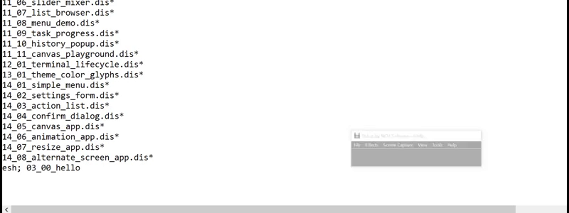

Окно помощи содержит текст `Welcome to Icurses!!` и собственную кнопку `OK`, которая закрывает только окно помощи и возвращает фокус в главное окно.

Пример также выводит небольшой фоновый текстовый блок через `canvas`. Это нужно для демонстрации слоистой отрисовки: окна и тени рисуются поверх содержимого, которое известно renderer-у. Тень в `icurses` является compositing-эффектом внутри собственного буфера renderer-а: символ ячейки сохраняется, а стиль ячейки заменяется на shadow-атрибут.

Важно понимать ограничение терминала: приложение обычно не может прочитать произвольный текст, который уже был выведен в реальную консоль до запуска. Поэтому `icurses` не может надежно затемнять старое содержимое консоли. Для демонстрации фона используется `canvas`, а для сохранения исходного экрана терминала — alternate/app screen.

Пример показывает основные принципы работы с фреймворком:

- подключение интерфейсных файлов;
- загрузку runtime-модулей;
- создание UI;
- создание общего слоя приложения;
- создание фонового canvas;
- создание окон, групп, меток и кнопок;
- использование корневого контейнера;
- вложенность контейнеров;
- отрисовку окна с тенью;
- отправку команд от кнопок;
- обработку сообщений;
- показ и скрытие группы элементов;
- использование alternate/app screen;
- корректное завершение приложения.

<details>
<summary><b>doc/icurses/examples/03_00_hello.b</b></summary>

```go
implement HelloIcurses;

include "draw.m";
include "icurses/ui.m";

HelloIcurses: module
{
	init: fn(nil: ref Draw->Context, nil: list of string);
};

sys: Sys;
ic: Icurses;
ui: IcUi;
msg: IcMsg;

out: ref Sys->FD;
appscreen: int;

AppTarget: con 1;

AppLayerId: con 10;
BackgroundId: con 11;

MainShadowId: con 20;
MainWinId: con 21;
MainTextId: con 22;
MainButtonsId: con 23;
BtnOkId: con 24;
BtnHelpId: con 25;

HelpLayerId: con 30;
HelpShadowId: con 31;
HelpWinId: con 32;
HelpTextId: con 33;
BtnHelpOkId: con 34;

AppX: con 10;
AppY: con 10;

BgCode: con "0";

loadmods()
{
	sys = load Sys Sys->PATH;
	if(sys == nil)
		raise "fail:load sys";

	ic = load Icurses Icurses->PATH;
	if(ic == nil)
		raise "fail:load icurses";

	ui = load IcUi IcUi->PATH;
	if(ui == nil)
		raise "fail:load icui";

	msg = load IcMsg IcMsg->PATH;
	if(msg == nil)
		raise "fail:load icmsg";

	ic->init();
	ui->init();
	msg->init();
}

minint(a, b: int): int
{
	if(a < b)
		return a;

	return b;
}

maxint(a, b: int): int
{
	if(a > b)
		return a;

	return b;
}

center(v, size: int): int
{
	x: int;

	x = (v - size) / 2;
	if(x < 0)
		x = 0;

	return x;
}

clamp(v, lo, hi: int): int
{
	if(hi < lo)
		hi = lo;

	if(v < lo)
		return lo;

	if(v > hi)
		return hi;

	return v;
}

enterappscreen()
{
	if(out == nil)
		return;

	if(appscreen)
		return;

	sys->fprint(out, "%c[?1049h", 27);
	ic->resettty(out);
	ic->hidecursor(out);
	ic->cleartty(out);

	appscreen = 1;
}

leaveappscreen()
{
	if(out == nil)
		return;

	ic->resettty(out);
	ic->showcursor(out);
	ic->cleartty(out);

	if(appscreen){
		sys->fprint(out, "%c[?1049l", 27);
		appscreen = 0;
	}

	ic->resettty(out);
	ic->showcursor(out);
}

sampleline(i: int): string
{
	case i % 5 {
	0 =>
		return "Renderer-owned background text. Shadow keeps glyphs and changes only their style.";

	1 =>
		return "Containers form a tree: root, windows, groups, controls, labels, and canvas nodes.";

	2 =>
		return "This short text block is drawn by canvas so layered windows can be demonstrated.";

	3 =>
		return "Terminal default colors are used here: no explicit black background is requested.";

	* =>
		return "Open Help to see a grouped window and its shadow shown and hidden together.";
	}
}

drawbackground(u: ref IcUi->Ui, w, h, y0, y1: int)
{
	y, n, lastrow: int;
	line: string;

	ui->canvasclear(u, BackgroundId, " ", BgCode);

	lastrow = h - 1;
	if(lastrow < 0)
		lastrow = 0;

	y0 = clamp(y0, 0, lastrow);
	y1 = clamp(y1, 0, lastrow);

	if(y1 < y0)
		return;

	n = 0;
	for(y = y0; y <= y1; y++){
		line = sampleline(n);
		ui->canvasputs(u, BackgroundId, 1, y, line, BgCode);
		n++;
	}

	w = w;
}

showhelp(u: ref IcUi->Ui)
{
	m: IcMsg->Msg;

	m = msg->newmsg(AppTarget, HelpLayerId, IcMsg->KindCommand, "node.show");
	ui->dispatch(u, m);

	ui->setfocus(u, BtnHelpOkId);
	ui->setstatus(u, "Help opened");
	ui->draw(u);
}

hidehelp(u: ref IcUi->Ui)
{
	m: IcMsg->Msg;

	m = msg->newmsg(AppTarget, HelpLayerId, IcMsg->KindCommand, "node.hide");
	ui->dispatch(u, m);

	ui->setfocus(u, BtnHelpId);
	ui->setstatus(u, "Help closed");
	ui->draw(u);
}

build(u: ref IcUi->Ui, sw, sh: int)
{
	root: int;
	appx, appy, appw, apph: int;
	mainx, mainy, mainw, mainh: int;
	helpx, helpy, helpw, helph: int;
	usableh, blockx, blocky, blockw, blockh: int;
	bgy0, bgy1: int;
	m: IcMsg->Msg;

	root = ui->rootid(u);

	mainw = 44;
	mainh = 9;
	helpw = 36;
	helph = 7;

	usableh = sh;
	if(usableh > 2)
		usableh -= 2;

	if(usableh < 1)
		usableh = sh;

	appx = AppX;
	appy = AppY;
	appw = sw - appx;
	apph = usableh - appy;

	if(appw < mainw){
		appx = 0;
		appw = sw;
	}

	if(apph < mainh){
		appy = 0;
		apph = usableh;
	}

	if(appw < 1)
		appw = 1;
	if(apph < 1)
		apph = 1;

	if(appw >= mainw + helpw + 6){
		blockw = mainw + helpw + 6;
		blockh = maxint(mainh, helph);

		blockx = center(appw, blockw);
		blocky = center(apph, blockh);

		mainx = blockx;
		mainy = blocky + center(blockh, mainh);

		helpx = blockx + mainw + 4;
		helpy = blocky + center(blockh, helph);
	}
	else{
		blockw = maxint(mainw, helpw);
		blockh = mainh + helph + 2;

		blockx = center(appw, blockw);
		blocky = center(apph, blockh);

		mainx = blockx + center(blockw, mainw);
		mainy = blocky;

		helpx = blockx + center(blockw, helpw);
		helpy = blocky + mainh + 2;

		if(blockh > apph){
			mainy = center(apph, mainh);
			helpy = mainy + mainh + 1;

			if(helpy + helph > apph)
				helpy = mainy - helph - 1;

			if(helpy < 0)
				helpy = clamp(mainy + mainh + 1, 0, apph - helph);
		}
	}

	mainx = clamp(mainx, 0, appw - mainw);
	helpx = clamp(helpx, 0, appw - helpw);
	mainy = clamp(mainy, 0, apph - mainh);
	helpy = clamp(helpy, 0, apph - helph);

	ui->setframestyle(u, IcPaint->FrameDouble);
	ui->setstatusrows(u, sh - 2, sh - 1);
	ui->sethelp(u, " Enter activates focused button | Tab changes focus | q/Esc exits ");

	if(ui->group(u, root, AppLayerId, appx, appy, appw, apph) < 0)
		raise "fail:app layer";

	if(ui->canvas(u, AppLayerId, BackgroundId, 0, 0, appw, apph) < 0)
		raise "fail:background canvas";

	bgy0 = minint(mainy, helpy) - 2;
	bgy1 = maxint(mainy + mainh, helpy + helph) + 1;
	drawbackground(u, appw, apph, bgy0, bgy1);

	if(ui->shadowwindow(u, AppLayerId, MainShadowId, MainWinId, mainx, mainy, mainw, mainh, " Hello ", 1, 1) < 0)
		raise "fail:main shadowwindow";

	if(ui->label(u, MainWinId, MainTextId, 4, 2, 34, "Welcome to Inferno!!") < 0)
		raise "fail:main label";

	if(ui->group(u, MainWinId, MainButtonsId, 8, 5, 28, 1) < 0)
		raise "fail:main buttons group";

	if(ui->button(u, MainButtonsId, BtnOkId, 0, 0, 10, 1, "OK", "", AppTarget, "app.ok") < 0)
		raise "fail:ok button";

	if(ui->button(u, MainButtonsId, BtnHelpId, 14, 0, 10, 1, "Help", "", AppTarget, "app.help") < 0)
		raise "fail:help button";

	if(ui->group(u, AppLayerId, HelpLayerId, 0, 0, appw, apph) < 0)
		raise "fail:help layer";

	if(ui->shadowwindow(u, HelpLayerId, HelpShadowId, HelpWinId, helpx, helpy, helpw, helph, " Help ", 1, 1) < 0)
		raise "fail:help shadowwindow";

	if(ui->label(u, HelpWinId, HelpTextId, 4, 2, 26, "Welcome to Icurses!!") < 0)
		raise "fail:help label";

	if(ui->button(u, HelpWinId, BtnHelpOkId, 13, 4, 10, 1, "OK", "", AppTarget, "app.help.ok") < 0)
		raise "fail:help ok button";

	m = msg->newmsg(AppTarget, HelpLayerId, IcMsg->KindCommand, "node.hide");
	ui->dispatch(u, m);

	ui->setfocus(u, BtnOkId);
	ui->setstatus(u, "Ready");
}

run()
{
	u: ref IcUi->Ui;
	s: IcUi->Step;
	w, h, done: int;

	out = sys->fildes(1);
	appscreen = 0;

	enterappscreen();

	(w, h) = ic->termsize();
	if(w <= 0)
		w = Icurses->DefaultCols;
	if(h <= 0)
		h = Icurses->DefaultRows;

	u = ui->new(out, w, h);
	if(u == nil){
		leaveappscreen();
		sys->print("cannot create ui\n");
		return;
	}

	build(u, w, h);
	ui->draw(u);

	if(ui->start(u) < 0){
		ui->close(u);
		leaveappscreen();
		sys->print("cannot start ui\n");
		return;
	}

	done = 0;

	for(; !done;){
		s = ui->step(u);

		case s.kind {
		IcUi->StepDone =>
			done = 1;

		IcUi->StepKey =>
			if(s.msg.cmd == "app.ok")
				done = 1;
			else if(s.msg.cmd == "app.help")
				showhelp(u);
			else if(s.msg.cmd == "app.help.ok")
				hidehelp(u);
			else
				ui->draw(u);

		IcUi->StepTick =>
			;

		IcUi->StepMouse =>
			;

		* =>
			;
		}
	}

	ui->close(u);
	leaveappscreen();

	sys->print("result: ok\n");
}

init(nil: ref Draw->Context, nil: list of string)
{
	loadmods();
	run();
}
```

</details>

Схема дерева элементов в этом примере:

```text
root
└── AppLayerId
    ├── BackgroundId
    ├── MainShadowId
    ├── MainWinId
    │   ├── MainTextId
    │   └── MainButtonsId
    │       ├── BtnOkId
    │       └── BtnHelpId
    └── HelpLayerId
        ├── HelpShadowId
        └── HelpWinId
            ├── HelpTextId
            └── BtnHelpOkId
```

Сборка примера:

```sh
limbo -I/module -o /dis/01_hello.dis doc/icurses/examples/03_00_hello.b
```

Запуск:

```sh
emu -r. /dis/03_00_hello.dis
```

См. полный пример `doc/icurses/examples/03_00_hello.b`.


### <a id="3-1">3.1</a>. Подключение интерфейсных файлов [&uarr;](#0)

В Limbo интерфейсные файлы подключаются директивой `include`.

В примере используются:

```go
include "draw.m";
include "icurses/ui.m";
```

`draw.m` нужен для стандартной сигнатуры точки входа приложения:

```go
init: fn(ctxt: ref Draw->Context, args: list of string);
```

`icurses/ui.m` подключает высокоуровневый UI-интерфейс. Через него приложение создает интерфейс, окна, группы, метки, кнопки, запускает обработку событий и выполняет отрисовку.

`Icurses` является базовым runtime-модулем фреймворка. Приложение явно загружает и инициализирует его:

```go
ic = load Icurses Icurses->PATH;
ic->init();
```

При этом в текущей include-иерархии `Icurses` уже становится видимым через `icurses/ui.m`. Поэтому в простом приложении не нужно одновременно писать:

```go
include "icurses/icurses.m";
include "icurses/ui.m";
```

Такое двойное подключение может привести к повторным объявлениям, если один интерфейс уже включен через другой.

Правило для первого приложения:

- подключаем `draw.m`;
- подключаем `icurses/ui.m`;
- загружаем runtime-модули, функции которых вызываем напрямую.

Более подробная схема подключений описывается в разделе [4. Подключение модулей](#4).

См. также пример `doc/icurses/examples/03_01_runtime_setup.b`, показывающий подключение интерфейсных файлов, загрузку runtime-модулей, инициализацию и создание `Ui`.


### <a id="3-2">3.2</a>. Загрузка runtime-модулей [&uarr;](#0)

После подключения интерфейсных файлов приложение должно загрузить runtime-модули через `load`.

В примере используются:

- `Sys` — системные вызовы Inferno;
- `Icurses` — низкоуровневая работа с терминалом и размером консоли;
- `IcUi` — основной UI-уровень;
- `IcMsg` — создание сообщений для команд `node.show` и `node.hide`.

Интерфейсный файл дает программе имя модуля и его `PATH`, но сам модуль нужно загрузить явно:

```go
sys = load Sys Sys->PATH;
ic = load Icurses Icurses->PATH;
ui = load IcUi IcUi->PATH;
msg = load IcMsg IcMsg->PATH;
```

Каждую загрузку лучше проверять. Если модуль не загрузился, приложение должно завершиться с понятной ошибкой.

В примере это вынесено в отдельную функцию `loadmods()`.

См. также пример `doc/icurses/examples/03_01_runtime_setup.b`, показывающий подключение интерфейсных файлов, загрузку runtime-модулей, инициализацию и создание `Ui`.


### <a id="3-3">3.3</a>. Инициализация модулей [&uarr;](#0)

После `load` у модулей вызывается `init()`:

```go
ic->init();
ui->init();
msg->init();
```

`init()` подготавливает внутреннее состояние модуля. Некоторые модули внутри `init()` загружают и инициализируют собственные зависимости. Поэтому правило простое: если приложение загрузило модуль и собирается вызывать его функции, модуль нужно инициализировать.

Исключение составляют только модули, у которых нет `init()` или где документация явно говорит, что инициализация не нужна.

См. также пример `doc/icurses/examples/03_01_runtime_setup.b`, показывающий подключение интерфейсных файлов, загрузку runtime-модулей, инициализацию и создание `Ui`.


### <a id="3-4">3.4</a>. Создание интерфейса [&uarr;](#0)

Перед созданием UI приложению нужен файловый дескриптор вывода и размер терминала.

В примере вывод идет в stdout:

```go
out = sys->fildes(1);
```

Пример использует alternate/app screen:

```go
enterappscreen();
```

Это позволяет приложению рисовать на отдельном экране терминала. При выходе вызывается:

```go
leaveappscreen();
```

После этого терминал возвращает исходное содержимое, которое было видно до запуска приложения.

Размер терминала получается через `Icurses->termsize()`:

```go
(w, h) = ic->termsize();
```

Данная функция читает актуальные размеры терминала из устройства `/dev/consinfo`, имеющегося в модифицированной версии ОС Инферно.

Если размер не удалось определить, используются стандартные значения:

```go
if(w <= 0)
	w = Icurses->DefaultCols;
if(h <= 0)
	h = Icurses->DefaultRows;
```

После этого создается UI:

```go
u = ui->new(out, w, h);
```

При создании UI фреймворк создает корневой контейнер. Все остальные элементы приложения добавляются внутрь него напрямую или через вложенные контейнеры.

Идентификатор корневого контейнера можно получить так:

```go
root = ui->rootid(u);
```

Сразу после создания `Ui` приложение при необходимости может перенастроить клавиши выхода из UI-цикла:

```go
ui->setquitkeys(u, "F10", "");
```

Здесь `F10` становится основной клавишей выхода, а пустая строка `""` отключает вторую fallback-клавишу. Если `setquitkeys()` не вызывать, по умолчанию используются `q` и `Q`.

В примере все видимые элементы помещаются в общий контейнер `AppLayerId`. Этот контейнер сдвинут относительно корня и задает локальную систему координат для фонового canvas, главного окна и окна помощи.

См. также пример `doc/icurses/examples/03_02_build_tree_step_by_step.b`, показывающий построение дерева интерфейса из root-контейнера, слоя, окна, групп, меток и кнопок.


### <a id="3-5">3.5</a>. Добавление элементов [&uarr;](#0)

В примере создаются:

- общий слой приложения `AppLayerId`;
- фоновый canvas `BackgroundId` внутри слоя приложения;
- главное окно `MainWinId` и его тень `MainShadowId`;
- группа кнопок `MainButtonsId` внутри главного окна;
- слой окна помощи `HelpLayerId`;
- окно помощи `HelpWinId` и его тень `HelpShadowId` внутри этого слоя.

В примере эти API ID заданы как `con`, чтобы код был простым и стабильным:

```go
AppLayerId: con 10;
BackgroundId: con 11;
```

Слой приложения создается так:

```go
if(ui->group(u, root, AppLayerId, appx, appy, appw, apph) < 0)
	raise "fail:app layer";
```

Все элементы примера добавляются уже внутрь этого слоя. Поэтому смещение `AppLayerId` перемещает сразу весь интерфейс примера: canvas, окна, тени и группы.

Фоновый canvas создается внутри `AppLayerId`:

```go
if(ui->canvas(u, AppLayerId, BackgroundId, 0, 0, appw, apph) < 0)
	raise "fail:background canvas";
```

На canvas выводится короткий текстовый блок. Он используется для демонстрации того, как окна и тени ложатся поверх содержимого, известного renderer-у.

Главное окно с тенью тоже добавляется в `AppLayerId`:

```go
if(ui->shadowwindow(u, AppLayerId, MainShadowId, MainWinId, mainx, mainy, mainw, mainh, " Hello ", 1, 1) < 0)
	raise "fail:main shadowwindow";
```

`shadowwindow()` создает два узла: узел тени и узел окна. Поэтому ему передаются два ID: `MainShadowId` и `MainWinId`.

Окно само используется как контейнер для дочерних элементов:

```go
if(ui->label(u, MainWinId, MainTextId, 4, 2, 34, "Welcome to Inferno!!") < 0)
	raise "fail:main label";
```

После этого создается группа кнопок:

```go
if(ui->group(u, MainWinId, MainButtonsId, 8, 5, 28, 1) < 0)
	raise "fail:main buttons group";
```

Кнопки добавляются уже внутрь группы:

```go
if(ui->button(u, MainButtonsId, BtnOkId, 0, 0, 10, 1, "OK", "", AppTarget, "app.ok") < 0)
	raise "fail:ok button";

if(ui->button(u, MainButtonsId, BtnHelpId, 14, 0, 10, 1, "Help", "", AppTarget, "app.help") < 0)
	raise "fail:help button";
```

У кнопки есть целевой адрес и команда. В примере `AppTarget` — числовой адрес прикладного обработчика команд, а `app.ok` и `app.help` — строковые команды. Приложение увидит эти команды в основном цикле.

Окно помощи помещено в отдельный слой-контейнер:

```go
if(ui->group(u, AppLayerId, HelpLayerId, 0, 0, appw, apph) < 0)
	raise "fail:help layer";
```

Внутри этого слоя создается окно с тенью:

```go
if(ui->shadowwindow(u, HelpLayerId, HelpShadowId, HelpWinId, helpx, helpy, helpw, helph, " Help ", 1, 1) < 0)
	raise "fail:help shadowwindow";
```

Это важно: `shadowwindow()` создает не только окно, но и отдельный элемент тени. Если скрывать только окно, тень останется видимой. Поэтому в примере показывается и скрывается весь контейнер `HelpLayerId`, в котором находятся и окно, и его тень.

См. также пример `doc/icurses/examples/03_02_build_tree_step_by_step.b`, показывающий построение дерева интерфейса из root-контейнера, слоя, окна, групп, меток и кнопок.


### <a id="3-6">3.6</a>. Отрисовка [&uarr;](#0)

После создания дерева элементов приложение вызывает:

```go
ui->draw(u);
```

Эта функция отрисовывает текущее состояние интерфейса.

Если приложение меняет текст, статус, видимость элементов или фокус, после изменения обычно нужно снова вызвать `ui->draw(u)`.

В примере окно помощи показывается и скрывается через команды `node.show` и `node.hide`. После каждой такой операции приложение вызывает `ui->draw(u)`, чтобы обновить экран.

Фоновый canvas рисуется до окон, потому что он находится раньше в дереве элементов. Затем поверх него рисуются тени, окна, labels и buttons.

См. также пример `doc/icurses/examples/03_03_redraw_counter.b`, показывающий изменение прикладного состояния, обновление элементов дерева и явный вызов `ui->draw()`.


### <a id="3-7">3.7</a>. Цикл обработки событий [&uarr;](#0)

После построения интерфейса приложение запускает UI:

```go
if(ui->start(u) < 0){
	ui->close(u);
	leaveappscreen();
	sys->print("cannot start ui\n");
	return;
}
```

Затем приложение входит в цикл обработки событий. В этом примере используется step-модель:

```go
s = ui->step(u);
```

Каждый шаг имеет тип:

- `IcUi->StepDone` — работа завершена;
- `IcUi->StepKey` — получена клавиша и, возможно, сообщение;
- `IcUi->StepTick` — событие таймера;
- `IcUi->StepMouse` — событие мыши.

В примере приложение реагирует на команды:

- `app.ok` — выйти из программы;
- `app.help` — показать окно помощи;
- `app.help.ok` — скрыть окно помощи.

Показ окна помощи:

```go
m = msg->newmsg(AppTarget, HelpLayerId, IcMsg->KindCommand, "node.show");
ui->dispatch(u, m);
```

Скрытие окна помощи:

```go
m = msg->newmsg(AppTarget, HelpLayerId, IcMsg->KindCommand, "node.hide");
ui->dispatch(u, m);
```

Так как окно помощи и его тень находятся внутри контейнера `HelpLayerId`, управление видимостью этого контейнера управляет всей группой дочерних элементов.

См. также пример `doc/icurses/examples/03_04_step_loop_commands.b`, показывающий step-цикл, обработку `StepKey` и получение команд как от кнопок, так и от глобальных key binding.


### <a id="3-8">3.8</a>. Завершение [&uarr;](#0)

При завершении нужно вызвать:

```go
ui->close(u);
```

`ui->close()` останавливает UI, закрывает ввод и renderer. Это важно: терминальное приложение может переводить клавиатуру в raw-режим, скрывать курсор, включать мышь или использовать служебные процессы чтения ввода. Если завершить программу без очистки, терминал может остаться в неправильном состоянии.

Так как пример использует alternate/app screen, после закрытия UI вызывается:

```go
leaveappscreen();
```

Это возвращает терминал к обычному экрану и восстанавливает видимое содержимое консоли, которое было до запуска приложения.

В простом приложении завершение выглядит так:

```go
ui->close(u);
leaveappscreen();

sys->print("result: ok\n");
```

См. также пример `doc/icurses/examples/03_05_clean_shutdown.b`, показывающий аккуратное завершение приложения, закрытие `Ui` и восстановление состояния терминала.


## <a id="4">4</a>. Подключение модулей [&uarr;](#0)

`icurses` состоит из набора связанных модулей. Часть модулей образует низкоуровневую основу для работы с терминалом, клавиатурой, размером консоли и управляющими последовательностями. Другая часть строит поверх этого дерево элементов, renderer, обработку сообщений, виджеты и вспомогательные интерфейсы.

При подключении `icurses` важно различать три уровня:

- интерфейсные файлы `.m`, которые подключаются через `include`;
- runtime-модули `.dis`, которые загружаются через `load`;
- инициализацию загруженных модулей через `init`.

Для прикладного кода главное правило такое: подключать нужно интерфейс того уровня, с которым приложение работает напрямую. Если приложение использует высокоуровневый UI-слой, обычно достаточно подключить `icurses/ui.m`. Если приложение работает только с низкоуровневыми функциями терминала, можно подключить `icurses/icurses.m`.

`Icurses` является базовым модулем фреймворка. Он отвечает за низкоуровневую работу с терминалом, клавиатурой, размерами консоли и базовыми управляющими последовательностями. При этом высокоуровневые интерфейсы могут делать объявления `Icurses` видимыми через свою цепочку зависимостей. Поэтому базовый модуль не всегда нужно подключать отдельной строкой `include`.

Практическая задача этого раздела — показать безопасные схемы подключения и объяснить, где возникают повторные объявления.


### <a id="4-1">4.1</a>. `include` [&uarr;](#0)

`include` подключает интерфейсный файл `.m` к коду приложения. Через интерфейсный файл становятся видимыми типы, константы и сигнатуры функций соответствующего модуля.

Для обычного приложения, использующего высокоуровневый UI-слой, базовый набор выглядит так:

```go
include "draw.m";
include "icurses/ui.m";
```

`draw.m` нужен для стандартной сигнатуры точки входа приложения:

```go
init: fn(ctxt: ref Draw->Context, args: list of string);
```

`icurses/ui.m` подключает основной UI facade. Через него приложение создает интерфейс, окна, группы, метки, кнопки, canvas, запускает event loop и выполняет отрисовку.

`Icurses` является базовым модулем фреймворка. Однако для UI-приложения его объявления уже становятся видимыми через цепочку подключений от `icurses/ui.m`. Поэтому в обычном UI-приложении не нужно одновременно писать:

```go
include "icurses/icurses.m";
include "icurses/ui.m";
```

Такой вариант может привести к повторным объявлениям, если один и тот же интерфейс подключается напрямую и одновременно приходит через вложенный include-граф.

Текущая основная цепочка для `icurses/ui.m` выглядит так:

```text
icurses/ui.m
├── icurses/paint.m
│   ├── icurses/view.m
│   ├── icurses/glyph.m
│   │   └── icurses/theme.m
│   │       └── icurses/icurses.m
│   │           └── sys.m
│   └── icurses/canvas.m
└── icurses/keymap.m
    └── icurses/msg.m
```

Из этой цепочки видно, что `icurses/ui.m` уже подтягивает значительную часть базовых интерфейсов, включая объявления `Icurses`.

Если приложение работает только с низкоуровневыми возможностями терминала и не использует UI-слой, оно может подключать `icurses/icurses.m` напрямую:

```go
include "draw.m";
include "icurses/icurses.m";
```

Если приложение использует `IcUi`, обычно следует подключать `icurses/ui.m` и не добавлять прямой include низкоуровневых интерфейсов без необходимости.

Общее правило:

```text
Use the highest-level icurses interface that matches the code you call directly.
```

См. также пример `doc/icurses/examples/04_01_simple_ui_modules.b`, показывающий безопасную схему подключения обычного UI-приложения: `include "icurses/ui.m"`, явный `load` используемых runtime-модулей и вызов `init()` для модулей, функции которых приложение вызывает напрямую.


### <a id="4-2">4.2</a>. `load` [&uarr;](#0)

`load` загружает runtime-модуль из `.dis`-файла.

Например:

```go
sys = load Sys Sys->PATH;
ic = load Icurses Icurses->PATH;
ui = load IcUi IcUi->PATH;
msg = load IcMsg IcMsg->PATH;
```

Интерфейсный файл делает модуль видимым для компилятора, но не загружает его реализацию. Если в коде объявлена переменная модуля:

```go
ui: IcUi;
```

то она начнет указывать на загруженный runtime-модуль только после:

```go
ui = load IcUi IcUi->PATH;
```

Приложение обычно загружает только те runtime-модули, функции которых вызывает напрямую.

Например, если приложение вызывает:

```go
ic->termsize();
ui->new(out, w, h);
msg->newmsg(AppTarget, targetnodeid, IcMsg->KindCommand, "cmd");
```

то оно должно загрузить:

```go
ic = load Icurses Icurses->PATH;
ui = load IcUi IcUi->PATH;
msg = load IcMsg IcMsg->PATH;
```

При этом приложение не обязано напрямую загружать все внутренние зависимости `IcUi`, если оно не обращается к ним напрямую. `IcUi->init()` загружает собственные внутренние зависимости, необходимые для работы UI-слоя.

Но если приложение само вызывает функции другого модуля, этот модуль должен быть загружен явно. Например, если приложение напрямую вызывает функции `IcView`, `IcPaint`, `IcButton`, `IcInput`, `IcList` или другого helper-модуля, то оно должно иметь соответствующую переменную модуля и выполнить `load`.

Каждую загрузку лучше проверять:

```go
ui = load IcUi IcUi->PATH;
if(ui == nil)
	raise "fail:load icui";
```

Такое сообщение проще диагностировать, чем последующее обращение к `nil`-модулю.

См. также пример `doc/icurses/examples/04_01_simple_ui_modules.b`, показывающий безопасную схему подключения обычного UI-приложения: `include "icurses/ui.m"`, явный `load` используемых runtime-модулей и вызов `init()` для модулей, функции которых приложение вызывает напрямую.


### <a id="4-3">4.3</a>. `init` [&uarr;](#0)

После успешного `load` модуль обычно нужно инициализировать:

```go
ic->init();
ui->init();
msg->init();
```

`init()` подготавливает модуль к работе. Конкретные действия зависят от модуля.

`Icurses` подготавливает внутреннее состояние для работы с клавиатурой и консолью.

`IcUi` при инициализации загружает и инициализирует внутренние зависимости, необходимые для работы UI-слоя.

`IcMsg` подготавливает состояние для создания сообщений.

Общее правило:

```text
Если модуль загружен и его функции вызываются напрямую, надо вызвать его метод init().
```

Исключение возможно только для модулей, у которых нет `init()` или где явно указано, что инициализация не требуется.

__Важно__: `init()` одного модуля не заменяет загрузку другого модуля в приложении, если приложение само обращается к этому другому модулю.

Например, `IcUi->init()` может загрузить `IcPaint` для внутренних нужд UI-слоя. Но если само приложение хочет вызвать:

```go
paint->clear(r);
```

то приложение должно иметь собственную переменную:

```go
paint: IcPaint;
```

и выполнить:

```go
paint = load IcPaint IcPaint->PATH;
if(paint == nil)
	raise "fail:load icpaint";

paint->init();
```

См. также пример `doc/icurses/examples/04_01_simple_ui_modules.b`, показывающий безопасную схему подключения обычного UI-приложения: `include "icurses/ui.m"`, явный `load` используемых runtime-модулей и вызов `init()` для модулей, функции которых приложение вызывает напрямую.


### <a id="4-4">4.4</a>. Риск повторных объявлений [&uarr;](#0)

Интерфейсные файлы `.m` в коде приложения разворачиваются как набор объявлений. Если один и тот же модульный интерфейс попадает в исходный файл несколькими путями, можно получить повторные объявления.

Типичный опасный случай:

```go
include "icurses/icurses.m";
include "icurses/ui.m";
```

Проблема в том, что `icurses/ui.m` уже приводит к подключению `icurses/icurses.m` через вложенную цепочку:

```text
icurses/ui.m
└── icurses/paint.m
    └── icurses/glyph.m
        └── icurses/theme.m
            └── icurses/icurses.m
```

Поэтому прямое подключение `icurses/icurses.m` рядом с `icurses/ui.m` может оказаться повторным.

Такая же проблема возможна и с другими интерфейсами. Например, многие helper-модули сами включают `icurses/ui.m`:

```text
icurses/button.m
└── icurses/ui.m

icurses/control.m
└── icurses/ui.m

icurses/input.m
└── icurses/ui.m

icurses/list.m
└── icurses/ui.m
```

`icurses/form.m` включает `icurses/input.m`, а тот уже включает `icurses/ui.m`:

```text
icurses/form.m
└── icurses/input.m
    └── icurses/ui.m
```

Из-за этого не следует подключать интерфейсы по принципу “все, что может пригодиться”. Лучше подключать один верхнеуровневый интерфейс, который соответствует уровню приложения.

Для простого UI-приложения:

```go
include "draw.m";
include "icurses/ui.m";
```

Для приложения, которое напрямую использует helper-модуль, можно подключить его интерфейс вместо прямого подключения `ui.m`, если этот helper уже включает UI-интерфейс.

Например:

```go
include "draw.m";
include "icurses/list.m";
```

Такой include уже делает видимым `IcUi`, потому что `icurses/list.m` включает `icurses/ui.m`.

Но если приложение использует несколько helper-модулей, каждый из которых включает `ui.m`, возможно повторное подключение. В таких случаях нужно выбирать структуру подключений осторожно. Иногда лучше использовать один фасадный интерфейс, иногда — объявить минимальный локальный интерфейс для нужных функций, как это сделано в некоторых внутренних модулях.

Общее правило:

```text
Do not include both a low-level interface and a high-level interface
if the high-level interface already includes the low-level one.
```

И еще одно правило:

```text
Include the interface that matches the highest abstraction level used directly
by the current source file.
```

См. также пример `doc/icurses/examples/04_01_simple_ui_modules.b`: он показывает безопасный вариант, где приложение подключает high-level interface `icurses/ui.m` и не дублирует низкоуровневые includes без необходимости.


### <a id="4-5">4.5</a>. Рекомендуемые схемы подключения [&uarr;](#0)

Ниже приведены типовые схемы подключения для разных видов приложений.

См. также пример `doc/icurses/examples/04_01_simple_ui_modules.b`, демонстрирующий рекомендуемую схему для обычного UI-приложения.


#### Простое UI-приложение

Для обычного приложения с окнами, метками, кнопками, canvas и стандартным event loop:

```go
include "draw.m";
include "icurses/ui.m";
```

Runtime-модули:

```go
sys = load Sys Sys->PATH;
ic = load Icurses Icurses->PATH;
ui = load IcUi IcUi->PATH;
msg = load IcMsg IcMsg->PATH;
```

Инициализация:

```go
ic->init();
ui->init();
msg->init();
```

`IcMsg` нужен только если приложение само создает сообщения через `msg->newmsg()`. Если приложение только получает сообщения от `ui->step()` и не создает свои, прямой `load IcMsg` может не понадобиться.

Для более крупных приложений можно дополнительно использовать `IcApp`. Этот helper-модуль стандартизует имя приложения, диагностические сообщения, доступ к stdout/stderr и короткие вызовы для status/help. Он не заменяет `IcUi`, но может уменьшить повторяющийся startup-код.

См. также пример `doc/icurses/examples/04_01_simple_ui_modules.b`, демонстрирующий рекомендуемую схему для обычного UI-приложения.


#### Низкоуровневое терминальное приложение

Если приложение не использует UI-дерево и renderer, а работает только с терминалом, клавиатурой, размером консоли и escape-последовательностями:

```go
include "draw.m";
include "icurses/icurses.m";
```

Runtime-модули:

```go
sys = load Sys Sys->PATH;
ic = load Icurses Icurses->PATH;
```

Инициализация:

```go
ic->init();
```

Такой вариант подходит для небольших терминальных утилит, тестов низкоуровневого ввода, аудита клавиатурных кодов или экспериментов с консолью.

См. также пример `doc/icurses/examples/04_02_low_level_terminal.b`, демонстрирующий схему приложения, которое использует только низкоуровневый модуль `Icurses` без `IcUi`, дерева элементов и renderer-а. Этот пример также полезен для просмотра фактических key codes и имен, возвращаемых `Icurses->keyname()`.


#### Приложение со списком

Если приложение напрямую использует `IcList` как helper-модуль:

```go
include "draw.m";
include "icurses/list.m";
```

`icurses/list.m` уже включает `icurses/ui.m`, поэтому отдельный include `icurses/ui.m` рядом с ним может быть лишним.

Runtime-модули зависят от того, какие функции приложение вызывает напрямую. Обычно это:

```go
sys = load Sys Sys->PATH;
ic = load Icurses Icurses->PATH;
ui = load IcUi IcUi->PATH;
list = load IcList IcList->PATH;
```

Если приложение создает сообщения напрямую:

```go
msg = load IcMsg IcMsg->PATH;
```

Инициализация:

```go
ic->init();
ui->init();
list->init();
```

Если загружен `msg`, он также инициализируется:

```go
msg->init();
```


#### Приложение с формой

Если приложение напрямую использует `IcForm`:

```go
include "draw.m";
include "icurses/form.m";
```

`icurses/form.m` включает `icurses/input.m`, а тот включает `icurses/ui.m`.

Runtime-модули:

```go
sys = load Sys Sys->PATH;
ic = load Icurses Icurses->PATH;
ui = load IcUi IcUi->PATH;
form = load IcForm IcForm->PATH;
```

Если приложение напрямую работает с сообщениями:

```go
msg = load IcMsg IcMsg->PATH;
```

Инициализация:

```go
ic->init();
ui->init();
form->init();
```

Если загружен `msg`:

```go
msg->init();
```


#### Приложение с canvas

Если приложение использует canvas только через функции `IcUi`, достаточно:

```go
include "draw.m";
include "icurses/ui.m";
```

Например:

```go
if(ui->canvas(u, parentid, CanvasId, 0, 0, w, h) < 0)
	raise "fail:canvas";

ui->canvasclear(u, CanvasId, " ", "0");
ui->canvasputs(u, CanvasId, 1, 1, "text", "0");
```

В этом случае приложение не обязано напрямую подключать `icurses/canvas.m`.

Если приложение хочет напрямую работать с `IcCanvas`, тогда нужен отдельный include и отдельный `load`, но такой вариант относится уже к более низкому уровню и должен использоваться осознанно.


#### Приложение с кнопочными helper-функциями

Обычные кнопки можно создавать через `IcUi`:

```go
include "draw.m";
include "icurses/ui.m";
```

Если приложение хочет напрямую использовать helper-модуль `IcButton`, например для visual press или ручной активации кнопки, можно подключить:

```go
include "draw.m";
include "icurses/button.m";
```

`icurses/button.m` уже включает `icurses/ui.m`.

Runtime-модули:

```go
sys = load Sys Sys->PATH;
ic = load Icurses Icurses->PATH;
ui = load IcUi IcUi->PATH;
button = load IcButton IcButton->PATH;
```

Инициализация:

```go
ic->init();
ui->init();
button->init();
```

См. также пример `doc/icurses/examples/04_03_button_helper_module.b`, демонстрирующий схему подключения helper-модуля `IcButton`, когда приложение вызывает его функции напрямую.


#### Общая рекомендация

Для прикладного кода лучше начинать с самого простого варианта:

```go
include "draw.m";
include "icurses/ui.m";
```

И добавлять другие интерфейсы только тогда, когда приложение действительно вызывает функции этих модулей напрямую.

Если появляется ошибка повторного объявления, нужно проверить include-граф: возможно, один из интерфейсов уже был подключен через другой.

На текущем этапе API и структура документации развиваются, поэтому схемы подключения могут уточняться. Но базовый принцип остается прежним:

```text
include управляет видимостью во время компиляции;
load управляет доступностью во время выполнения;
init подготавливает загруженный модуль к использованию.
```


## <a id="5">5</a>. Дерево элементов [&uarr;](#0)

Дерево элементов — центральная структура `icurses`. Оно хранит все узлы интерфейса, их иерархию, локальную геометрию, состояние видимости и доступности, порядок дочерних элементов и текущий фокус.

На уровне реализации дерево представлено структурами `IcView->Tree` и `IcView->Node`. Высокоуровневый модуль `IcUi` скрывает большую часть прямой работы с `IcView`, но приложение все равно работает по правилам дерева: создает узлы, задает их ID, передает эти ID в вызовы `IcUi`, показывает и скрывает контейнеры, меняет текст, управляет фокусом и отправляет сообщения.

Дерево нужно не только для хранения элементов. На нем основаны:

- вложенная геометрия;
- отрисовка контейнеров и виджетов;
- порядок слоев;
- показ и скрытие целых групп;
- включение и отключение поддеревьев;
- поиск фокусируемых элементов;
- адресация сообщений.


### <a id="5-1">5.1</a>. Корневой элемент [&uarr;](#0)

Корневой элемент создается автоматически при создании UI:

```go
u = ui->new(out, w, h);
```

После этого приложение получает ID корня:

```go
root = ui->rootid(u);
```

`root` имеет тип `int`. Корневой узел представляет всю рабочую область интерфейса. Обычно его координаты соответствуют `(0, 0)`, а размеры соответствуют размерам renderer-а.

Все остальные элементы должны быть потомками корня. Приложение может добавлять элементы прямо в корень, но для реальных экранов обычно удобнее сначала создать один или несколько контейнеров верхнего уровня:

```go
root = ui->rootid(u);

if(ui->group(u, root, AppLayerId, 0, 0, w, h) < 0)
	raise "fail:app layer";
```

Такой контейнер верхнего уровня становится основой экрана приложения. Его можно переместить, скрыть, отключить или пересоздать вместе со всеми дочерними элементами.

См. также пример `doc/icurses/examples/05_01_root_element.b`, показывающий корневой контейнер `Ui`, первый пользовательский слой и дерево `root -> layer -> window -> controls`.


### <a id="5-2">5.2</a>. Идентификаторы [&uarr;](#0)

В качестве идентификаторов обычный прикладной код использует числовые ID. Для небольших примеров удобно использовать `con`:

```go
AppTarget: con 1;

AppLayerId: con 10;
MainWinId: con 21;
BtnOkId: con 24;
```

Конструкторы UI принимают ID как числовой аргумент:

```go
if(ui->group(u, root, AppLayerId, 0, 0, 80, 24) < 0)
	raise "fail:group";

if(ui->window(u, AppLayerId, MainWinId, 2, 1, 40, 10, " Main ") < 0)
	raise "fail:window";

if(ui->button(u, MainWinId, BtnOkId, 10, 7, 8, 1, "OK", "", AppTarget, "app.ok") < 0)
	raise "fail:button";
```

ID должен быть уникальным внутри дерева. Если два узла получат один и тот же ID, поиск, фокус, dispatch и отрисовка будут работать непредсказуемо или вернут ошибку при создании узла.

Отдельный случай — функции, создающие несколько узлов. Например, `shadowwindow()` создает и тень, и окно. Поэтому она принимает два ID:

```go
if(ui->shadowwindow(u, parentid, ShadowId, WinId, x, y, w, h, " Title ", 1, 1) < 0)
	raise "fail:shadowwindow";
```

ID действителен только пока существует соответствующий узел в текущем дереве. Если узел удален или UI полностью пересоздан, старый ID использовать нельзя.

Особенно важно помнить это при resize. Если приложение уничтожает старый UI и строит новый, оно должно заново построить дерево и использовать ID, корректные для нового дерева. Если IDs заданы как стабильные константы, rebuild должен заново создать узлы с теми же константами. Если приложение использует динамическую выдачу ID, оно должно заново сохранить все полученные значения.

В сообщениях поля `src` и `dst` также имеют тип `int`:

```go
m = msg->newmsg(AppTarget, HelpLayerId, IcMsg->KindCommand, "node.hide");
```

Команды при этом остаются строками:

```go
"node.hide"
"app.ok"
"app.help"
```

См. также пример `doc/icurses/examples/05_02_stable_ids.b`, показывающий использование стабильных числовых ID как адресов узлов при обновлении элемента.


### <a id="5-3">5.3</a>. Родитель и дочерние элементы [&uarr;](#0)

Каждый узел, кроме корня, имеет родителя. Внутри дерева эта связь хранится через `parentid: int`.

Дочерние элементы хранятся как массив ID:

```text
children: array of int
```

Когда приложение создает узел через `IcUi`, оно указывает родителя:

```go
if(ui->group(u, root, AppLayerId, 0, 0, 80, 24) < 0)
	raise "fail:group";

if(ui->window(u, AppLayerId, MainWinId, 2, 1, 40, 10, " Main ") < 0)
	raise "fail:window";

if(ui->label(u, MainWinId, MainTextId, 2, 2, 20, "Hello") < 0)
	raise "fail:label";
```

Получается дерево:

```text
root
└── AppLayerId
    └── MainWinId
        └── MainTextId
```

Порядок детей важен. Он влияет на порядок отрисовки и на порядок обхода дерева. Элемент, добавленный позже, обычно находится выше в визуальном слое, если renderer рисует детей последовательно.

Контейнеры позволяют управлять сразу группой узлов. Например, если окно помощи, его тень, текст и кнопка находятся внутри одного контейнера `HelpLayerId`, то достаточно скрыть этот контейнер:

```go
m = msg->newmsg(AppTarget, HelpLayerId, IcMsg->KindCommand, "node.hide");
ui->dispatch(u, m);
```

После этого все дочерние элементы контейнера перестают участвовать в отрисовке и вводе как часть этого поддерева.

См. также пример `doc/icurses/examples/05_03_parent_children.b`, показывающий parent/child-структуру и управление целой веткой дерева через родительский group-node.


### <a id="5-4">5.4</a>. Координаты и размеры [&uarr;](#0)

Каждый узел хранит локальные координаты `x`, `y` и размеры `w`, `h`.

Координаты всегда задаются относительно родителя:

```go
root = ui->rootid(u);

if(ui->group(u, root, AppLayerId, 10, 5, 60, 20) < 0)
	raise "fail:group";

if(ui->window(u, AppLayerId, MainWinId, 2, 1, 30, 8, " Window ") < 0)
	raise "fail:window";

if(ui->label(u, MainWinId, MainTextId, 3, 2, 12, "Hello") < 0)
	raise "fail:label";
```

В этом примере:

- `AppLayerId` находится в `(10, 5)` относительно корня;
- `MainWinId` находится в `(2, 1)` относительно `AppLayerId`;
- `MainTextId` находится в `(3, 2)` относительно `MainWinId`.

Абсолютная позиция `MainTextId` получается суммированием координат по цепочке родителей.

Такая модель позволяет перемещать контейнер целиком. Если изменить положение `AppLayerId`, все дочерние элементы останутся на своих локальных местах внутри `AppLayerId`, но их абсолютные координаты на экране изменятся.

Это особенно полезно для:

- диалогов;
- панелей;
- групп кнопок;
- модальных слоев;
- адаптивного layout;
- rebuild после resize.

См. также пример `doc/icurses/examples/05_04_local_coordinates.b`, показывающий локальные координаты дочерних элементов внутри перемещаемого родительского контейнера.


### <a id="5-5">5.5</a>. Видимость и доступность [&uarr;](#0)

У каждого узла есть состояние видимости и доступности.

Видимость определяет, будет ли узел рисоваться. Доступность определяет, будет ли узел участвовать в обработке ввода.

Важно, что итоговая видимость зависит не только от самого узла, но и от всех его родителей. Если скрыт контейнер, то все его потомки тоже фактически скрыты.

Поэтому для модальных окон и временных панелей удобно создавать отдельный контейнер:

```go
if(ui->group(u, AppLayerId, HelpLayerId, 0, 0, appw, apph) < 0)
	raise "fail:help layer";

if(ui->shadowwindow(u, HelpLayerId, HelpShadowId, HelpWinId, helpx, helpy, helpw, helph, " Help ", 1, 1) < 0)
	raise "fail:help shadowwindow";
```

Чтобы скрыть всю группу:

```go
m = msg->newmsg(AppTarget, HelpLayerId, IcMsg->KindCommand, "node.hide");
ui->dispatch(u, m);
ui->draw(u);
```

Чтобы снова показать:

```go
m = msg->newmsg(AppTarget, HelpLayerId, IcMsg->KindCommand, "node.show");
ui->dispatch(u, m);
ui->draw(u);
```

Такой подход надежнее, чем скрывать отдельные элементы по одному.

См. также пример `doc/icurses/examples/05_05_visibility_accessibility.b`, показывающий скрытие группы элементов и отключение отдельного focusable/actionable узла.


### <a id="5-6">5.6</a>. Фокусируемость [&uarr;](#0)

Фокус — это текущий интерактивный узел, который получает клавиатурное действие по умолчанию.

Не каждый узел может получить фокус. Обычно фокусируемыми являются:

- кнопки;
- поля ввода;
- списки;
- меню;
- slider;
- переключатели.

Служебные группы, labels, декоративные узлы и canvas обычно не получают фокус сами по себе.

Фокус хранится как `int` ID узла. Установка фокуса выглядит так:

```go
ui->setfocus(u, BtnOkId);
```

Если приложение скрывает контейнер, внутри которого находился текущий фокус, нужно перевести фокус на другой видимый и доступный элемент:

```go
ui->setfocus(u, BtnHelpId);
```

Именно так работает пример из раздела 3: при открытии help-окна фокус переводится на кнопку `BtnHelpOkId`, а при закрытии возвращается на `BtnHelpId`.

Фокусируемость зависит не только от самого узла, но и от его родителей. Если родительский контейнер скрыт или отключен, дочерний элемент не должен участвовать в нормальной навигации фокуса.

См. также пример `doc/icurses/examples/05_06_focusability.b`, показывающий, как скрытые и disabled-кнопки выпадают из практической навигации по фокусу.


### <a id="5-7">5.7</a>. Изменение дерева во время работы [&uarr;](#0)

Дерево интерфейса можно менять во время работы приложения.

Типичные изменения:

- обновить текст;
- поменять содержимое;
- показать или скрыть контейнер;
- включить или отключить часть интерфейса;
- изменить фокус;
- добавить новый узел;
- удалить поддерево;
- полностью пересоздать UI.

После изменения состояния дерева обычно нужна отрисовка:

```go
ui->draw(u);
```

Небольшие изменения лучше делать точечно:

```go
ui->settext(u, MainTextId, "New text");
ui->draw(u);
```

Для временных окон удобно заранее создать поддерево и затем показывать или скрывать контейнер:

```go
m = msg->newmsg(AppTarget, HelpLayerId, IcMsg->KindCommand, "node.show");
ui->dispatch(u, m);
ui->draw(u);
```

При сильном изменении структуры экрана, например после resize, часто проще пересоздать весь UI:

1. закрыть или отсоединить старый UI;
2. создать новый UI с новой геометрией;
3. заново вызвать `build`;
4. заново создать все нужные узлы.

Главная ошибка при таком подходе — использовать ID узлов, которых больше нет в текущем дереве. Если ID заданы как константы, они должны снова быть использованы при создании нового дерева. Если приложение получает ID динамически, оно должно заново сохранить новые значения.

См. также пример `doc/icurses/examples/05_07_runtime_tree_changes.b`, показывающий runtime-изменения существующего дерева: переключение видимых поддеревьев, перемещение узла и обновление текста.


## <a id="6">6</a>. Layout и resize [&uarr;](#0)

Размещение элементов в `icurses` почти всегда строится поверх контейнерного дерева. Даже если экран выглядит простым, приложение обычно не рисует все элементы прямо в корне, а сначала выделяет одну или несколько крупных областей: общий слой приложения, рабочую панель, окно, модальный слой, canvas-область.

Такой подход важен по двум причинам:

1. layout становится предсказуемым, потому что координаты дочерних элементов задаются относительно контейнера;
2. при resize легче перестраивать несколько крупных блоков, чем пересчитывать весь экран как один плоский список координат.

В `icurses` нет обязательной отдельной layout-системы наподобие HTML/CSS или toolkit-based flex/grid. Layout — это прикладной код, который вычисляет координаты и размеры, а затем создает или перестраивает дерево в соответствии с текущей геометрией терминала.


### <a id="6-1">6.1</a>. Статический layout [&uarr;](#0)

Статический layout — это размещение элементов фиксированными координатами и размерами.

Это самый простой вариант. Он подходит, когда:

- размер экрана заранее известен;
- интерфейс небольшой;
- геометрия почти не меняется;
- приложение служит тестом, демо или внутренней утилитой.

Простейший пример:

```go
root = ui->rootid(u);

if(ui->window(u, root, MainWinId, 2, 1, 40, 10, " Main ") < 0)
	raise "fail:window";

if(ui->label(u, MainWinId, MainTextId, 2, 2, 20, "Hello") < 0)
	raise "fail:label";

if(ui->button(u, MainWinId, BtnOkId, 10, 7, 8, 1, "OK", "", AppTarget, "app.ok") < 0)
	raise "fail:button";
```

Здесь все числа заданы явно:

- окно всегда находится в `(2, 1)`;
- ширина окна всегда `40`;
- высота окна всегда `10`;
- кнопка всегда находится внутри окна в `(10, 7)`.

Плюсы статического layout:

- минимальная сложность;
- код легко читать;
- проще отлаживать;
- хорошо подходит для первых примеров.

Минусы:

- интерфейс плохо адаптируется к разным размерам терминала;
- при узком или низком окне элементы могут не помещаться;
- приходится вручную переделывать геометрию под разные экраны.

На практике статический layout часто используется внутри уже вычисленного контейнера. Например, приложение сначала адаптивно вычисляет позицию главного окна, а уже содержимое окна размещает статически.

Именно так сделан quick-start пример из раздела 3:

- сначала вычисляется положение `AppLayerId`, `MainWinId` и `HelpWinId`;
- затем label и кнопки внутри окна ставятся фиксированно.

См. также пример `doc/icurses/examples/06_01_static_layout.b`, показывающий простой статический layout с фиксированными локальными координатами элементов внутри окна.


### <a id="6-2">6.2</a>. Адаптивный layout [&uarr;](#0)

Адаптивный layout — это расчет координат и размеров от текущей геометрии терминала.

В `inferno64ng` для этого добавлено специальное устройство `/dev/consinfo`. Через него фреймворк может динамически получать параметры текущей консоли, включая:

- ширину терминала в колонках;
- высоту терминала в строках;
- цветовые возможности;
- truecolor support;
- UTF-8 related flags;
- источник/тип консольного host-а.

На прикладном уровне приложение чаще всего получает геометрию не прямым чтением `/dev/consinfo`, а через функции модуля `Icurses`. Минимальный вариант — `termsize()`:

```go
(w, h) = ic->termsize();
if(w <= 0)
	w = Icurses->DefaultCols;
if(h <= 0)
	h = Icurses->DefaultRows;
```

Если приложению нужны не только размеры, но и дополнительные свойства консоли, используется более полный путь через данные `consinfo`. Именно этот механизм является правильной базой для adaptive layout и последующего resize handling, потому что он дает не только `w` и `h`, но и контекст терминала.

Дальше приложение вычисляет размеры крупных блоков и строит дерево с этими значениями:

```go
u = ui->new(out, w, h);
build(u, w, h);
```

Функция `build(u, w, h)` обычно принимает размеры терминала и решает:

- где расположить основные контейнеры;
- сколько строк отдать под help/status;
- как выровнять окна;
- какие размеры оставить фиксированными, а какие растягивать.

В quick-start примере адаптивность реализована именно так. Функция `build()` сначала вычисляет доступную рабочую высоту:

```go
usableh = sh;
if(usableh > 2)
	usableh -= 2;
```

Затем корректирует размеры слоя приложения:

```go
appx = AppX;
appy = AppY;
appw = sw - appx;
apph = usableh - appy;
```

Потом выбирает один из двух сценариев:

- если ширины достаточно — главное окно и окно помощи ставятся рядом;
- если ширины не хватает — окна размещаются друг под другом.

Это хороший практический паттерн: адаптивность не обязана означать непрерывную сложную геометрию. Часто достаточно нескольких режимов layout и понятных правил перехода между ними.

Полезные приемы адаптивного layout:

- выделять минимальные размеры окна;
- ограничивать вычисленные координаты через `clamp`;
- выравнивать блоки относительно центра;
- сначала считать геометрию крупных контейнеров, потом — внутренности;
- резервировать строки под status/help заранее.

См. также пример `doc/icurses/examples/06_02_adaptive_layout.b`, показывающий выбор wide/narrow layout-режима при построении интерфейса.


### <a id="6-3">6.3</a>. Контейнеры как основа layout [&uarr;](#0)

Контейнеры — основной инструмент layout в `icurses`.

Они позволяют разбить экран на независимые области и работать с каждой областью в своей локальной системе координат.

Например:

```go
if(ui->group(u, root, AppLayerId, appx, appy, appw, apph) < 0)
	raise "fail:app layer";

if(ui->canvas(u, AppLayerId, BackgroundId, 0, 0, appw, apph) < 0)
	raise "fail:background canvas";
```

Здесь `AppLayerId` задает локальную область приложения. Все дочерние элементы строятся уже внутри нее. Это значит:

- фон можно рисовать в координатах `AppLayerId`;
- окно помощи можно позиционировать относительно `AppLayerId`;
- все приложение можно сдвинуть, изменив только один контейнер верхнего уровня.

Контейнеры особенно удобны для:

- отдельных панелей;
- модальных слоев;
- боковых колонок;
- областей с canvas;
- составных окон;
- переключаемых экранов.

Внутри контейнера можно использовать любой стиль layout:

- фиксированные координаты;
- расчет от ширины/высоты контейнера;
- собственные helper-функции центрирования;
- разбиение на подгруппы.

Это делает layout более модульным. Вместо того чтобы считать абсолютные координаты каждого элемента относительно корня, приложение работает с иерархией блоков.

Еще один важный плюс контейнеров — операции над поддеревом. Если блок интерфейса завернут в контейнер, можно:

- скрыть весь блок;
- отключить весь блок;
- переместить весь блок;
- пересоздать только этот блок.

В quick-start примере `HelpLayerId` как раз используется таким образом: внутри него находятся и тень, и окно помощи, и кнопка, и текст.

См. также пример `doc/icurses/examples/06_03_container_layout.b`, показывающий layout из крупных контейнеров: header, body, panels и footer.


### <a id="6-4">6.4</a>. Resize [&uarr;](#0)

Resize в терминальном приложении означает, что геометрия экрана изменилась и старый layout больше не гарантированно корректен.


Приложение должно уметь:

- обнаружить изменение размера;
- понять, достаточно ли локальной коррекции;
- при необходимости перестроить интерфейс.

Базовый уровень — заново получить текущие параметры терминала. В `inferno64ng` это связано с `/dev/consinfo`: именно через этот механизм фреймворк может узнать актуальные размеры консоли и сопутствующие terminal capabilities.

Если приложению нужны только размеры, оно может использовать:

```go
(w, h) = ic->termsize();
```

Если же resize logic опирается не только на ширину и высоту, но и на тип консоли, truecolor, UTF-8 policy или другие runtime-свойства, правильнее считать, что resize detection опирается на данные `consinfo`, а не просто на пару чисел.

Практический шаблон обработки resize обычно такой:

1. сохранить старые `w` и `h`;
2. получить новые terminal parameters;
3. сравнить старую и новую геометрию;
4. если размеры не изменились — ничего не делать;
5. если изменились — пересчитать layout или пересобрать UI.

Для приложений с анимацией или фоновой активностью resize не стоит проверять на каждом шаге без необходимости. Часто полезно делать это:

- перед обработкой клавиши;
- на tick-событиях с throttling;
- в явных точках основного цикла.

Сам факт resize не означает автоматически полный rebuild. Иногда достаточно пересчитать bounds отдельных контейнеров. Но если экран зависит от многих взаимосвязанных блоков, пересоздание дерева часто безопаснее и проще.

См. также пример `doc/icurses/examples/06_04_resize_polling.b`, показывающий периодическую проверку размеров терминала и rebuild UI при обнаружении resize.


### <a id="6-5">6.5</a>. Перестроение интерфейса [&uarr;](#0)

Есть два основных подхода к реакции на resize:

1. изменить существующее дерево;
2. пересоздать UI целиком.

См. также пример `doc/icurses/examples/06_05_rebuild_ui.b`, показывающий полный rebuild `Ui` с сохранением прикладного состояния между старым и новым деревом.


#### Локальное изменение дерева

Этот путь подходит, если:

- структура экрана остается прежней;
- меняются только размеры и координаты;
- у приложения есть понятные точки обновления bounds;
- не нужно полностью пересобирать сложные слои.

Например, если приложение имеет одну главную панель и одну status-строку, можно пересчитать только их геометрию и затем вызвать `ui->draw(u)`.

Плюс подхода — меньше работы и меньше риска потерять локальное состояние виджетов.

Минус — код быстро усложняется, если экран состоит из множества взаимосвязанных областей.


#### Полный rebuild

Этот путь подходит, если:

- layout зависит от большого числа условий;
- меняется структура экрана;
- есть модальные слои, canvas и несколько групп;
- проще заново вызвать `build`, чем править старое дерево.

Типичный шаблон:

```go
ui->close(u);

u = ui->new(out, neww, newh);
if(u == nil)
	return;

build(u, neww, newh);
ui->draw(u);
```

При таком подходе нужно помнить главное правило: после rebuild нужно заново построить дерево и заново создать все узлы с корректными ID.

Если IDs заданы как стабильные `con`, новое дерево должно быть создано с теми же константами:

```go
if(ui->group(u, root, AppLayerId, appx, appy, appw, apph) < 0)
	raise "fail:app layer";
```

Если приложение хранит дополнительные runtime-состояния, их тоже нужно заново применить после rebuild:

- текущий фокус;
- visibility модальных слоев;
- status/help строки;
- содержимое canvas;
- пользовательские значения контролов;
- terminal-dependent flags, если они тоже читаются заново через consinfo.

Практическое правило:

- если меняется только геометрия простого экрана — можно обновлять существующее дерево;
- если layout сложный или много уровней контейнеров — лучше rebuild.


### <a id="6-6">6.6</a>. Canvas при resize [&uarr;](#0)

Canvas требует отдельного внимания, потому что он связан не только с деревом узлов, но и с внутренним буфером рисования.

Если интерфейс содержит canvas-backed область, после resize недостаточно только восстановить ID узла. Нужно заново:

1. создать canvas-узел с новым размером;
2. очистить canvas;
3. заново нарисовать его содержимое.

Пример:

```go
if(ui->canvas(u, AppLayerId, BackgroundId, 0, 0, appw, apph) < 0)
	raise "fail:background canvas";

ui->canvasclear(u, BackgroundId, " ", BgCode);
drawbackground(u, appw, apph, bgy0, bgy1);
```

Это важный момент: canvas не является "magically resizable" областью. Если размер изменился, старое содержимое не будет автоматически переразложено под новую геометрию. Приложение должно сделать это само.

Для canvas-интерфейсов полезно разделять:

- создание canvas-узла;
- очистку;
- полное рисование содержимого;
- частичное обновление.

Тогда после rebuild можно просто снова вызвать нужную последовательность шагов.

В quick-start примере это уже сделано естественным образом:

- `build()` создает `BackgroundId`;
- `drawbackground()` заполняет его новым содержимым;
- `ui->draw(u)` отображает итоговый экран.

Такой стиль особенно хорош для графиков, анимаций, фоновых текстур и прочих нестандартных визуальных областей: resize просто приводит к повторному созданию canvas и повторной генерации кадра.

См. также пример `doc/icurses/examples/06_06_canvas_resize.b`, показывающий пересоздание canvas-узла с размерами, вычисленными из новой геометрии терминала.


## <a id="7">7</a>. Рендеринг [&uarr;](#0)

Рендеринг в `icurses` — это преобразование дерева элементов и связанных с ним служебных структур в фактический вывод в терминал. На входе у фреймворка есть логическое описание интерфейса: дерево узлов, тексты, рамки, focus state, canvas data, status/help rows, visibility flags. На выходе — последовательность terminal updates, которая должна привести экран в нужное состояние с минимально возможным объемом вывода.

Для этого `icurses` разделяет несколько уровней:

- дерево элементов описывает, что должно быть показано;
- renderer хранит текущее и целевое экранные состояния;
- drawing code проходит по дереву и заполняет back buffer;
- diff между back и front buffer определяет, что реально нужно вывести в терминал.

Эта модель важна по двум причинам:

1. она делает интерфейс устойчивым и предсказуемым даже при сложном дереве;
2. она позволяет не перерисовывать весь экран целиком при каждом небольшом изменении.

Более крупный пример canvas-heavy приложения см. в `doc/icurses/examples/07_05_matrix.b`: он показывает renderer-managed canvas, анимацию, terminal capabilities и resize/rebuild на реальном демо.


### <a id="7-1">7.1</a>. Renderer [&uarr;](#0)

Renderer — это структура, которая отвечает за экранное представление интерфейса.

На уровне данных renderer обычно хранит:

- файловый дескриптор вывода;
- ширину экрана;
- высоту экрана;
- текущий стиль рамок;
- front buffer;
- back buffer.

Именно renderer знает, в какую терминальную ячейку должен попасть каждый символ и какой SGR/style должен быть применен к этой ячейке.

С практической точки зрения renderer создается вместе с UI:

```go
u = ui->new(out, w, h);
```

После этого `u.renderer` становится экранным представлением текущего UI. Дерево элементов само по себе не рисует терминал напрямую. Оно только дает renderer-у информацию о том, какие элементы существуют, где они расположены и как должны выглядеть.

Renderer не хранит прикладную бизнес-логику. Он не знает, почему кнопка появилась, зачем открылось окно помощи и что означает команда `app.ok`. Его задача — перевести текущее UI state в последовательность экранных ячеек и вывести различия в терминал.

Еще одна важная роль renderer-а — согласование разных визуальных слоев:

- обычных виджетов;
- рамок и заголовков;
- status/help rows;
- теней;
- canvas content.

Именно renderer обеспечивает, что все это собирается в одну итоговую экранную картину.

См. также пример `doc/icurses/examples/07_01_renderer_layers.b`, показывающий, как renderer собирает canvas, shadow, window, labels, buttons, help row и status row в единую экранную картину.


### <a id="7-2">7.2</a>. Front/back buffers [&uarr;](#0)

Ключевая часть renderer-а — работа через два экранных буфера: front и back.

Идея простая:

- `front` описывает то, что renderer считает уже выведенным на экран;
- `back` описывает то, что должно быть показано после текущего draw pass.

Во время отрисовки дерево не пишет сразу в терминал. Сначала формируется back buffer. После этого renderer сравнивает back с front и решает, какие ячейки действительно изменились.

Такая схема нужна для того, чтобы:

- уменьшить количество терминального вывода;
- сократить мерцание;
- не перерисовывать неизменные области;
- держать экран в согласованном состоянии.

Практически это означает, что даже если приложение вызывает:

```go
ui->draw(u);
```

это не обязательно приводит к полному переписыванию всего экрана. Если изменилась только одна кнопка или одна строка статуса, renderer обычно выведет только разницу.

Буферная модель особенно важна для терминалов, потому что терминал — это сравнительно медленное устройство вывода. Полный redraw на каждом действии быстро приводит к лишнему трафику, заметным артефактам и ухудшению отзывчивости.

Сами элементы front/back обычно представляют собой массив ячеек экрана. Каждая ячейка содержит как минимум:

- символ;
- style/code;
- сигнатуру или иное служебное значение для ускорения сравнения.

См. также пример `doc/icurses/examples/07_02_buffer_diff_counter.b`, показывающий прикладную модель front/back buffer rendering: приложение меняет небольшое состояние и вызывает `ui->draw()`, а renderer сам определяет изменившиеся ячейки.


### <a id="7-3">7.3</a>. Dirty rendering [&uarr;](#0)

Dirty rendering — это принцип, при котором в терминал выводятся только изменившиеся части экрана.

Именно для этого renderer и сравнивает `back` с `front`. Если ячейка не изменилась, повторно печатать ее не нужно. Если изменилась — renderer обновляет только ее.

Это уменьшает объем вывода в терминал и делает интерфейс визуально стабильнее.

Типичные случаи dirty updates:

- изменение текста label;
- смена фокуса между двумя кнопками;
- показ или скрытие одного окна;
- обновление status line;
- локальное обновление canvas;
- изменение одного control value.

Простейший прикладной пример:

```go
ui->setstatus(u, "Help opened");
ui->draw(u);
```

С точки зрения приложения выполняется общая операция draw, но renderer обычно перерисует только изменившуюся строку статуса и, возможно, несколько связанных ячеек.

Важно понимать, что dirty rendering работает на уровне экранных ячеек, а не на уровне "виджетов как целых объектов". Даже если приложение логически изменило один элемент дерева, renderer в итоге сравнивает итоговое состояние экрана cell-by-cell.

Это также объясняет, почему прямой вывод в терминал вне renderer-а опасен: если приложение вручную что-то напечатало, `front` больше не соответствует реальному состоянию консоли. В такой ситуации следующий diff может быть некорректным, пока UI не выполнит полную синхронизацию.

См. также пример `doc/icurses/examples/07_03_dirty_status_updates.b`, показывающий небольшие dirty-friendly изменения: обновление status row, одной label и видимости отдельной panel-группы.


### <a id="7-4">7.4</a>. Отрисовка дерева [&uarr;](#0)

Отрисовка дерева — это проход по узлам интерфейса и преобразование их в экранные ячейки back buffer-а.

Общий принцип такой:

1. renderer получает пустой или подготовленный back buffer;
2. UI code проходит по дереву элементов;
3. для каждого видимого узла вычисляется абсолютная геометрия;
4. узел рисует себя в back buffer;
5. после завершения прохода renderer diff-ит back против front;
6. различия выводятся в терминал.

При отрисовке дерева учитываются:

- координаты контейнеров и вложенных элементов;
- текущий frame style;
- focus state;
- visibility/accessibility;
- порядок детей в дереве;
- специальные узлы, такие как shadow or canvas;
- строки help/status.

Порядок детей важен, потому что он влияет на layering. Если один элемент рисуется позже, он может перекрыть ранее нарисованную область.

Например, в quick-start примере сначала в `AppLayerId` создается background canvas, затем main shadow/window, затем help layer. Это значит, что итоговый экран строится как композиция слоев дерева.

С точки зрения приложения вызов простой:

```go
ui->draw(u);
```

Но внутри это означает полную процедуру формирования back buffer на основе текущего дерева.

Именно поэтому любые изменения дерева — текста, видимости, фокуса, содержимого canvas — должны быть доведены до renderer через `ui->draw(u)` или эквивалентную полную синхронизацию.

См. также пример `doc/icurses/examples/07_04_tree_layering.b`, показывающий влияние порядка узлов дерева на layering: canvas рисуется раньше, окно поверх него, overlay layer — еще выше.


### <a id="7-5">7.5</a>. Canvas [&uarr;](#0)

Canvas — это специальная область произвольного рисования внутри общего renderer-owned экрана.

Он нужен там, где стандартных виджетов недостаточно:

- фоновые текстовые блоки;
- графики;
- псевдографика;
- анимация;
- нестандартные визуальные эффекты;
- служебные диагностические панели.

Canvas отличается от обычных элементов тем, что приложение не просто задает "виджет с готовым видом", а само заполняет ячейки canvas content-а.

Типичный пример:

```go
if(ui->canvas(u, AppLayerId, BackgroundId, 0, 0, appw, apph) < 0)
	raise "fail:background canvas";

ui->canvasclear(u, BackgroundId, " ", BgCode);
ui->canvasputs(u, BackgroundId, 1, 1, "text", BgCode);
```

Основные canvas-операции:

- `canvasclear` — очистить весь canvas;
- `canvasfill` — заполнить прямоугольную область;
- `canvasputc` — записать одну ячейку;
- `canvasputs` — записать строку текста.

Все эти операции принимают `int` ID canvas-узла.

Важно, что canvas все равно остается частью общей renderer model. Это не "внешний" прямой терминальный вывод, а данные, которые renderer учитывает при формировании итогового back buffer.

Именно поэтому canvas хорошо сочетается с окнами, тенями и другими виджетами: renderer знает о нем и может корректно скомпоновать экран.

Еще одно важное свойство: canvas удобен для background content, потому что поверх него могут быть нарисованы обычные окна. В quick-start примере фоновый текст принадлежит canvas, а окна и тени рисуются позже поверх него.

См. также пример `doc/icurses/examples/07_05_canvas_wave.b`, показывающий renderer-owned canvas с анимированным содержимым, согласованным с обычными элементами UI.

Более крупный canvas-heavy пример см. в `doc/icurses/examples/07_05_matrix.b`: он показывает анимацию, renderer-managed canvas, terminal capabilities и resize/rebuild в полноценном демо.


### <a id="7-6">7.6</a>. Прямой вывод в терминал [&uarr;](#0)

В общем случае `icurses` предполагает, что экраном владеет renderer. Поэтому прямой вывод в терминал в обход renderer-а является особым режимом и требует осторожности.

Он может быть допустим, если приложение сознательно делает это ради:

- very fast animation;
- специальных low-level terminal effects;
- редких diagnostic prints;
- управляемой синхронизированной отрисовки, где приложение само понимает последствия.

Главный риск прямого вывода: renderer перестает точно знать, что реально находится на экране. Его `front` buffer остается в одном состоянии, а терминал уже изменен вручную.

Это может привести к нескольким проблемам:

- diff начинает опираться на устаревший `front`;
- часть экрана визуально не совпадает с внутренним состоянием UI;
- следующий обычный draw может "сломать" вручную выведенную область;
- появляются артефакты, если прямой вывод попадает в области окон, status rows или canvas.

Поэтому базовое правило такое:

- если можно рисовать через `IcUi`/canvas — надо рисовать через них;
- прямой вывод допустим только как осознанное исключение.

Если приложение все же использует прямой терминальный вывод, ему обычно нужен механизм последующей синхронизации. Практически это означает forced redraw или явное приведение renderer state в консистентное состояние.

Именно поэтому advanced demos с прямой terminal animation обычно содержат дополнительные helper-функции для invalidate/full redraw/resync.

См. также пример `doc/icurses/examples/07_06_direct_terminal_output.b`, показывающий, почему прямой вывод в терминал нужно согласовывать с renderer state и как вернуть управление экраном renderer-у через rebuild.


### <a id="7-7">7.7</a>. Полная перерисовка [&uarr;](#0)

Полная перерисовка нужна тогда, когда обычного dirty diff уже недостаточно или внутреннее представление renderer-а больше нельзя считать надежным.

Типичные случаи, когда нужен full redraw:

- после resize и rebuild UI;
- после прямого вывода в терминал в обход renderer-а;
- после восстановления terminal state;
- после сложной смены screen ownership;
- после ситуаций, где `front` buffer считается недостоверным.

С точки зрения приложения самый обычный путь — просто заново построить корректное состояние интерфейса и вызвать:

```go
ui->draw(u);
```

Если UI был полностью пересоздан, этого обычно достаточно, потому что новый renderer и новое дерево заново формируют экран.

Но в более сложных приложениях full redraw может означать не просто `draw(u)`, а последовательность действий:

1. восстановить или заново создать UI;
2. заново построить дерево;
3. заново заполнить canvas content;
4. заново установить focus/status/help;
5. выполнить draw, который пересоберет back buffer целиком.

Для canvas-heavy или animation-heavy приложений полезно иметь отдельную прикладную helper-функцию вроде:

```go
rebuildandredraw(u, w, h)
{
	u = ui->new(out, w, h);
	build(u, w, h);
	ui->draw(u);
}
```

Идея full redraw проста: не пытаться минимально исправить поврежденный screen state, а полностью заново объявить, каким экран должен быть, и дать renderer-у вывести это состояние заново.

Именно такой подход обычно самый надежный после resize, terminal desync и других сложных ситуаций.

См. также пример `doc/icurses/examples/07_07_full_redraw_rebuild.b`, показывающий полную перерисовку через rebuild `Ui` после ситуации, где renderer front buffer нельзя считать надежным.


## <a id="8">8</a>. Ввод и события [&uarr;](#0)

Ввод в `icurses` объединяет несколько источников событий:

- клавиатуру;
- мышь;
- таймерные события;
- служебные события завершения.

С точки зрения приложения это означает, что UI не является "пассивным деревом виджетов". Он живет внутри event loop: получает входные события, преобразует их в навигацию, команды и сообщения, а затем отдает результат прикладному коду.

Важно различать два уровня обработки ввода:

1. низкоуровневый — чтение клавиатуры, mouse input, terminal event sources;
2. UI-уровень — интерпретация этих данных как focus navigation, command activation, message dispatch и `Step` events.

На прикладном уровне это обычно выглядит либо как ручной цикл обработки, либо как step-model, где приложение получает уже нормализованные события.


### <a id="8-1">8.1</a>. Клавиатура [&uarr;](#0)

Клавиатура — основной канал управления для большинства TUI-приложений на `icurses`.

Через клавиатуру обычно выполняются:

- навигация по фокусу;
- активация кнопок и других control-ов;
- ввод текста;
- запуск горячих клавиш;
- выход из приложения;
- служебные действия, такие как toggle panel, resize check, mode switch и т.п.

На прикладном уровне базовое чтение клавиатуры обычно скрыто внутри `IcUi`, но логически оно сводится к получению очередной key event и последующей обработке.

В quick-start примере чтение клавиатуры использовано через step-model:

```go
s = ui->step(u);

case s.kind {
IcUi->StepKey =>
	if(s.msg.cmd == "app.ok")
		done = 1;
	...
}
```

Это означает, что приложение не читает raw key bytes напрямую. Вместо этого UI уже преобразовал ввод в нормализованный event, а при необходимости — и в сообщение `s.msg`.

При этом полезно помнить, что у клавиатурного ввода есть несколько слоев:

- raw key from terminal;
- internal key interpretation inside `IcUi`;
- optional message produced by focused node or key binding;
- application-level reaction.

Для диагностического вывода и symbolic key matching низкоуровневый модуль `Icurses` предоставляет функцию:

```go
ic->keyname(k)
```

Она возвращает символьное имя клавиши. Поддерживаются, в частности, следующие группы имен:

- навигационные клавиши:
  - `Home`
  - `End`
  - `Up`
  - `Down`
  - `Left`
  - `Right`
  - `PageUp`
  - `PageDown`
  - `Shift-Tab`
  - `Insert`
  - `Delete`

- управляющие клавиши:
  - `Enter`
  - `Return`
  - `Tab`
  - `Backspace`
  - `Escape`
  - `Space`

- function keys:
  - `F1` ... `F12`

- control-комбинации:
  - `Ctrl-A` ... `Ctrl-Z`
  - `Ctrl-Space`
  - `Ctrl-Backspace`

- lock/edit клавиши:
  - `CapsLock`
  - `NumLock`
  - `ScrollLock`
  - `Ctrl-NumLock`

- часть `Alt-*` и `Alt-Shift-*` комбинаций, если соответствующие key codes реально возвращаются платформенным backend-ом.

Следует учитывать, что не каждая комбинация клавиш гарантированно доходит до приложения. Некоторые комбинации:

- перехватываются хост-системой;
- различаются между Windows/MSYS2 и Linux console;
- не репортятся текущим backend-ом вовсе.

Поэтому `keyname()` именует только те комбинации, которые реально приходят в приложение через `/dev/ekeyboard`.

Если приложению нужно исследовать фактические key codes, для этого удобно использовать пример:

`doc/icurses/examples/04_02_low_level_terminal.b`

Он показывает и числовой код клавиши, и результат `Icurses->keyname()`.

Специальные клавиши вроде `Tab`, `Enter`, `Esc`, arrows и другие используются для стандартной UI navigation и activation. Конкретная интерпретация зависит от того, какой элемент находится в фокусе и какие bind/key handlers назначены в текущем UI.

Для завершения работы UI используется UI-level quit policy. По умолчанию `IcUi->isquit()` считает клавиши `q` и `Q` запросом на завершение, а также завершает цикл по `Esc`.

Приложение может перенастроить это поведение для конкретного объекта `Ui`:

```go
ui->setquitkeys(u, "F10", "");
```

или

```go
ui->setquitkeys(u, "Ctrl-Q", "F10");
```

Пустая строка `""` отключает соответствующую fallback-клавишу. Если приложению нужно полностью отключить пользовательские quit-key bindings, можно вызвать:

```go
ui->setquitkeys(u, "", "");
```

При этом `Esc` остается стандартным fallback завершения UI-цикла.

Если приложение работает не через `ui->step(u)`, а в более низкоуровневом стиле, оно может отдельно использовать keyboard-open/read/close path, а затем передавать key values в UI handlers. Но для типовых приложений лучше использовать уже готовый уровень `IcUi`.

См. также пример `doc/icurses/examples/08_01_keyboard_commands.b`, показывающий обработку клавиатуры через `StepKey`, кнопки и глобальные key bindings.


### <a id="8-2">8.2</a>. Мышь [&uarr;](#0)

Поддержка мыши в terminal UI всегда зависит от host terminal, console backend и доступных системных механизмов ввода.

В `inferno64ng` и `icurses` мышь рассматривается как дополнительный канал ввода, а не как гарантированно основной. Это важно, потому что на разных системах возможны различия:

- мышь может быть полностью доступна;
- могут работать только click events;
- может работать wheel, но нестабильно;
- мышь может быть недоступна или конфликтовать с host console behavior.

На уровне приложения мышь может использоваться для:

- выбора элементов;
- смены фокуса;
- wheel-based navigation;
- специальных интерактивных действий в canvas;
- terminal-specific controls.

Но хороший TUI все равно должен оставаться управляемым с клавиатуры.

Если приложение использует мышь, оно должно учитывать несколько вещей:

- для работы терминала/хоста может потребоваться специальный режим работы мыши;
- колесо мыши может перехватываться консолью;
- raw mouse stream может приходить в terminal-specific формате;
- на hosted systems поведение может отличаться.

В step-model мышиные события приходят как отдельный тип шага:

```go
case s.kind {
IcUi->StepMouse =>
	;
}
```

В простом quick-start примере мышь не используется активно, но сам тип события уже присутствует в модели `Step`. Это значит, что приложение может позже добавить mouse handling без полной переделки главного цикла.

В более сложных примерах мышь может использоваться и через raw event handling, особенно если приложению нужно вручную интерпретировать wheel/buttons/coords. Тогда важно понимать, что это уже более низкий уровень и он сильнее зависит от конкретной terminal environment.

Практическое правило:

- клавиатура — обязательна;
- мышь — optional enhancement;
- если mouse mode включается, нужно корректно выключать его при завершении приложения.

См. также пример `doc/icurses/examples/08_02_mouse_optional.b`, показывающий опциональную обработку `StepMouse` с fallback в keyboard-only режим, если mouse input недоступен в текущем окружении.


### <a id="8-3">8.3</a>. Таймеры [&uarr;](#0)

Таймеры нужны там, где интерфейс должен меняться без явного нажатия клавиш.

Типичные случаи:

- анимация;
- progress updates;
- blinking/fading effects;
- периодический refresh status line;
- polling external state;
- scheduled UI tasks.

С точки зрения `icurses` timer event — это просто еще один вид события в event loop.

В step-model он приходит как:

```go
case s.kind {
IcUi->StepTick =>
	;
}
```

Если приложение не использует таймеры, этот тип события можно просто игнорировать.

Если использует — tick обычно запускает один небольшой шаг обновления:

- поменять состояние модели;
- обновить нужные элементы;
- вызвать `ui->draw(u)`.

Важно, что tick event сам по себе не обязан означать полный redraw всего экрана. Обычно достаточно локально обновить state и дать renderer-у сделать dirty redraw.

Для animation-heavy приложений полезно помнить:

- слишком частые ticks увеличивают terminal output;
- слишком редкие делают интерфейс "рваным";
- таймер не должен блокировать input processing;
- сложную работу лучше делать вне hot path tick handler-а.

Практический паттерн:

```go
case s.kind {
IcUi->StepTick =>
	updateanimstate();
	ui->draw(u);
}
```

В более сложных приложениях tick handler может сначала проверять, действительно ли пришло время для очередного обновления конкретного visual block, а не перерисовывать все подряд.

См. также пример `doc/icurses/examples/08_03_timer_tick.b`, показывающий `StepTick` для периодического обновления spinner-а и счетчика без нажатий клавиш.


### <a id="8-4">8.4</a>. Основной цикл приложения [&uarr;](#0)

Основной цикл приложения — это место, где собираются вместе:

- input events;
- update logic;
- message handling;
- redraw.

Даже если UI library берет на себя большую часть низкоуровневой работы, прикладной код все равно обычно организован как event loop.

В самом общем виде ручной цикл выглядит так:

1. получить событие;
2. понять его тип;
3. обновить прикладное состояние;
4. при необходимости изменить UI state;
5. выполнить redraw;
6. решить, продолжать ли работу.

Даже в step-model это все равно остается главным циклом приложения, просто event acquisition уже нормализован.

На практике ручной цикл удобен, когда приложению нужно:

- контролировать несколько каналов событий;
- совмещать UI и фоновые процессы;
- отдельно обрабатывать resize checks;
- смешивать framework events и custom channels;
- делать animation scheduling.

Минимальный skeleton:

```go
done = 0;

for(; !done;){
	s = ui->step(u);

	case s.kind {
	IcUi->StepDone =>
		done = 1;

	IcUi->StepKey =>
		...
	IcUi->StepTick =>
		...
	IcUi->StepMouse =>
		...
	}
}
```

Во многих приложениях на шаге `StepKey` используется глобальная проверка выхода:

```go
IcUi->StepKey =>
	if(ui->isquit(s.key))
		done = 1;
	else
		done = handlecmd(u, s.msg.cmd);
```

Функция `ui->isquit()` относится к политике уровня `IcUi`, а не к низкоуровневому terminal backend-у. По умолчанию новый объект `Ui`, созданный через `ui->new(...)`, получает fallback-клавиши выхода `q` и `Q`, а также завершает UI-цикл по `Esc`.

Приложение может заменить пользовательские quit-клавиши сразу после создания `Ui`:

```go
u = ui->new(out, w, h);
if(u == nil)
	return;

ui->setquitkeys(u, "F10", "");
```

В этом примере `F10` становится единственной пользовательской quit-клавишей. Пустая строка `""` отключает соответствующую fallback-клавишу.

Можно задать две символьные клавиши:

```go
ui->setquitkeys(u, "F10", "Ctrl-Q");
```

Если приложение использует более низкоуровневый input path, а не только `IcUi`, оно может строить цикл само, читая keyboard/mouse/timer sources отдельно и потом передавая результаты в UI. Это дает больше контроля, но и усложняет код. Для большинства приложений лучше начинать с `IcUi` event model.

Главное требование к главному циклу — он должен оставаться предсказуемым:

- не зависать на одном типе событий;
- не забывать redraw после изменений UI state;
- корректно завершать приложение;
- корректно освобождать input resources.

См. также пример `doc/icurses/examples/08_04_main_loop.b`, показывающий основной цикл приложения как место, где объединяются input events, update logic, message handling, redraw и решение о завершении.


### <a id="8-5">8.5</a>. Step-модель [&uarr;](#0)

Step-model — это высокоуровневая модель, где приложение получает от `IcUi` уже готовые шаги обработки событий.

Вместо того чтобы вручную читать клавиатуру, мышь, tick channels и signal states, приложение вызывает:

```go
s = ui->step(u);
```

И получает структуру `Step`, в которой уже нормализован тип события и сопутствующие данные.

Практически это упрощает архитектуру:

- не нужно самим multiplex-ить базовые input sources;
- quit/done path уже оформлен как отдельный event kind;
- keyboard/mouse/tick events уже приведены к общей форме;
- UI message, если он был сгенерирован, уже лежит в `s.msg`.

Важный момент: в `Step.msg` поля `src` и `dst` являются `int`, а `cmd` остается строкой.

Пример из quick-start:

```go
s = ui->step(u);

case s.kind {
IcUi->StepDone =>
	done = 1;

IcUi->StepKey =>
	if(s.msg.cmd == "app.ok")
		done = 1;
	else if(s.msg.cmd == "app.help")
		showhelp(u);
	else if(s.msg.cmd == "app.help.ok")
		hidehelp(u);
	else
		ui->draw(u);

IcUi->StepTick =>
	;

IcUi->StepMouse =>
	;
}
```

Здесь хорошо видно, что приложение мыслит не категориями "какой raw byte пришел с клавиатуры", а категориями "какой шаг UI lifecycle сейчас произошел".

Во многих приложениях на шаге `StepKey` сначала используется глобальная quit policy:

```go
IcUi->StepKey =>
	if(ui->isquit(s.key))
		done = 1;
	else
		done = handlecmd(u, s.msg.cmd);
```

Функция `ui->isquit()` использует настройки конкретного объекта `Ui`. По умолчанию это `q` и `Q`, но приложение может изменить их через `ui->setquitkeys()`.

Например:

```go
ui->setquitkeys(u, "F10", "");
```

Если приложению нужно отключить пользовательские quit-key bindings полностью, можно задать:

```go
ui->setquitkeys(u, "", "");
```

При этом `Esc` остается стандартным fallback завершения UI-цикла.

Преимущества step-model:

- меньше boilerplate;
- проще quick-start and demos;
- меньше шансов забыть про quit/done path;
- легче писать типовые TUI applications;
- естественно сочетается с message-based interaction.

Когда step-model особенно хороша:

- простые окна и меню;
- формы;
- диалоги;
- небольшие multi-widget applications;
- приложения, где логика в основном завязана на commands/messages.

Когда может понадобиться более ручной стиль:

- сложные async apps;
- animation-heavy apps;
- custom multiplexing нескольких внешних каналов;
- специальные terminal integrations;
- нестандартная обработка raw mouse/keyboard streams.

Но даже в этих случаях step-model часто остается хорошей отправной точкой.

См. также пример `doc/icurses/examples/08_05_step_model.b`, показывающий структуру `IcUi->Step`: тип шага, сообщение, tick и status.


### <a id="8-6">8.6</a>. Завершение ввода [&uarr;](#0)

Корректное закрытие input subsystem — обязательная часть terminal application lifecycle.

Если приложение открыло ввод, запустило UI loop или включило дополнительные terminal modes, оно должно корректно завершить работу и вернуть терминал в нормальное состояние.

Минимально это обычно означает:

```go
ui->close(u);
leaveappscreen();
```

`ui->close(u)` важен не только как "destroy UI object". Он завершает связанные с UI input/process state and renderer resources.

Если приложение использовало:

- keyboard input;
- mouse mode;
- tick/timer events;
- alternate screen;
- hidden cursor;
- raw terminal state;

все это должно быть либо закрыто через `ui->close(u)`, либо восстановлено прикладным кодом.

Иначе после выхода могут остаться:

- raw input behavior;
- hidden cursor;
- broken mouse behavior;
- мусор на экране;
- неправильный terminal mode.

Если приложение использует более низкоуровневый input path, а не только `IcUi`, нужно особенно внимательно закрывать все открытые input resources в обратном порядке:

1. остановить event loop;
2. закрыть input readers/timers;
3. закрыть UI;
4. восстановить terminal state;
5. выйти из alternate screen, если он был включен.

Практическое правило простое: любой code path, который может завершить приложение — normal exit, error exit, early return — должен приводить к одинаково корректному cleanup.

См. также пример `doc/icurses/examples/08_06_input_shutdown.b`, показывающий нормальный shutdown path: остановку UI input/tick processing через `ui->close(u)` и восстановление terminal state через `leaveappscreen()`.


## <a id="9">9</a>. Сообщения и команды [&uarr;](#0)

Сообщения — это основной механизм связи между элементами интерфейса, UI-слоем и прикладным кодом. Именно через сообщения `icurses` передает наружу действия пользователя и внутренние UI-события, а приложение, в свою очередь, может управлять деревом и поведением интерфейса через dispatch стандартных и пользовательских команд.

Такой подход важен по нескольким причинам:

- элементы не обязаны знать прикладную логику друг друга;
- UI остается построенным как дерево узлов, а не как набор hardcoded callbacks;
- приложение может централизованно обрабатывать действия пользователя;
- стандартные команды фреймворка и команды приложения используют общий маршрут доставки.

На практике это означает, что кнопка, пункт меню, хоткей или другой control обычно не "выполняет бизнес-логику сам", а инициирует сообщение. Дальше либо это сообщение обрабатывает сам фреймворк, либо оно попадает в приложение.


### <a id="9-1">9.1</a>. Назначение сообщений [&uarr;](#0)

Сообщения нужны для того, чтобы элементы и приложение могли обмениваться действиями и состояниями в согласованной форме.

Типичные задачи сообщений:

- передать команду от кнопки в приложение;
- показать или скрыть узел;
- изменить фокус;
- инициировать навигацию;
- сообщить о пользовательском действии;
- описать системное или lifecycle-событие;
- передать изменение значения control-а.

Например, в quick-start примере кнопки создаются так:

```go
if(ui->button(u, MainButtonsId, BtnOkId, 0, 0, 10, 1, "OK", "", AppTarget, "app.ok") < 0)
	raise "fail:ok button";

if(ui->button(u, MainButtonsId, BtnHelpId, 14, 0, 10, 1, "Help", "", AppTarget, "app.help") < 0)
	raise "fail:help button";
```

Здесь сама кнопка не знает, как "завершить приложение" или "открыть help". Она только формирует команду и отправляет ее по адресу `AppTarget`. Уже прикладной код решает, что делать с `app.ok` и `app.help`.

Такой подход удобнее прямого связывания UI и логики, потому что:

- элементы становятся переиспользуемыми;
- приложение может централизованно маршрутизировать команды;
- один и тот же command style можно использовать и для кнопок, и для hotkeys, и для menu items.

См. также пример `doc/icurses/examples/09_01_message_purpose.b`, показывающий назначение сообщений: кнопки создают command message, приложение получает `m.cmd`, обновляет прикладное состояние и перерисовывает интерфейс.


### <a id="9-2">9.2</a>. Источник и адресат [&uarr;](#0)

Источник и адресат сообщения задаются целочисленными полями `src: int` и `dst: int`.

`src` обычно содержит ID узла или служебный адрес, который создал сообщение. `dst` содержит ID получателя. В quick-start примере `AppTarget` используется как адрес прикладного обработчика команд.

Пример создания сообщения:

```go
m = msg->newmsg(AppTarget, HelpLayerId, IcMsg->KindCommand, "node.hide");
ui->dispatch(u, m);
```

Здесь:

- `src = AppTarget`;
- `dst = HelpLayerId`;
- тип сообщения — `KindCommand`;
- команда — `"node.hide"`.

Важно не путать смысл полей:

- `src` и `dst` — это адреса;
- `cmd` — это имя действия.

Это разделение дает гибкость. Один и тот же получатель может реагировать на разные команды, а одна и та же команда может быть отправлена разным получателям.

На практике адресат бывает двух основных видов:

1. конкретный узел дерева;
2. специальный служебный или прикладной target.

Во втором случае приложение само решает, что означает конкретный target ID. В quick-start примере это роль `AppTarget`.

См. также пример `doc/icurses/examples/09_02_source_destination.b`, показывающий поля `src` и `dst`: разные кнопки-источники отправляют команды одному прикладному адресату `AppTarget`.


### <a id="9-3">9.3</a>. Тип сообщения [&uarr;](#0)

Тип сообщения определяет, к какому классу событий оно относится.

На прикладном уровне полезно мыслить сообщениями хотя бы в таких категориях:

- команда;
- изменение значения;
- навигация;
- системное событие;
- lifecycle-related событие.

В quick-start примере напрямую используется командный тип:

```go
m = msg->newmsg(AppTarget, HelpLayerId, IcMsg->KindCommand, "node.show");
```

Именно тип сообщения позволяет UI и приложению понять, как интерпретировать остальные поля.

Командные сообщения удобны тем, что они универсальны: через них можно выразить и действия самого фреймворка (`node.show`, `node.hide`), и пользовательские команды приложения (`app.ok`, `app.help`).

Другие типы сообщений могут использоваться там, где важен не просто "запуск действия по имени", а семантически отдельное событие: изменение значения поля, focus transition, selection update и т.п.

Практическое правило простое:

- если нужно инициировать действие по имени — обычно используется command message;
- если нужно передать более специальное состояние, используйте соответствующий message kind, если он предусмотрен API.

См. также пример `doc/icurses/examples/09_03_message_kind.b`, показывающий разные значения `kind` у сообщений: command, notify, lifecycle и focus.


### <a id="9-4">9.4</a>. Команда [&uarr;](#0)

Команда `cmd` остается строкой. Именно строковая команда связывает действие интерфейса с прикладной логикой.

Простейший пример из quick-start:

```go
if(s.msg.cmd == "app.ok")
	done = 1;
else if(s.msg.cmd == "app.help")
	showhelp(u);
else if(s.msg.cmd == "app.help.ok")
	hidehelp(u);
```

Здесь прикладной код не анализирует, "какая кнопка была нажата" на уровне layout geometry. Он получает строковую команду и выполняет соответствующее действие.

Важно отличать строковую команду от адресных полей `src` и `dst`, которые имеют тип `int`.

Команда отвечает на вопрос:

- **что сделать?**

А поля `src` и `dst` отвечают на вопросы:

- **кто отправил?**
- **кому адресовано?**

Это разделение делает систему сообщений удобной и расширяемой.

В quick-start примере можно увидеть две разные группы команд:

См. также пример `doc/icurses/examples/09_04_command_dispatch.b`, показывающий dispatch команд: framework command `node.toggle` применяется к узлу дерева, а application commands `app.export` и `app.build` обрабатываются приложением.


#### Команды приложения

```go
"app.ok"
"app.help"
"app.help.ok"
```


#### Команды фреймворка для узлов

```go
"node.show"
"node.hide"
```

То есть одна и та же message model используется и для прикладных действий, и для стандартных команд управления деревом.


### <a id="9-5">9.5</a>. Дополнительные параметры [&uarr;](#0)

Помимо `src`, `dst`, `kind` и `cmd`, сообщение может нести дополнительные данные.

Обычно это:

- строковый аргумент;
- числовые аргументы;
- служебные флаги;
- признак обработанности.

Эти поля полезны, когда одной строки команды недостаточно. Например:

- передать новое значение control-а;
- передать индекс выбранного элемента;
- передать координаты или размер;
- передать небольшой контекст без введения отдельного custom protocol.

Даже если конкретное приложение в основном работает только со строковым `cmd`, полезно понимать, что message structure рассчитана и на более сложные сценарии.

Типичный принцип использования такой:

- `cmd` задает тип прикладного действия;
- дополнительные поля уточняют параметры этого действия.

Например, в будущем команда могла бы быть `"list.select"`, а числовой аргумент — индекс выбранной строки.

На уровне документации важно зафиксировать главное: строковые и числовые аргументы существуют не для замены `cmd`, а для его уточнения.

См. также пример `doc/icurses/examples/09_05_message_args.b`, показывающий использование `sarg`, `iarg0` и `iarg1` для уточнения команды на примере перемещения визуального маркера.


### <a id="9-6">9.6</a>. Обработка сообщения [&uarr;](#0)

Сообщение может быть обработано на разных уровнях:

- самим узлом;
- UI-фреймворком;
- прикладным кодом.

Это зависит от типа сообщения, адресата и самой команды.

Простейший путь выглядит так:

1. элемент генерирует сообщение;
2. UI доставляет его по назначению;
3. если это стандартная framework command, она может быть выполнена самим `icurses`;
4. если это application command, она доходит до прикладного обработчика.

В quick-start примере можно увидеть оба варианта.

См. также пример `doc/icurses/examples/09_06_message_handling.b`, показывающий pipeline обработки сообщения: получение, классификацию, применение handler-а и redraw.


#### Обработка framework command

```go
m = msg->newmsg(AppTarget, HelpLayerId, IcMsg->KindCommand, "node.hide");
ui->dispatch(u, m);
```

Здесь команда `"node.hide"` интерпретируется не приложением, а фреймворком как действие над узлом `HelpLayerId`.


#### Обработка application command

```go
s = ui->step(u);

case s.kind {
IcUi->StepKey =>
	if(s.msg.cmd == "app.ok")
		done = 1;
	...
}
```

Здесь команда `"app.ok"` остается на ответственности приложения.

Это и есть ключевая идея message processing в `icurses`: часть сообщений является встроенным UI protocol, а часть — прикладным protocol поверх него.

Практически это означает:

- стандартные команды управления деревом удобно dispatch-ить через `ui->dispatch`;
- пользовательские команды удобно разбирать в основном цикле приложения;
- после действий, которые меняют UI state, обычно нужен `ui->draw(u)`.


### <a id="9-7">9.7</a>. Пользовательские команды приложения [&uarr;](#0)

Для пользовательских команд полезно придерживаться простого и стабильного стиля именования.

Рекомендуемый паттерн:

```text
namespace.action
```

Например:

```text
app.ok
app.help
app.help.ok
list.open
form.submit
dialog.cancel
```

Почему это удобно:

- имена команд становятся самодокументируемыми;
- меньше риск пересечься со стандартными командами фреймворка;
- легче читать event loop;
- проще группировать команды по подсистемам приложения.

Хорошая практика — не смешивать framework-style команды и application-style команды в одном неймспейсе. Например:

- `node.show`, `node.hide` — оставить для framework semantics;
- `app.*`, `dialog.*`, `menu.*`, `form.*` — использовать для прикладной логики.

Для небольших приложений достаточно одного пространства имен:

```text
app.*
```

Для более крупных — лучше сразу делить команды по областям:

```text
main.open
main.quit
settings.save
settings.cancel
help.show
help.close
```

Главное правило: имя команды должно выражать прикладной смысл, а не UI-случайность вроде позиции кнопки или ее текста. Лучше:

```text
app.ok
dialog.confirm
```

чем что-то вроде:

```text
button1
leftbtn
```

Потому что команда описывает действие, а не визуальное место элемента на экране.

См. также пример `doc/icurses/examples/09_07_custom_app_commands.b`, показывающий пользовательские команды приложения `app.task.*` на примере task board.


## <a id="10">10</a>. Фокус и навигация [&uarr;](#0)

Фокус в `icurses` определяет, какой элемент интерфейса в данный момент считается активной точкой пользовательского интерфейса. Именно фокусный элемент обычно получает клавиатурные действия по умолчанию: нажатие `Enter`, `Space`, стрелок, `Tab`, ввод текста и другие навигационные или action-oriented keys.

С практической точки зрения focus model нужна для того, чтобы пользователь мог работать с интерфейсом без мыши и без явного выбора каждого элемента через координаты. В TUI это один из центральных механизмов взаимодействия.

Фокус тесно связан с деревом элементов:

- фокус всегда принадлежит конкретному узлу;
- участвовать в фокусе могут не все узлы;
- порядок перехода по фокусу зависит от дерева, visibility и accessibility;
- при изменении дерева фокус часто тоже нужно обновлять.


### <a id="10-1">10.1</a>. Фокус [&uarr;](#0)

Текущий фокус — это узел, который в данный момент считается активным для навигации и действий пользователя.

Идентификатор текущего фокуса имеет тип `int`.

На прикладном уровне установка фокуса выглядит так:

```go
ui->setfocus(u, BtnOkId);
```

Это означает, что именно `BtnOkId` станет текущим focus target. После этого нажатия клавиш, которые трактуются как activation or navigation, будут интерпретироваться относительно этого узла.

Фокус нужен не только для "визуального выделения". Он определяет реальное поведение UI:

- какой control активируется по `Enter`;
- какой элемент реагирует на `Space`;
- куда попадет ввод текста;
- какой элемент будет стартовой точкой для `Tab` navigation;
- какой message может быть сгенерирован focused control-ом.

На экране фокус обычно отображается визуально: стиль рамки, инверсия, изменение вида кнопки, cursor placement или иной focus marker. Но конкретный visual effect зависит от реализации control-а и renderer-а.

Важно помнить, что фокус — это часть UI state. Если приложение перестраивает дерево, скрывает контейнер или отключает поддерево, старый focus target может стать недействительным или недоступным. В таких ситуациях приложение должно явно перевести фокус на корректный узел.

См. также пример `doc/icurses/examples/10_01_focus_spotlight.b`, показывающий текущий focus target, явный `ui->setfocus()` и то, какой элемент получает последующую активацию.


### <a id="10-2">10.2</a>. Переключение фокуса [&uarr;](#0)

Переключение фокуса — это переход от одного focusable элемента к другому.

В терминальном UI чаще всего используются такие способы перехода:

- `Tab` — вперед по focus order;
- `Shift-Tab` — назад по focus order;
- стрелки — если control or container поддерживает directional navigation;
- мышь — если приложение и terminal environment поддерживают mouse input;
- явный вызов `ui->setfocus(u, id)` из прикладного кода.

Для простых форм и диалогов основным механизмом обычно служит `Tab`/`Shift-Tab`.

Прикладной код может явно управлять фокусом. Это особенно полезно в ситуациях, когда состояние экрана меняется не только из-за табуляции пользователя, а из-за логики приложения.

Пример из quick-start:

```go
ui->setfocus(u, BtnHelpOkId);
```

Так фокус переводится на кнопку окна помощи после его открытия.

А при закрытии help window фокус возвращается назад:

```go
ui->setfocus(u, BtnHelpId);
```

Это важный паттерн: если приложение показывает временный слой, dialog or help window, оно обычно должно:

1. перевести фокус внутрь этого слоя;
2. после закрытия вернуть фокус в исходную рабочую область.

Без этого пользователь может остаться "на скрытом узле" или потерять предсказуемость navigation flow.

Мышь тоже может участвовать в переключении фокуса, но это зависит от конкретного приложения и terminal backend. В `icurses` мышь следует рассматривать как дополнительный механизм, а не как обязательную основу focus navigation.

См. также пример `doc/icurses/examples/10_02_focus_dialog_flow.b`, показывающий перевод фокуса во временный dialog layer и восстановление фокуса после закрытия диалога.


### <a id="10-3">10.3</a>. Фокусируемые элементы [&uarr;](#0)

Не каждый узел дерева участвует в навигации по фокусу.

Обычно focusable являются элементы, с которыми пользователь может взаимодействовать напрямую:

- buttons;
- input fields;
- lists;
- menus;
- sliders;
- checkbox/radio/switch controls;
- иные interactive widgets.

Обычно не участвуют в focus navigation:

- labels;
- декоративные рамки;
- фоновые контейнеры;
- canvas как просто область рисования;
- служебные группы без direct interaction.

Практически это означает, что дерево может содержать много узлов, но focus chain будет включать только часть из них.

Например, в quick-start примере:

- `AppLayerId` не является смысловой точкой фокуса;
- `BackgroundId` как canvas не является обычным focus target;
- `MainWinId` как контейнер не обязан сам получать focus;
- `BtnOkId`, `BtnHelpId`, `BtnHelpOkId` — естественные focusable nodes.

Важно также, что focusability зависит не только от "типа элемента", но и от его текущего состояния:

- скрытый узел не должен участвовать в navigation;
- disabled or inaccessible element обычно тоже исключается;
- если скрыт контейнер, его потомки фактически выпадают из focus flow.

Поэтому focus chain — это не просто список всех interactive controls, а список тех controls, которые сейчас реально доступны пользователю.

См. также пример `doc/icurses/examples/10_03_focusable_elements.b`, показывающий, что дерево содержит windows, labels и canvas, но focus chain состоит только из доступных interactive controls.


### <a id="10-4">10.4</a>. Активация элемента [&uarr;](#0)

Активация элемента — это выполнение его основного действия, когда элемент уже находится в фокусе или выбран другим способом.

Для TUI наиболее типичные способы активации:

- `Enter`;
- `Space`;
- горячая клавиша;
- mouse click;
- прикладной вызов, который программно инициирует действие.

У button-like элементов активация чаще всего приводит к генерации command message.

Пример из quick-start:

```go
if(ui->button(u, MainButtonsId, BtnOkId, 0, 0, 10, 1, "OK", "", AppTarget, "app.ok") < 0)
	raise "fail:ok button";
```

Когда эта кнопка активируется, приложение в итоге получает команду:

```go
if(s.msg.cmd == "app.ok")
	done = 1;
```

То есть activation flow обычно выглядит так:

1. focused control получает activation key;
2. control генерирует message or command;
3. UI доставляет это сообщение;
4. приложение выполняет нужное действие.

Для кнопки это "нажать". Для checkbox — "переключить". Для menu item — "выполнить пункт". Для input field — activation может означать начало или подтверждение режима ввода, в зависимости от control semantics.

Горячие клавиши полезны тем, что позволяют активировать действие без явного перемещения фокуса на сам элемент. Но если приложение вводит hotkeys, важно сохранять предсказуемость: пользователь должен понимать, какая команда выполняется и не конфликтует ли hotkey со стандартной navigation.

См. также пример `doc/icurses/examples/10_04_activation_flow.b`, показывающий activation flow: focused control, activation key, command message и application handler.


### <a id="10-5">10.5</a>. Навигация внутри сложных элементов [&uarr;](#0)

Не все interactive controls являются "атомарными". Некоторые содержат собственную внутреннюю навигацию.

Типичные примеры:

- списки;
- меню;
- поля ввода;
- составные формы;
- selection-based widgets.

В таких элементах есть два уровня navigation:

1. внешний — переход focus between controls;
2. внутренний — перемещение внутри самого control-а.

Например:

- у списка один узел может быть текущим focus target, но внутри списка есть текущий selected item;
- у меню есть focus on menu widget, но внутри него есть active command/item;
- у поля ввода focus принадлежит самому input control, но внутри него есть cursor position и edit state.

Это важное отличие. Фокус дерева не обязан совпадать с "внутренним положением" внутри сложного control-а.

Поэтому при проектировании приложения полезно разделять:

- кто сейчас focus owner в дереве;
- какое внутреннее состояние имеет сам control.

Примерно так это выглядит концептуально:

```text
focus = ListId
list.selected = 7
```

Или:

```text
focus = InputId
input.cursor = 12
```

С точки зрения приложения это означает:

- не стоит пытаться моделировать внутреннюю навигацию списка только через перевод фокуса между множеством фиктивных узлов;
- сложный control обычно сам должен интерпретировать arrows, page keys, home/end и т.п.;
- application logic должна реагировать на уже осмысленные messages и state changes, а не на каждый raw key отдельно.

Для обычного диалога это может быть неважно. Но как только появляются list/menu/input-heavy интерфейсы, distinction between "tree focus" and "internal control navigation" становится принципиальным.

См. также пример `doc/icurses/examples/10_05_complex_navigation.b`, показывающий различие между focus owner в дереве и внутренним состоянием сложного элемента на примере listbox selection.


## <a id="11">11</a>. Базовые элементы интерфейса [&uarr;](#0)

Этот раздел — обзор основных интерфейсных элементов `icurses` без попытки превратить его в полный API reference. Цель — показать, какие типы узлов и helper-модулей есть в текущем фреймворке, для чего они нужны и как они обычно используются в прикладном коде.

Все элементы адресуются через `int` ID. В коротких примерах ниже IDs задаются заранее как константы, чтобы примеры было легко читать и сразу вставлять в тестовый код.

Важно: здесь собраны именно базовые строительные блоки. Для части элементов достаточно функций `IcUi`, для части существуют отдельные helper-модули (`IcInput`, `IcControl`, `IcSlider`, `IcList`, `IcMenu`, `IcTask`, `IcHistory`). Поэтому раздел полезно читать вместе с разделом 4 о подключении модулей.


### <a id="11-1">11.1</a>. Label [&uarr;](#0)

`Label` — это простой текстовый элемент. Обычно он используется для:

- подписей к полям;
- статических текстовых строк;
- пояснений внутри окна;
- заголовков секций;
- служебных коротких сообщений внутри layout-а.

Базовое создание label:

```go
if(ui->label(u, parentid, LabelId, x, y, w, "Text") < 0)
	raise "fail:label";
```

Здесь:

- `parentid` — контейнер, внутри которого находится label;
- `LabelId` — ID узла;
- `x`, `y` — локальные координаты внутри родителя;
- `w` — доступная ширина;
- `"Text"` — отображаемая строка.

`Label` обычно:

- не участвует в фокусе;
- не генерирует собственные команды;
- не обрабатывает activation keys;
- используется как чисто визуальный элемент.

Типичный пример:

```go
if(ui->label(u, MainWinId, MainTextId, 4, 2, 34, "Welcome to Inferno!!") < 0)
	raise "fail:main label";
```

Если приложению нужно изменить текст label во время работы, оно обычно меняет содержимое узла и затем вызывает `ui->draw(u)`.

См. пример `doc/icurses/examples/11_01_label_gallery.b`: он показывает статические и динамические label-элементы, их место в дереве элементов и обновление текста через `ui->settext()`.

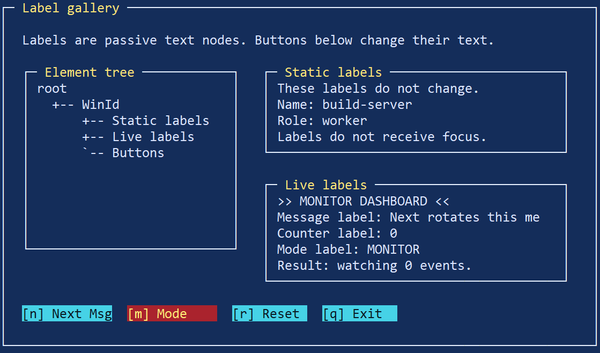


### <a id="11-2">11.2</a>. Window [&uarr;](#0)

`Window` или panel — это видимый контейнер, который задает рамку, заголовок и локальную область для дочерних элементов.

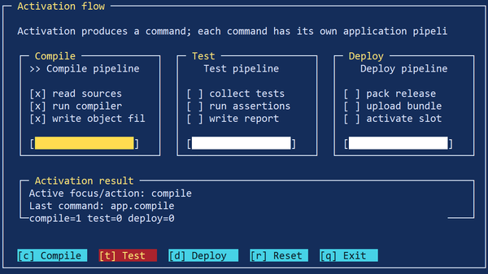

Базовое окно создается так:

```go
if(ui->window(u, parentid, WinId, x, y, w, h, " Title ") < 0)
	raise "fail:window";
```

Здесь:

- `parentid` — родительский контейнер;
- `WinId` — ID окна;
- `x`, `y`, `w`, `h` — геометрия;
- `" Title "` — заголовок окна.

Окно важно не только как визуальная рамка, но и как контейнер layout-а. Внутрь окна обычно помещаются:

- labels;
- buttons;
- input fields;
- lists;
- groups;
- canvas;
- другие вложенные controls.

Окно с тенью требует два ID:

```go
if(ui->shadowwindow(u, parentid, ShadowId, WinId, x, y, w, h, " Title ", 1, 1) < 0)
	raise "fail:shadowwindow";
```

Здесь создаются два узла:

- узел тени `ShadowId`;
- узел окна `WinId`.

Это важно помнить при показе/скрытии. Если скрыть только `WinId`, тень может остаться на экране. Поэтому на практике окно с тенью удобно держать внутри отдельного контейнера верхнего уровня и скрывать уже этот контейнер.

Именно так сделано в quick-start примере с `HelpLayerId`.

См. пример `doc/icurses/examples/11_02_window_shadow_layers.b`: он показывает обычное окно, `shadowwindow()`, отдельные узлы тени и окна, а также показ и скрытие дополнительного оконного слоя.


### <a id="11-3">11.3</a>. Button [&uarr;](#0)

`Button` — один из основных interactive elements в `icurses`.

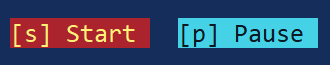

Базовое создание кнопки:

```go
if(ui->button(u, parentid, ButtonId, x, y, w, h, "OK", "", AppTarget, "app.ok") < 0)
	raise "fail:button";
```

Параметры здесь особенно важны:

- `parentid` — контейнер кнопки;
- `ButtonId` — ID кнопки;
- `x`, `y`, `w`, `h` — геометрия;
- `"OK"` — видимый текст;
- `""` — hotkey string, если он не используется;
- `AppTarget` — target ID для сообщения;
- `"app.ok"` — строковая команда.

Кнопка обычно:

- участвует в focus navigation;
- активируется через `Enter` или `Space`;
- при активации генерирует command message.

Типичный pattern обработки:

```go
if(s.msg.cmd == "app.ok")
	done = 1;
```

Кнопки особенно хорошо сочетаются с контейнерными группами:

```go
if(ui->group(u, MainWinId, MainButtonsId, 8, 5, 28, 1) < 0)
	raise "fail:buttons group";

if(ui->button(u, MainButtonsId, BtnOkId, 0, 0, 10, 1, "OK", "", AppTarget, "app.ok") < 0)
	raise "fail:ok button";
```

Такой стиль помогает держать layout кнопок изолированным от общей геометрии окна.

См. пример `doc/icurses/examples/11_03_button_commands.b`: он показывает кнопки как focusable action-элементы, генерацию command message, `src` кнопки и изменение прикладного состояния.


### <a id="11-4">11.4</a>. Input [&uarr;](#0)

`Input` — это поле ввода текста. Оно используется там, где пользователь должен вводить строковые значения: имя, путь, команду, фильтр, search query и т.п.


В отличие от `label`, input:

- участвует в focus navigation;
- хранит редактируемое текстовое состояние;
- интерпретирует часть клавиатурного ввода как editing commands;
- часто становится центром более сложной внутренней навигации.

В текущем фреймворке для input есть отдельный helper-модуль `IcInput`. Т.е. input — не просто "один узел с текстом", а полноценный interactive control.

Концептуально input нужен для задач вроде:

- single-line text entry;
- editable form fields;
- command prompts;
- integration with history and popup suggestions.

Так как input связан с редактированием текста, у него обычно есть собственное внутреннее состояние:

- текущий текст;
- позиция курсора;
- режим редактирования;
- optional history integration.

Это как раз тот случай, где tree focus и internal navigation элемента не совпадают: фокус принадлежит самому input control, а внутри него есть свой editing state.

См. пример `doc/icurses/examples/11_04_input_field.b`: он показывает редактируемое поле ввода, перемещение курсора, изменение текста и submit-сообщение.


### <a id="11-5">11.5</a>. Checkbox, radio, switch [&uarr;](#0)

Эти элементы относятся к группе boolean/choice controls и реализуются через helper-модуль `IcControl`.

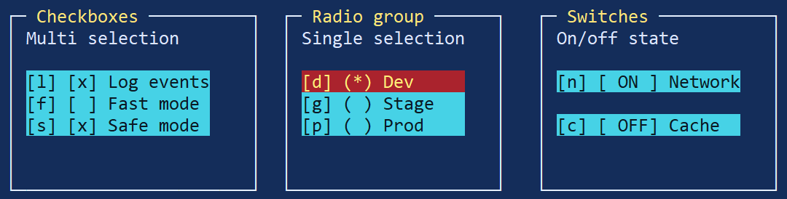

Он задает несколько стилей control-ов:

- `StyleCheckbox`;
- `StyleRadio`;
- `StyleSwitch`.

И два режима группировки:

- `GroupSingle`;
- `GroupMulti`.

Это говорит о том, что checkbox/radio/switch в `icurses` не просто рисуются как разные символы, а оформлены как отдельный reusable слой control-логики.

Полезно различать их семантически:


#### Checkbox

Подходит для независимого флага yes/no.

Примеры использования:

- включить опцию;
- разрешить feature;
- отметить элемент.


#### Radio

Подходит для выбора одного варианта из группы.

Здесь обычно важна связка radio controls с group semantics, потому что выбор одного значения снимает выбор с остальных.


#### Switch

Это stylistic variation boolean control-а, ближе к "on/off toggle". Логически он похож на checkbox, но может выглядеть иначе и восприниматься пользователем как переключатель режима.

Практически это хороший слой для:

- forms;
- settings dialogs;
- filters;
- option panels.

Именно поэтому `IcForm` умеет собирать значения checkbox/radio/slider fields через соответствующие helper-модули, а не через низкоуровневое прямое чтение узлов.

См. пример `doc/icurses/examples/11_05_controls_check_radio_switch.b`: он показывает checkbox, radio group и switch, их состояние checked/on и сообщения изменения состояния.


### <a id="11-6">11.6</a>. Slider [&uarr;](#0)

`Slider` — control для выбора числового значения в ограниченном диапазоне.

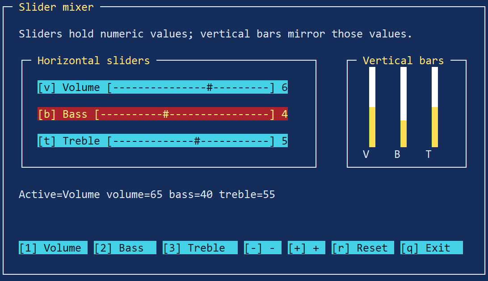

Для него существует отдельный helper-модуль `IcSlider`, что показывает: slider имеет собственную internal behavior model, а не является просто "строкой с числом".

Slider полезен, когда нужно:

- выбрать уровень;
- выставить процент;
- регулировать параметр в диапазоне;
- управлять числовой настройкой.

Он обычно:

- участвует в focus navigation;
- реагирует на arrows or activation-like keys;
- хранит текущее значение;
- может генерировать сообщения или обновляться прикладным кодом.

Практически slider особенно удобен в:

- настройках;
- панелях параметров;
- progress-like interactive controls;
- формах.

То, что `IcForm` умеет получать его текущее значение через `slider->value(u, id)`, показывает его роль как стандартного поля формы, а не экзотического custom widget-а.

См. пример `doc/icurses/examples/11_06_slider_mixer.b`: он показывает слайдеры как числовые focusable controls, переключение активного слайдера, изменение значения и зеркальное отображение этих значений вертикальными индикаторами.


### <a id="11-7">11.7</a>. List [&uarr;](#0)

`List` — это элемент для отображения и навигации по набору строк или записей.

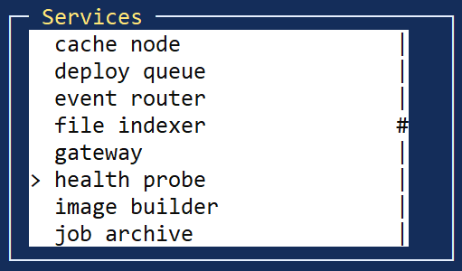

Для него существует отдельный helper-модуль `IcList`, а это значит, что список имеет собственную внутреннюю модель поведения:

- текущий selected item;
- scrolling or clipping;
- focus-aware navigation;
- internal rendering of rows.

Список удобен там, где нужно:

- выбрать один объект из набора;
- показать историю команд;
- вывести набор файлов, задач, пунктов;
- организовать keyboard-based selection UI.

List — хороший пример сложного control-а, где важно различать:

- фокус на самом list widget;
- внутренне выбранную строку или индекс.

То есть концептуально состояние может выглядеть так:

```text
focus = ListId
list.selected = 7
```

Это делает list особым по сравнению с button or label: navigation keys обычно двигают не focus между соседними controls, а selection внутри самого списка.

Для TUI-приложений это один из важнейших controls, потому что многие реальные сценарии — это именно "показать список чего-либо и позволить пользователю выбрать элемент".

См. пример `doc/icurses/examples/11_07_list_browser.b`: он показывает список с внутренними состояниями selected/top, навигацию по элементам и отображение текущего выбранного элемента.


### <a id="11-8">11.8</a>. Menu [&uarr;](#0)

`Menu` — это control для выбора и запуска одной команды из набора menu items.

В `icurses` для меню есть отдельный helper-модуль `IcMenu`, а также отдельный модуль навигации `IcMenuNav`. Это уже показывает, что menu трактуется как полноценная подсистема, а не просто как "несколько кнопок в строку".

Menu обычно нужно для:

- command bars;
- menu rows;
- top-level action selection;
- popup or inline command groups.

Из кода видно, что `IcMenu` работает с массивом `Item`, где у пункта есть как минимум:

- label;
- hotkey;
- target ID;
- command.

Это делает menu близким родственником button-group, но с собственной navigation and rendering semantics.

У menu есть важная особенность: пользователь обычно взаимодействует не с одной "кнопкой", а с целым набором menu items внутри одного control-а. Поэтому menu, как и list, является примером сложного элемента с внутренней навигацией.

См. пример `doc/icurses/examples/11_08_menu_demo.b`: он показывает menu-like интерфейс с navbar, popup menu, actionbar, выбранным пунктом, disabled item, checked item и выполнением команды выбранного пункта.

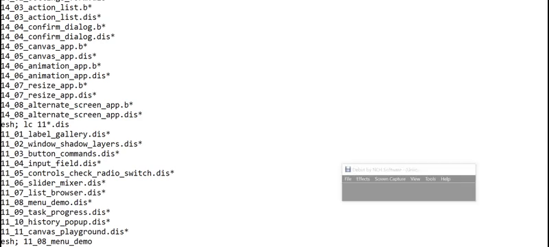


### <a id="11-9">11.9</a>. Task/progress [&uarr;](#0)

`Task` и progress-related elements нужны для отображения хода работы приложения.

Для этого в фреймворке есть отдельный helper-модуль `IcTask`.

Из его структуры видно, что он хранит, например:

- `phase`;
- `src`;
- `dst`;
- `item`;
- `itemvalue`;
- `totalvalue`;
- `meter`;
- `ticks`.

То есть задача здесь понимается не просто как "одна полоска прогресса", а как более богатый progress context, который может описывать:

- текущую фазу;
- текущий обрабатываемый объект;
- прогресс по набору объектов;
- общее числовое продвижение.

Это особенно полезно для:

- file operations;
- background jobs;
- copy/move pipelines;
- long-running form actions;
- terminal dashboards.

Также `IcTask` имеет `tick()` and `render()` semantics, что хорошо сочетается с event loop and timer events из раздела 8. То есть task/progress naturally вписывается в модель "state changes on tick + redraw".

См. пример `doc/icurses/examples/11_09_task_progress.b`: он показывает task dialog, фазу задачи, item progress, total progress, spinner и управление задачей через Start/Pause/Reset.

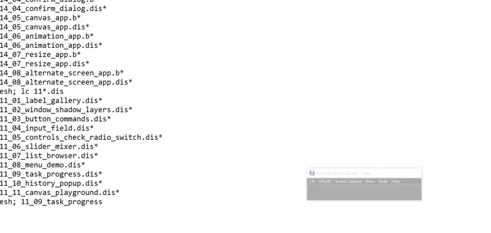


### <a id="11-10">11.10</a>. History/popup [&uarr;](#0)

`History` и popup-related elements нужны там, где ввод текста должен сопровождаться памятью предыдущих значений или временным всплывающим списком.

Для этого в `icurses` есть отдельный helper-модуль `IcHistory`.

Из его интерфейса видно, что history хранит:

- `inputid`;
- `popupid`;
- массив строк `items`;
- текущий selection index;
- `maxitems`;
- `wrap`;
- `visible`;
- число строк popup-а.

Это значит, что history в текущем фреймворке — не просто список строк "где-то рядом", а связка:

- input control;
- stored history items;
- optional popup representation.

Такой механизм полезен для:

- command prompts;
- history-driven input;
- repeated forms;
- shell-like interactive tools;
- autocomplete-like popup workflows.

Особенно важно, что здесь уже появляется связка `input + popup`, а значит — целый микро-сценарий внутренней навигации:

- input держит фокус;
- popup может показывать history items;
- arrows or special keys могут переключать history selection;
- выбранная запись может подставляться обратно в input.

Закрытие history popup по `Esc` является локальной логикой самого history-control и не должно смешиваться с глобальной quit policy приложения.

Это один из примеров того, как `icurses` позволяет строить составные controls поверх базового дерева узлов.

См. пример `doc/icurses/examples/11_10_history_popup.b`: он показывает связку input + history popup, сохранение введенных значений в историю, навигацию по истории и применение выбранного значения обратно в поле ввода.


### <a id="11-11">11.11</a>. Canvas [&uarr;](#0)

`Canvas` — это произвольная область рисования внутри общего renderer-managed экрана.

Базовое создание canvas выглядит так:

```go
if(ui->canvas(u, parentid, CanvasId, x, y, w, h) < 0)
	raise "fail:canvas";

ui->canvasclear(u, CanvasId, " ", "0");
ui->canvasputs(u, CanvasId, 1, 1, "text", "0");
```

Canvas нужен тогда, когда приложение хочет само заполнять экранные ячейки, а не работать только через готовые widgets.

Типичные сценарии:

- фоновые текстовые блоки;
- графики;
- псевдографика;
- animation surfaces;
- нестандартные диаграммы;
- debug overlays;
- special composited content.

Canvas-операции `canvasclear`, `canvasfill`, `canvasputc` и `canvasputs` принимают `int` ID canvas-узла.

Очень важно, что canvas не является "прямым выводом в терминал". Он остается частью общей renderer model:

- canvas content хранится как часть UI state;
- renderer учитывает его при построении back buffer;
- поверх canvas могут рисоваться окна, тени и другие controls;
- resize требует заново создать или заново заполнить canvas content.

Именно поэтому canvas особенно хорошо подходит для background content. В quick-start примере он используется именно так: сначала рисуется фоновый текстовый слой, а затем поверх него — окна и тени.

См. пример `doc/icurses/examples/11_10_history_popup.b`: он показывает связку input + history popup, сохранение введенных значений в историю, навигацию по истории и применение выбранного значения обратно в поле ввода.


## <a id="12">12</a>. Terminal lifecycle [&uarr;](#0)

Terminal lifecycle в `icurses` — это все, что связано с захватом терминала приложением, изменением его режима работы и последующим восстановлением состояния при выходе.

Для TUI это критически важная тема. Интерфейс может быть полностью логически корректным, но если приложение:

- не восстановило курсор;
- оставило terminal в raw-like состоянии;
- не выключило alternate screen;
- не остановило input processing;
- не вернуло normal rendering state;

то с точки зрения пользователя программа завершилась некорректно.

Поэтому `icurses` нужно рассматривать не только как UI toolkit, но и как слой управления terminal ownership.

Практический пример полного terminal lifecycle см. в `doc/icurses/examples/12_01_terminal_lifecycle.b`.

Пример показывает безопасную последовательность владения терминалом: вход в alternate/app screen, сброс атрибутов, скрытие курсора, запуск raw input через `IcUi`, обработку событий, закрытие input/UI, восстановление курсора и возврат из alternate screen. Отдельно показан simulated emergency path: даже аварийный сценарий должен выходить через тот же cleanup-код, а не оставлять терминал в raw mode или со скрытым курсором.


### <a id="12-1">12.1</a>. Обычный режим терминала [&uarr;](#0)

При старте приложения терминал обычно находится в обычном пользовательском режиме.

Это означает, что:

- курсор видим;
- на экране отображается прежнее содержимое консоли;
- input and echo behavior контролируются стандартным terminal mode;
- никакой отдельный application screen еще не включен;
- renderer еще не взял экран под полный контроль.

Для приложения это стартовая точка, из которой оно либо:

- остается в обычном screen mode и просто начинает рисовать;
- либо переводит терминал в более управляемое состояние для TUI.

В quick-start примере старт выглядит так:

```go
out = sys->fildes(1);
appscreen = 0;

enterappscreen();

(w, h) = ic->termsize();
...
u = ui->new(out, w, h);
```

То есть приложение сначала получает stdout FD, а затем начинает последовательно переводить терминал в режим, удобный для интерфейса.

Важно помнить, что "обычный режим" может отличаться в деталях на разных host terminals, но для прикладного кода главное следующее: до явного входа в managed UI mode приложение не должно предполагать, что экран очищен, курсор скрыт или terminal уже синхронизирован с renderer-ом.


### <a id="12-2">12.2</a>. Raw input [&uarr;](#0)

Raw input нужен для того, чтобы приложение могло получать клавиатурные события в форме, пригодной для интерактивного TUI, а не только как обычный line-based terminal input.

Когда приложение открывает UI input path, меняется прежде всего поведение клавиатуры:

- ввод начинает поступать как event stream;
- специальные клавиши становятся различимыми как navigation/input actions;
- UI получает возможность реагировать на `Tab`, arrows, `Esc`, `Enter` и другие terminal keys в реальном времени;
- line-buffered пользовательская модель обычной консоли перестает быть основной.

С практической точки зрения именно поэтому UI должен быть корректно закрыт при выходе: raw-like input behavior нельзя оставлять после завершения приложения.

Даже если прикладной код напрямую не вызывает "open raw keyboard" вручную, он все равно получает этот эффект через `IcUi`:

```go
if(ui->start(u) < 0){
	ui->close(u);
	leaveappscreen();
	sys->print("cannot start ui\n");
	return;
}
```

Здесь `ui->start(u)` не просто "запускает цикл", а переводит UI в рабочее состояние, где input processing уже начинает жить собственной event-oriented логикой.

Из этого следует важное правило:

- если input path был открыт, его обязательно нужно закрыть через нормальный cleanup path.

Иначе после выхода могут остаться:

- сломанное клавиатурное поведение;
- отсутствие нормального echo;
- странная реакция консоли на специальные клавиши;
- ощущение, что terminal "завис" или "испортился".


### <a id="12-3">12.3</a>. Cursor visibility [&uarr;](#0)

Во многих TUI курсор либо мешает, либо должен управляться явно. Поэтому приложение часто скрывает его на время работы и возвращает при выходе.

В quick-start примере это делается через helper-функции:

```go
ic->hidecursor(out);
...
ic->showcursor(out);
```

Сокрытие курсора полезно, когда:

- интерфейс не использует text caret;
- курсор визуально конфликтует с рамками и layout-ом;
- UI полностью контролирует экран и не хочет оставлять "мигающую точку" в случайном месте.

Но здесь очень важна симметрия: если курсор был скрыт, он должен быть восстановлен при любом корректном завершении.

В quick-start это делается внутри `leaveappscreen()`:

```go
ic->resettty(out);
ic->showcursor(out);
```

Именно так и нужно мыслить cursor lifecycle:

1. при входе в managed terminal mode приложение может скрыть курсор;
2. при завершении обязано его вернуть.

Если этого не сделать, пользователь после выхода из программы увидит "пропавший" курсор в обычной консоли. Это одна из самых заметных ошибок terminal cleanup.


### <a id="12-4">12.4</a>. Очистка экрана [&uarr;](#0)

Очистка экрана в TUI может использоваться в нескольких разных ситуациях:

- перед первым показом интерфейса;
- при входе в alternate/app screen;
- при полном redraw после desync;
- перед восстановлением normal terminal state;
- при аварийной или диагностической зачистке экрана.

В quick-start используется:

```go
ic->cleartty(out);
```

Очистка полезна, когда приложение хочет гарантированно начать с известного terminal surface, а не накладывать свой интерфейс на случайное предыдущее содержимое.

Но важно понимать: обычный renderer-based draw и полная очистка экрана — не одно и то же.

- `ui->draw(u)` синхронизирует логическое UI state с renderer-owned screen state;
- `ic->cleartty(out)` — это более низкоуровневая операция над самим терминалом.

Поэтому clearing screen стоит использовать осознанно:

- при переходе между режимами terminal ownership;
- перед/после app screen transitions;
- в special recovery paths.

Если просто вызывать clear слишком часто, это может ломать визуальную плавность, увеличивать terminal traffic и мешать преимуществам buffered rendering.

__Важно__: пока экраном владеет renderer, не следует напрямую вызывать terminal clear в середине работы UI. Это может рассинхронизировать реальный экран и front buffer renderer-а. Очистка терминала безопасна на lifecycle boundaries: при входе в app screen и при выходе из него. Для очистки содержимого внутри приложения лучше использовать renderer-owned операции: `ui->settext`, `ui->canvasclear`, изменение видимости узлов и последующий `ui->draw(u)`.


### <a id="12-5">12.5</a>. Alternate/app screen [&uarr;](#0)

Alternate/app screen — это специальный terminal mode, в котором приложение получает отдельный экранный буфер, не разрушая видимое содержимое обычной консоли.

С практической точки зрения это один из самых удобных способов запускать полноэкранный TUI:

- пользовательский shell screen сохраняется;
- приложение работает на отдельном "экземпляре" экрана;
- после выхода предыдущее содержимое консоли возвращается.

В quick-start это реализовано так:

```go
enterappscreen()
{
	if(out == nil)
		return;

	if(appscreen)
		return;

	sys->fprint(out, "%c[?1049h", 27);
	ic->resettty(out);
	ic->hidecursor(out);
	ic->cleartty(out);

	appscreen = 1;
}
```

А выход — так:

```go
leaveappscreen()
{
	if(out == nil)
		return;

	ic->resettty(out);
	ic->showcursor(out);
	ic->cleartty(out);

	if(appscreen){
		sys->fprint(out, "%c[?1049l", 27);
		appscreen = 0;
	}

	ic->resettty(out);
	ic->showcursor(out);
}
```

Из этого видно несколько важных вещей:

1. app screen включается и выключается явно;
2. это часть terminal lifecycle, а не просто cosmetic option;
3. вместе с ним обычно сразу выполняются cursor and tty reset operations.

Использование alternate screen особенно полезно для:

- полноэкранных приложений;
- диалоговых TUI;
- интерфейсов со сложным redraw;
- demo and showcase apps.

Если приложение не использует app screen, оно может рисовать и в обычной консоли, но тогда нужно особенно аккуратно относиться к очистке, восстановлению и возможному конфликту с уже существующим terminal content.


### <a id="12-6">12.6</a>. Корректный выход [&uarr;](#0)

Корректный выход — это завершение приложения, при котором terminal возвращается в нормальное пользовательское состояние.

Минимальный правильный путь выглядит так:

```go
ui->close(u);
leaveappscreen();

sys->print("result: ok\n");
```

Что именно должно быть закрыто и восстановлено:

- UI loop;
- input processing;
- renderer resources;
- cursor visibility;
- terminal mode;
- alternate/app screen, если он был включен.

Ключевая операция со стороны фреймворка:

```go
ui->close(u);
```

Она завершает работу UI как подсистемы. Но если приложение дополнительно управляло terminal state вручную, этого недостаточно — нужно также выполнить прикладной cleanup, например `leaveappscreen()`.

Корректный выход должен быть одинаково надежным для всех нормальных путей завершения:

- пользователь нажал кнопку OK;
- приложение получило quit command;
- `StepDone`;
- startup partially succeeded, но дальше произошла ошибка;
- приложение решило выйти по логике сценария.

Практическое правило: любой code path, который может завершить программу после начала UI lifecycle, должен проходить через один и тот же cleanup sequence или его эквивалент.

Корректный выход должен быть единым для обычного завершения, quit hotkey и обработанного аварийного сценария. В типовом приложении порядок такой: остановить UI/input (`ui->close(u)` или `ui->stop(u)`), восстановить атрибуты терминала, показать курсор, очистить app screen при необходимости и выйти из alternate screen.


### <a id="12-7">12.7</a>. Аварийный выход [&uarr;](#0)

Аварийный выход — это любой путь завершения, при котором normal cleanup не был выполнен полностью.

Например:

- приложение упало после включения app screen;
- произошел `raise` после старта UI;
- error path вышел раньше, чем вызвал `ui->close(u)`;
- terminal state был изменен вручную, но не восстановлен.

В таких ситуациях в консоли могут остаться:

- скрытый курсор;
- очищенный экран;
- незакрытый alternate screen;
- сломанное keyboard/input behavior;
- артефакты частично отрисованного интерфейса;
- ощущение, что terminal "не вернулся обратно".

Именно поэтому quick-start пример старается закрывать UI и app screen даже в error paths:

```go
if(ui->start(u) < 0){
	ui->close(u);
	leaveappscreen();
	sys->print("cannot start ui\n");
	return;
}
```

Это правильный подход: cleanup должен происходить не только на happy path, но и на ветках с ошибками.

Разумеется, полностью защититься от любого аварийного сценария нельзя. Если процесс был убит внешне или завершился до выполнения cleanup, часть terminal state может остаться поврежденной. Но задача прикладного кода — минимизировать такие случаи и для всех контролируемых error paths выполнять максимальное возможное восстановление.

Аварийный выход не должен означать "бросить терминал как есть". Если приложение обнаружило внутреннюю ошибку, лучше записать состояние ошибки в прикладную переменную и перейти в общий cleanup path. В примере `12_01_terminal_lifecycle.b` кнопка Emergency именно это и демонстрирует: она не ломает процесс, а имитирует аварийное завершение через безопасное восстановление терминала.


## <a id="13">13</a>. Темы, цвета и символы [&uarr;](#0)

Визуальный слой `icurses` строится не только на layout и renderer logic, но и на terminal capabilities. Один и тот же интерфейс может выглядеть по-разному в зависимости от того, что умеет текущая консоль:

- сколько цветов доступно;
- есть ли truecolor;
- поддерживается ли UTF-8;
- безопасно ли использовать Unicode box-drawing glyphs;
- насколько корректно отображаются широкие символы;
- какой console backend используется.

Именно поэтому в `icurses` есть отдельные модули для темы (`IcTheme`) и glyph policy (`IcGlyph`). Оба они инициализируются из terminal capabilities, которые фреймворк получает через `Icurses->consinfo()`.

Практически это значит, что внешний вид приложения в `icurses` — не жестко прошитый набор символов и SGR-кодов, а результат политики, зависящей от терминала.

Практический пример тем, цветов и glyph policy см. в `doc/icurses/examples/13_01_theme_color_glyphs.b`.

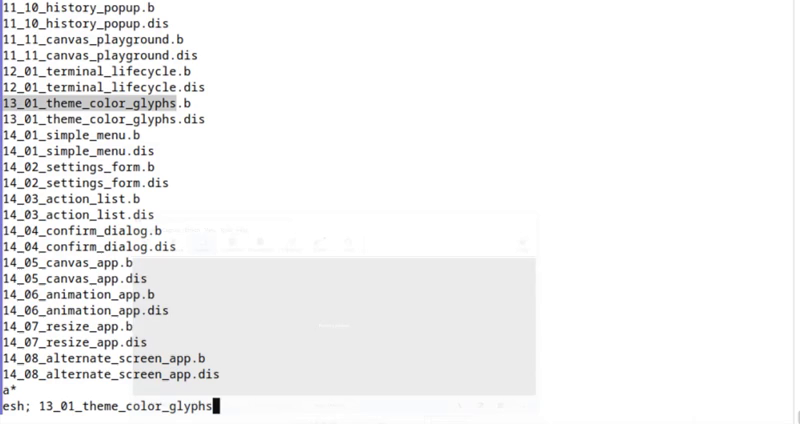

Пример читает `/dev/consinfo`, показывает размер терминала, количество цветов, truecolor/UTF-8/VT flags, выбранную палитру, semantic theme attributes, frame glyphs, scrollbar/block glyphs и предупреждение о double-width символах в fixed-cell layout.


### <a id="13-1">13.1</a>. Цветовые возможности терминала [&uarr;](#0)

Цветовая модель `icurses` основана на semantic attributes, а не на том, чтобы приложение вручную подставляло сырые ANSI SGR последовательности в каждый элемент.

Для этого используется модуль `IcTheme`, который получает terminal capabilities и возвращает SGR body для конкретного UI attribute.

Возможности терминала считываются из `consinfo`. В частности, там есть:

- `colors` — количество доступных цветов;
- `truecolor` — поддержка truecolor mode.

На уровне реализации тема инициализируется так:

```limbo
init(ci: Icurses->ConsInfo)
{
	_colorcount = 16;
	_truecolor = 0;

	if(ci.colors > 0)
		_colorcount = ci.colors;

	if(ci.truecolor != 0)
		_truecolor = 1;
}
```

А renderer использует это при старте:

```go
ci = ic->consinfo();

theme->init(ci);
glyph->init(ci);

CodeNormal = theme->sgr(IcTheme->AttrNormal);
CodeWindow = theme->sgr(IcTheme->AttrWindow);
CodeFrame = theme->sgr(IcTheme->AttrFrame);
CodeTitle = theme->sgr(IcTheme->AttrTitle);
CodeButton = theme->sgr(IcTheme->AttrButton);
CodeFocus = theme->sgr(IcTheme->AttrFocus);
CodeStatus = theme->sgr(IcTheme->AttrStatus);
CodeScroll = theme->sgr(IcTheme->AttrScroll);
CodeShadow = theme->sgr(IcTheme->AttrShadow);
```

Это означает, что приложение мыслит не категориями "какой ANSI color code поставить", а категориями:

- normal;
- window;
- frame;
- title;
- button;
- focus;
- status;
- scroll;
- shadow.

Если truecolor доступен, тема может вернуть полноценные `38;2;...;48;2;...` последовательности. Если нет — используется более консервативный fallback, например 16-color palette.

Пример из `IcTheme`:

```text
truecolor:
38;2;220;230;255;48;2;20;45;90

16-color fallback:
0;37;44
```

Это удобно по двум причинам:

1. одна и та же semantic theme работает на разных терминалах;
2. прикладной код не зависит от конкретной глубины цвета.

Практическое правило: если приложению нужен "правильный внешний вид", лучше опираться на theme attributes, а не вручную печатать SGR strings.

Цветовая схема в `icurses` строится не вокруг конкретных ANSI-кодов в приложении, а вокруг semantic attributes. `IcTheme->sgr(attr)` возвращает подходящий SGR-код с учетом возможностей терминала: truecolor, indexed colors или 16-color fallback.


### <a id="13-2">13.2</a>. UTF-8 и glyph policy [&uarr;](#0)

Поддержка UTF-8 сама по себе еще не означает, что любые Unicode glyphs стоит использовать безоговорочно. Именно поэтому в `icurses` есть отдельная glyph policy.

Ее задача — решить, какой профиль символов безопасно использовать на текущем terminal backend.

В `IcGlyph` есть два базовых профиля:

- `ProfileAscii`;
- `ProfileUnicode`.

Инициализация профиля происходит из `ConsInfo`:

```limbo
init(ci: Icurses->ConsInfo)
{
	#
	# Default to Unicode when /dev/consinfo is available.
	# This preserves the current good-looking terminal rendering.
	#
	_profile = ProfileUnicode;

	#
	# If consinfo is missing entirely, use the safest fallback.
	#
	if(ci.ok == 0)
		_profile = ProfileAscii;

	#
	# Explicit source names can force ASCII fallback.
	#
	if(ci.source == "ascii" || ci.source == "dumb")
		_profile = ProfileAscii;
}
```

Из этого видно, что glyph policy зависит не только от "utf8=1/0", но и от источника консоли. Это важный момент: терминал может формально уметь UTF-8, но practically быть плохим местом для сложной Unicode-псевдографики.

Поэтому правильная логика выбора такая:

- Unicode-friendly terminal → Unicode profile;
- unknown/dumb/ascii-like backend → ASCII fallback.

Именно glyph policy определяет, какие рамки, block glyphs и scrollbar symbols будут реально использоваться в renderer-е.

Практический вывод: приложение не должно само решать "печатать ли Unicode box chars". Эту политику уже должен задавать фреймворк через `IcGlyph`.

Glyph policy выбирается через `IcGlyph` на основе возможностей консоли. Если доступен нормальный Unicode/UTF-8 профиль, можно использовать более красивые рамки и блоки. Если консоль ограничена или `/dev/consinfo` недоступен, безопасный fallback — ASCII glyph profile.


### <a id="13-3">13.3</a>. Frame glyphs [&uarr;](#0)

Рамки в `icurses` поддерживают несколько стилей:

- ASCII;
- single;
- double.

Эти стили задаются через `IcPaint`:

```limbo
FrameAscii:  con 0;
FrameSingle: con 1;
FrameDouble: con 2;
```

И именно эти значения intentionally match glyph styles:

```limbo
StyleAscii:  con 0;
StyleSingle: con 1;
StyleDouble: con 2;
```

В Unicode profile рамки выглядят так:


#### Single

```text
h  = ─
v  = │
nw = ┌
ne = ┐
sw = └
se = ┘
```


#### Double

```text
h  = ═
v  = ║
nw = ╔
ne = ╗
sw = ╚
se = ╝
```

В ASCII fallback используются безопасные символы:

```text
h  = -
v  = |
nw = +
ne = +
sw = +
se = +
```

Renderer получает glyphs не напрямую, а через `glyph->frame(style)`:

```go
f = glyph->frame(style);

a[0] = f.h;
a[1] = f.v;
a[2] = f.nw;
a[3] = f.ne;
a[4] = f.sw;
a[5] = f.se;
```

Это значит, что один и тот же вызов:

```go
ui->setframestyle(u, IcPaint->FrameDouble);
```

может в одном терминале привести к красивой Unicode double frame, а в другом — к более безопасному ASCII-like варианту, если policy вынужденно упадет в консервативный режим.

Практически это и есть правильная модель: приложение выбирает semantic frame style, а glyph policy уже подбирает реальное представление.

Frame glyphs не следует зашивать в прикладной код вручную. Лучше запрашивать набор символов через `IcGlyph->frame(style)`. Это позволяет одному и тому же приложению работать с ASCII, single-line и double-line рамками в зависимости от выбранного профиля.


### <a id="13-4">13.4</a>. Double-width символы [&uarr;](#0)

Double-width символы — это символы, которые на экране могут занимать не одну terminal cell, а две. Чаще всего сюда относятся:

- CJK glyphs;
- часть декоративных Unicode blocks;
- некоторые совместимые wide codepoints.

Для TUI это сложная тема, потому что renderer работает в модели "одна ячейка = один экранный слот". Если приложение помещает в такую ячейку символ, который реально отображается на две позиции, возможны проблемы:

- visual misalignment;
- ломание рамок;
- смещение соседних ячеек;
- неправильный diff between front/back buffers;
- артефакты при clipping and redraw.

Именно поэтому `icurses` разделяет:

- безопасные box-drawing glyphs, выбранные через policy;
- более рискованные декоративные/демо-символы, которые приложение должно использовать осознанно.

В `matrix` demo это видно особенно хорошо: demo умеет работать с несколькими charset modes, включая CJK-like content, но при этом явно учитывает terminal policy и выбирает conservative default, если backend ненадежен.

То есть проблема double-width символов не в том, что их "никогда нельзя использовать", а в том, что их нельзя считать безопасными universal UI glyphs.

Практическое правило:

- для рамок, scrollbar-ов и базовых UI элементов лучше использовать glyph policy фреймворка;
- CJK and other wide glyphs лучше оставлять для специальных demo/effect/canvas сценариев;
- если приложение активно использует wide chars, это нужно отдельно тестировать на конкретных host terminals.

Double-width символы требуют осторожности. Терминальный renderer работает с fixed-cell координатами, а широкие символы могут занимать две колонки и ломать расчет ширины строк. Поэтому для элементов интерфейса, списков, таблиц и menu-like controls безопаснее использовать narrow glyphs или заранее нормализованный текст.


### <a id="13-5">13.5</a>. Особенности Windows console [&uarr;](#0)

Windows console и особенно hosted variants вроде MinGW console могут заметно отличаться от Unix-like terminal environments.

Это различие проявляется в нескольких местах:

- UTF-8 capability может быть объявлена, но фактическое отображение некоторых glyphs остается плохим;
- truecolor behavior может отличаться;
- alternate/app screen semantics могут быть иными;
- mouse/input support может работать не так, как на Unix-like terminals;
- font/rendering backend может ломать часть Unicode glyphs даже при nominally correct UTF-8.

В `matrix` demo это зафиксировано прямо в комментариях: Windows MinGW console может сообщать `utf8=1`, но фактический console host/font все равно плохо отображает часть Matrix/CJK glyphs.

Это и есть причина, почему glyph policy нельзя строить только на одном флаге UTF-8. Нужно учитывать `ci.source` и backend identity.

Практический вывод для `icurses` такой:

- Windows-like console нельзя считать автоматически "полноценным Unicode terminal";
- лучше иметь conservative glyph fallback;
- сложные декоративные glyph sets нужно использовать осторожно;
- для core UI важно, чтобы приложение оставалось читаемым_

Windows console может отличаться по поддержке VT, UTF-8 и truecolor. Поэтому приложения не должны полагаться на один фиксированный набор escape-последовательностей или glyphs. Информацию о возможностях нужно брать из `/dev/consinfo`, а визуальные решения — через `IcTheme` и `IcGlyph`.


## <a id="14">14</a>. Типовые шаблоны приложений [&uarr;](#0)

В предыдущих разделах документ описывал `icurses` по слоям: дерево, layout, rendering, input, messages, terminal lifecycle. Но на практике разработчик чаще мыслит не отдельными подсистемами, а типовыми сценариями:

- "мне нужно сделать простое меню";
- "нужна форма настроек";
- "нужен список с действиями";
- "нужен confirm dialog";
- "нужен canvas-backed screen";
- "нужно переживать resize";
- "нужно корректно жить в alternate screen".

Этот раздел собирает такие сценарии в набор прикладных шаблонов. Это не полный cookbook и не исчерпывающий API reference, а ориентиры по архитектуре типового приложения на `icurses`.

Во всех шаблонах повторяются одни и те же базовые идеи:

- корень дерева используется только как стартовая точка;
- реальная структура строится через один или несколько контейнеров верхнего уровня;
- интерактивные элементы посылают команды;
- приложение централизованно обрабатывает эти команды;
- после изменения UI state выполняется `ui->draw(u)`;
- сложные временные блоки удобнее оформлять отдельными слоями-контейнерами.

В разделе 14 примеры устроены как прикладные шаблоны, а не как демонстрация одного отдельного элемента. Каждый пример показывает типовую архитектуру небольшого TUI-приложения: где хранится прикладное состояние, как строится дерево элементов, как команды приходят в единый обработчик и как после изменения состояния выполняется redraw.

Также, в директории `/doc/icurses/examples/` расположен файл `00_sceleton.b`, который можно использовать в качестве шаблона для написания приложений с TUI-интерфейсом и поддержкой мыши.


### <a id="14-1">14.1</a>. Простое меню [&uarr;](#0)

Самый простой menu-like интерфейс на `icurses` не обязательно требует специального menu helper-модуля. Во многих случаях достаточно:

- одного окна;
- группы кнопок;
- общего `AppTarget`;
- цикла обработки команд.

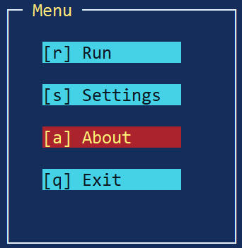

Именно такой подход удобен для:

- launch screens;
- main menu;
- small tools;
- simple selection dialogs.

Типичная структура:

```text
root
└── main layer
    └── main window
        ├── title label
        └── buttons group
            ├── item 1
            ├── item 2
            └── quit
```

Практический pattern:

1. создать окно;
2. поместить в него label with short explanation;
3. сделать группу кнопок;
4. на каждую кнопку навесить отдельную command string;
5. в основном цикле обрабатывать эти команды.

Например:

```go
if(ui->button(u, MenuGroupId, BtnOpenId, 0, 0, 12, 1, "Open", "", AppTarget, "menu.open") < 0)
	raise "fail:open button";

if(ui->button(u, MenuGroupId, BtnQuitId, 0, 2, 12, 1, "Quit", "", AppTarget, "menu.quit") < 0)
	raise "fail:quit button";
```

В event loop:

```go
if(s.msg.cmd == "menu.open")
	openitem();
else if(s.msg.cmd == "menu.quit")
	done = 1;
```

Такой стиль хорош тем, что:

- интерфейс тривиально читается;
- кнопки уже интегрированы с focus navigation;
- не нужен отдельный custom menu protocol.

Если позже понадобится более богатая menu navigation с hotkeys и internal item model, можно перейти на `IcMenu`, но для первых приложений button-based menu often simpler and clearer.

См. пример `doc/icurses/examples/14_01_simple_menu.b`: он показывает минимальный шаблон приложения с главным меню, несколькими command buttons, отдельным About-слоем и централизованной обработкой команд.


### <a id="14-2">14.2</a>. Форма настроек [&uarr;](#0)

Форма настроек — один из самых типичных сценариев для TUI.

Обычно такая форма состоит из:

- окна или панели;
- labels;
- input fields;
- checkbox/radio/switch controls;
- slider-ов;
- кнопок `Save` / `Cancel`.

Здесь хорошо работают helper-модули более высокого уровня:

- `IcInput`;
- `IcControl`;
- `IcSlider`;
- при необходимости `IcForm`.

Типовая структура:

```text
root
└── settings layer
    └── settings window
        ├── labels
        ├── text inputs
        ├── checkbox/radio/switch group
        ├── slider
        └── buttons group
```

Важные рекомендации для такой формы:

1. группировать controls по смыслу, а не просто "класть подряд";
2. держать actions (`Save`, `Cancel`) в отдельной buttons group;
3. focus order строить сверху вниз;
4. прикладное состояние формы отделять от финальной бизнес-логики сохранения.

Если форма небольшая, можно обрабатывать controls напрямую через IDs и helper-модули. Если полей много, уже полезен `IcForm`, который умеет собирать значения полей как единую модель.

Практический смысл шаблона формы:

- UI хранит layout и interaction state;
- приложение хранит actual settings model;
- при `Save` данные читаются из controls и применяются к прикладной конфигурации.

Это особенно важно, чтобы не смешивать "то, что сейчас напечатано на экране" и "то, что уже подтверждено как новое значение настройки".

См. пример `doc/icurses/examples/14_02_settings_form.b`: он показывает форму настроек, где значения хранятся в прикладных переменных, кнопки изменяют состояние, `Apply` фиксирует изменения, а `Reset` возвращает значения по умолчанию.


### <a id="14-3">14.3</a>. Список с действиями [&uarr;](#0)

Другой очень частый шаблон — экран со списком элементов и набором действий над текущим выбором.

Такой экран полезен для:

- file lists;
- task lists;
- history browsers;
- package/resource selectors;
- dashboards with actionable items.

Типичная структура:

```text
root
└── list layer
    └── list window
        ├── list widget
        ├── info/status line
        └── actions group
            ├── open
            ├── remove
            └── close
```

Здесь важно различать два режима работы пользователя:

1. навигация внутри самого списка;
2. переход фокуса к кнопкам действий.

В простом варианте список — основной focus owner, а действия доступны либо горячими клавишами, либо через переход к buttons group.

Типичный pattern:

- `ListId` показывает и удерживает selected item;
- команды `list.open`, `list.delete`, `list.close` обрабатываются приложением;
- приложение отдельно хранит business meaning выбранной строки.

Такой шаблон особенно удобен, потому что:

- список хорошо масштабируется по числу элементов;
- actions остаются стандартными button/command handlers;
- renderer и focus model уже делают большую часть работы за приложение.

См. пример `doc/icurses/examples/14_03_action_list.b`: он показывает шаблон списка с действиями. В нем разделены cursor item и selected item, а команды `Run`, `Disable` и `Delete` работают с текущей строкой списка.


### <a id="14-4">14.4</a>. Диалог подтверждения [&uarr;](#0)

Confirm dialog — один из лучших примеров того, зачем в `icurses` полезны отдельные контейнеры верхнего уровня.

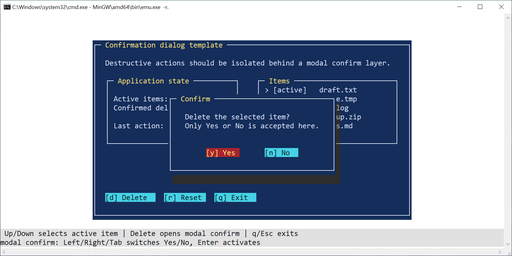

Типичный confirm dialog должен:

- появляться поверх основного экрана;
- иметь собственный фокус;
- содержать короткий вопрос;
- иметь кнопки `Yes/No`, `OK/Cancel` или аналог;
- после закрытия возвращать фокус на исходный элемент.

Правильный pattern:

```text
root
└── app layer
    ├── main content
    └── dialog layer
        ├── dialog shadow
        └── dialog window
            ├── question label
            └── buttons group
```

Очень важно, что dialog оформляется не как "добавили одно окно", а как отдельный слой. Тогда можно:

- показать его командой `node.show`;
- скрыть его командой `node.hide`;
- держать внутри и окно, и тень;
- управлять focus transfer в одном месте.

Практический flow:

1. пользователь инициирует действие;
2. приложение показывает dialog layer;
3. фокус переводится на `ConfirmYesId` or `ConfirmNoId`;
4. после выбора dialog layer скрывается;
5. фокус возвращается в исходную рабочую область.

Это как раз тот шаблон, который уже продемонстрирован в quick-start через help window.

См. пример `doc/icurses/examples/14_04_confirm_dialog.b`: он показывает подтверждающий диалог как отдельный слой с shadow window. При открытии диалога фокус переносится на кнопки диалога, а при закрытии возвращается к кнопке, которая его открыла.


### <a id="14-5">14.5</a>. Приложение с canvas [&uarr;](#0)

Canvas-backed приложение нужно там, где обычных widgets недостаточно.

Canvas особенно полезен для:

- фоновых слоев;
- графиков;
- pseudo-graphics;
- game-like screens;
- нестандартных диаграмм;
- визуальных эффектов.

Наиболее удобный шаблон:

```text
root
└── app layer
    ├── canvas background
    ├── optional windows/panels over canvas
    └── status/help rows
```

То есть canvas часто выступает не как единственный screen primitive, а как базовый visual layer, поверх которого по-прежнему могут жить окна, labels и buttons.

Это важное достоинство `icurses`: canvas не ломает модель дерева, а встраивается в нее.

Типичный pattern работы с canvas:

1. создать canvas node;
2. очистить его;
3. нарисовать базовое содержимое;
4. при изменении состояния обновить canvas;
5. вызвать `ui->draw(u)`.

Если приложение использует canvas интенсивно, полезно разделять:

- полное построение кадра;
- локальное обновление отдельных областей;
- rebuild after resize.

Такой шаблон особенно хорош для демо, визуализаций и приложений, где "главный экран" — это не список controls, а собственная визуальная сцена.

См. пример `doc/icurses/examples/14_05_canvas_app.b`: он показывает canvas-backed application, где основное содержимое рисуется на canvas, а обычные элементы интерфейса используются для управления состоянием приложения.

Также см. демо "Матрица": `doc/icurses/examples/07_05_matrix.b`ю


### <a id="14-6">14.6</a>. Анимация [&uarr;](#0)

Анимация в `icurses` строится вокруг timer/tick model и регулярного redraw.


Типичный animation pattern:

1. приложение хранит animation state;
2. tick event обновляет этот state;
3. UI or canvas content перестраивается в соответствии с ним;
4. renderer делает dirty redraw.

Самый простой skeleton:

```go
case s.kind {
IcUi->StepTick =>
	updateanimstate();
	ui->draw(u);
}
```

Практически анимация в `icurses` чаще всего хорошо сочетается с canvas, потому что canvas удобен для произвольного и частого обновления visual state.

Но и обычные UI animations возможны:

- blinking status;
- progress indicators;
- animated tasks;
- visual effects in dialog/window.

Что важно при проектировании animation-based app:

- не пытаться перерисовывать больше, чем реально нужно;
- держать animation state отдельно от дерева;
- использовать renderer model, а не прямой raw terminal output, если нет особой причины;
- учитывать resize и terminal lifecycle.

Если приложение начинает активно анимировать экран, особенно полезен принцип "canvas as dynamic layer + ordinary widgets as control layer".

См. пример `doc/icurses/examples/14_06_animation_app.b`: он показывает animation template, где `ui->settick()` задает период обновления, `StepTick` изменяет прикладное состояние, а canvas перерисовывается через renderer-owned операции.


### <a id="14-7">14.7</a>. Приложение с resize [&uarr;](#0)

Resize-aware приложение должно считать, что геометрия терминала может измениться в любой момент, и layout должен уметь это пережить.

Типичный resize pattern:

1. получить новые terminal params;
2. сравнить их со старыми;
3. либо локально скорректировать layout;
4. либо пересобрать UI полностью.

На практике для средних и сложных TUI rebuild часто проще и надежнее, чем patching existing tree.

Подход, который хорошо работает:

- вся геометрия считается в одной `build(u, w, h)` функции;
- дерево всегда строится из terminal size;
- при resize приложение просто снова вызывает rebuild path.

Это и есть причина, почему в quick-start `build()` уже отделен в самостоятельную функцию. Такой стиль естественно подготавливает код к будущей resize-support логике.

Особенно важно не забывать, что при rebuild нужно заново:

- построить дерево;
- создать canvas nodes;
- заполнить canvas content;
- восстановить status/help text;
- выставить корректный фокус;
- показать/скрыть временные слои в правильном состоянии.

То есть resize-aware app — это не "просто поменять пару чисел", а держать весь UI в состоянии, пригодном для повторного полного построения.

См. пример `doc/icurses/examples/14_07_resize_app.b`: он показывает resize-aware подход через layout profiles. Пример демонстрирует, что состояние приложения не должно зависеть от конкретной раскладки, а layout можно переключать или перестраивать отдельно.


### <a id="14-8">14.8</a>. Приложение в alternate screen [&uarr;](#0)

Для полноэкранных TUI одним из лучших рабочих шаблонов остается отдельный application screen.

Такой режим особенно удобен для:

- menu-driven tools;
- dashboards;
- form-based applications;
- demos;
- canvas-heavy interfaces;
- interactive terminal apps, которые должны не разрушать содержимое shell screen.

Типичный lifecycle:

1. взять stdout FD;
2. войти в app screen;
3. сбросить tty state;
4. скрыть курсор;
5. создать UI;
6. построить дерево;
7. запустить event loop;
8. при выходе закрыть UI;
9. выйти из app screen;
10. восстановить normal terminal state.

Quick-start пример уже демонстрирует этот шаблон через `enterappscreen()` и `leaveappscreen()`.

Практически это один из самых надежных режимов для `icurses`, потому что:

- приложение получает чистую экранную поверхность;
- shell content сохраняется отдельно;
- выход из программы возвращает пользователю его старый экран;
- меньше конфликтов с "предыдущим содержимым терминала".

Если приложение претендует на роль полноценного TUI, а не "маленькой штуки, которая что-то подпечатывает в обычную консоль", alternate screen обычно является правильным default pattern.

См. пример `doc/icurses/examples/14_08_alternate_screen_app.b`: он показывает шаблон full-screen приложения в alternate/app screen, с отдельным временным Help-слоем и корректным восстановлением терминала при выходе.


## <a id="15">15</a>. Отладка и типовые ошибки [&uarr;](#0)

Даже если архитектура приложения на `icurses` в целом понятна, на практике большая часть времени уходит не на "рисование окна", а на разбор типичных ошибок:

- модуль подключили не тем способом;
- модуль виден компилятору, но не загружен в runtime;
- забыли `init()`;
- неправильно завершили input lifecycle;
- сломали terminal state;
- не закрыли фоновые процессы;
- некорректно пережили resize;
- уперлись в особенности Windows console.

Этот раздел собирает именно такие типовые проблемы. Он полезен не только как troubleshooting checklist, но и как напоминание о том, где в `icurses` проходят самые чувствительные границы:

- compile-time include graph;
- runtime module loading;
- initialization order;
- terminal ownership;
- rebuild after resize;
- host-terminal specific behavior.


### <a id="15-1">15.1</a>. Ошибки `include` [&uarr;](#0)

Одна из самых типичных проблем в Limbo-коде под `icurses` — ошибки уровня `include`.

Обычно они проявляются так:

- повторные объявления;
- конфликт нескольких интерфейсов, которые уже тянут друг друга;
- избыточный include graph;
- подключение "всего подряд" вместо одного подходящего верхнего уровня.

Классический плохой пример:

```go
include "icurses/icurses.m";
include "icurses/ui.m";
```

Проблема здесь в том, что `icurses/ui.m` уже тянет `icurses/icurses.m` по цепочке зависимостей. В результате можно получить duplicate declarations.

То же самое касается helper-модулей. Если модуль уже включает `ui.m`, второй прямой include `ui.m` рядом с ним может быть лишним или конфликтным.

Признаки include-problem:

- compile-time duplicate declaration errors;
- несогласованные типы одного и того же модуля;
- "вроде бы все подключено, но стало только хуже".

Практическое правило:

- подключать интерфейс самого высокого уровня, который соответствует коду текущего файла;
- не подключать одновременно low-level и high-level interface, если high-level уже включает low-level;
- не собирать include graph по принципу "вдруг пригодится".

Если есть сомнение, обычно безопаснее начать с:

```go
include "draw.m";
include "icurses/ui.m";
```

А дополнительные `.m` добавлять только тогда, когда текущий source file реально вызывает функции соответствующих модулей напрямую.


### <a id="15-2">15.2</a>. Ошибки `load` [&uarr;](#0)

Вторая классическая категория ошибок: модуль виден компилятору, но не загружен во время выполнения.

Это важное отличие Limbo module model:

- `include` делает интерфейс видимым на compile-time;
- `load` загружает runtime implementation.

То есть такой код может успешно компилироваться:

```go
ui: IcUi;
```

но если дальше нет:

```go
ui = load IcUi IcUi->PATH;
```

то при попытке вызвать `ui->...` приложение уже в runtime сломается.

Типовые признаки load-problem:

- `nil` module value;
- runtime failure на первом вызове `module->function`;
- ощущение "код же видит тип и PATH, почему не работает".

Хорошая практика — проверять каждый `load` отдельно:

```go
ui = load IcUi IcUi->PATH;
if(ui == nil)
	raise "fail:load icui";
```

Это особенно важно в `icurses`, потому что приложение часто загружает сразу несколько модулей:

- `Icurses`;
- `IcUi`;
- `IcMsg`;
- optional helper modules вроде `IcInput`, `IcList`, `IcMenu`, `IcTask`.

Еще одна типичная ошибка: разработчик рассчитывает, что если `IcUi->init()` internally загрузит свои зависимости, то это якобы заменяет `load` тех модулей, которые само приложение вызывает напрямую. Это неверно.

Если прикладной код сам вызывает модуль, он должен:

1. иметь переменную нужного типа;
2. сделать `load`;
3. проверить результат;
4. вызвать `init()`, если он нужен.


### <a id="15-3">15.3</a>. Забытый `init` [&uarr;](#0)

Следующая распространенная ошибка — модуль загружен, но не инициализирован.

Например:

```go
ui = load IcUi IcUi->PATH;
if(ui == nil)
	raise "fail:load icui";
```

Такой код сам по себе еще недостаточен. После `load` обычно нужен вызов:

```go
ui->init();
```

То же касается других модулей:

```go
ic->init();
msg->init();
```

Типовой симптом забытого `init()`:

- модуль вроде бы загружен;
- compile-time все в порядке;
- `load` не вернул `nil`;
- но runtime behavior странный или неполный;
- внутренние зависимости модуля не готовы.

Это особенно важно для `IcUi`, потому что он не является "пустой таблицей функций". Его `init()` подготавливает внутренние зависимости UI layer-а.

Практическое правило:

- если модуль загружен и приложение собирается вызывать его функции напрямую — почти всегда вызывайте его `init()`.

Исключение возможно только для модулей, у которых `init()` отсутствует или документация явно говорит, что инициализация не нужна.


### <a id="15-4">15.4</a>. Забытый `closeinput` [&uarr;](#0)

Одна из самых неприятных terminal ошибок — забыть корректно закрыть input path.

С точки зрения пользователя это выглядит так:

- после выхода из программы клавиатура ведет себя странно;
- `Enter`/`Esc`/special keys работают некорректно;
- echo mode кажется "сломавшимся";
- terminal как будто остался в raw-like состоянии.

В приложениях на `IcUi` типичный безопасный путь — закрыть UI через:

```go
ui->close(u);
```

Именно он завершает input lifecycle как часть общего UI cleanup.

Если же приложение использует input на более низком уровне, нужно убедиться, что закрыты:

- keyboard readers;
- timer/event channels;
- optional mouse input path;
- любые фоновые input-related processes.

В низкоуровневом коде такую проблему можно описывать как "forgotten closeinput". Даже если конкретный современный прикладной слой использует `ui->close(u)`, смысл остается тем же: input subsystem должен быть явно и корректно завершен.

Практическое правило:

- любой выход из приложения после старта UI должен проходить через корректный input cleanup;
- error path обязан делать то же самое, что и normal exit path.


### <a id="15-5">15.5</a>. Не восстановлен терминал [&uarr;](#0)

Еще одна очень заметная категория ошибок — приложение завершилось, но terminal state не был восстановлен.

Симптомы:

- остались цвета;
- курсор невидим;
- экран частично очищен;
- alternate screen не выключен;
- на консоли остался "мусор";
- shell prompt появился в неожиданном визуальном состоянии.

Такое происходит, если приложение:

- не вызвало `ui->close(u)`;
- не вернуло normal tty mode;
- не показало курсор обратно;
- не вышло из app screen;
- завершилось слишком рано по error path.

Quick-start пример показывает хороший cleanup pattern:

```go
ui->close(u);
leaveappscreen();
```

А внутри `leaveappscreen()` делаются:

- `resettty`;
- `showcursor`;
- `cleartty`;
- выключение app screen.

Это и есть правильная модель terminal recovery: приложение должно думать не только о том, как "запустить красивый UI", но и как полностью откатить все terminal-side изменения назад.


### <a id="15-6">15.6</a>. Зависшие процессы [&uarr;](#0)

Если приложение использует background readers, timers, animation loops или дополнительные input processes, одна из типовых проблем — зависшие процессы после завершения основного UI.

Это особенно характерно для:

- raw keyboard readers;
- optional mouse readers;
- timer/tick producers;
- animation workers;
- custom background loops, которые продолжают писать в channels.

Симптомы:

- программа вроде бы закончилась, но что-то еще живет;
- каналы продолжают держать процессы;
- shutdown path подвисает;
- приложение не освобождает ресурсы;
- терминал выглядит "полузакрытым".

В `icurses` это особенно важно для приложений, которые уходят ниже обычной `step()` модели и заводят свои процессы.

Хорошая практика:

1. иметь явный `running` flag или другой shutdown marker;
2. останавливать producers before closing UI;
3. не оставлять background processes заблокированными на send/recv после shutdown;
4. закрывать input resources в предсказуемом порядке.

Типовая ошибка здесь не в самом наличии background processes, а в отсутствии симметричного shutdown path для них.


### <a id="15-7">15.7</a>. Проблемы resize [&uarr;](#0)

Resize — один из самых богатых источников тонких ошибок.

Типичные симптомы:

- canvas старого размера продолжает использоваться после rebuild;
- renderer живет со старой геометрией;
- окна пересчитаны, а фон — нет;
- фокус остался на несуществующем или скрытом узле;
- часть дерева относится к старому UI, часть — к новому;
- screen state выглядит "рваным" или смещенным.

Ключевая причина здесь почти всегда одна: разработчик воспринимает resize как "подправить несколько координат", а фактически приложение уже находится в состоянии, где нужно полностью синхронизировать UI state с новой terminal geometry.

Особенно частые ошибки:

- не пересоздан canvas;
- не заново заполнено canvas content;
- не пересоздан renderer;
- не восстановлены status/help rows;
- забыли заново выставить focus;
- часть ID относится к старому дереву.

Отдельная типовая ошибка после перестроения интерфейса — забыть заново создать нужные узлы и заново привести дерево к корректному состоянию для нового размера.

Практическое правило:

- если resize handling нетривиален, лучше rebuild, чем частичное patching;
- после rebuild заново создайте все critical nodes;
- заново заполните canvas;
- заново приведите focus, visibility и status/help state к согласованному виду.


### <a id="15-8">15.8</a>. Проблемы Windows console [&uarr;](#0)

Windows console — отдельный класс host-specific проблем.

Особенности Windows console могут проявляться в:

- поддержке UTF-8;
- цветах;
- alternate screen;
- raw input;
- мыши;
- отображении Unicode glyphs;
- фактическом качестве рендеринга wide or decorative symbols.

Проблема здесь в том, что nominal capability flags не всегда гарантируют хорошее практическое поведение. Терминал может формально сообщать `utf8=1`, но все равно плохо отображать часть glyph sets. Именно поэтому `icurses` учитывает не только capability flags, но и source/backend identity при выборе glyph policy.

Также на данном этапе в MinGW-сборке Inferno обнаруживаются множественные системные баги, дающие тонкие сложно выявляемые ошибки и падения системы.

Практический вывод:

- Windows-like console нужно считать более консервативной средой;
- для нее особенно важны ASCII fallback и осторожный glyph selection;
- cleanup path должен быть максимально аккуратным;
- любые advanced visual tricks стоит тестировать отдельно.

Приложение должно корректно восстанавливать терминал при выходе независимо от backend-а. Но на Windows-like consoles особенно важно не полагаться на "скорее всего terminal сам разберется" — лучше всегда явно выполнять полный cleanup.

